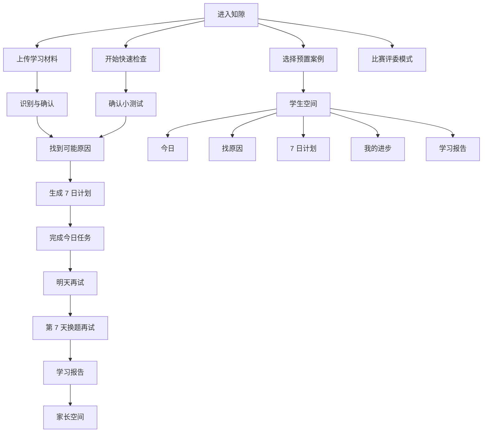
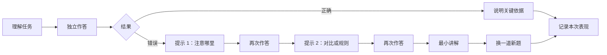

# 知隙 GapProof 视觉与交互设计文档

> 本文回答：用户如何进入产品、每一页显示什么、如何完成任务、系统状态如何被理解，以及界面应遵循什么视觉与交互规范。

> 产品范围与验收以 [PRD.md](./PRD.md) 为准；项目定位与关键决策以 [PROJECT_MASTER.md](./PROJECT_MASTER.md) 为准；技术实现边界以 [TDD.md](./TDD.md) 为准。

## 0. 给设计与开发团队的结论

### 0.1 产品体验定位

知隙不是聊天机器人，也不是普通刷题软件。界面必须持续帮助用户回答三个问题：

1. **我现在做什么？**
2. **为什么先做这件事？**
3. **怎样才算真的学会？**

产品前台采用“一个 AI 学习教练”的形态。后台可以有诊断、教学、计划、复测等不同职责，但学生不需要理解 Agent、状态机、RAG、置信度模型等技术概念。

### 0.2 本轮范围

| 范围 | 设计深度 | 结论 |
|---|---|---|
| 学生端 | 完整页面、流程、状态和视觉规范 | 本轮重点 |
| 家长端 | 完整页面、流程、状态和视觉规范 | 本轮重点 |
| 比赛评委模式 | 满足比赛演示的关键页面和状态 | 精简实现 |
| Guide、教师、运营后台 | 不设计 | 后续独立立项 |
| 桌面浏览器 | 详细设计与验收 | MVP 一级支持 |
| 平板 | 定义适配原则和关键行为 | MVP 一级支持 |
| 手机 | 保留移动网页显示比例、内容适配和不溢出检查；不做完整端到端体验验收 | 后续完善完整移动体验 |
| Logo 与完整品牌识别 | 透明 `logo.png` 已获当前项目 MVP 使用确认；完整品牌规范后续独立设计 | 不阻塞页面实现；仍需紧裁横版/SVG、图形标、Favicon 和品牌色复核 |

### 0.3 视觉方向

视觉参考为 Bogdan Nikitin / Nixtio 的 **Projects Monitoring Dashboard**。借用其设计语言，不复制其业务布局：

- 中性现代的无衬线字体；
- 白色和极浅灰的工作区；
- 黑色、电光蓝、青柠绿的高对比点缀；
- 大圆角、细描边、弱阴影；
- 胶囊式 Tab、筛选器和状态标签；
- 模块化卡片、清晰数字和简洁图表；
- 信息密度可控，强调内容层级而非装饰。

参考图外部的浅雾蓝只是作品展示背景，不是软件必须采用的全局背景。本产品默认使用白色和极浅中性灰；浅雾蓝仅在适合的局部场景中使用。

### 0.3.1 当前已确认的视觉基线

`[PROTOTYPE]` 已在 Stitch 中完成并选定学生端“今日”桌面高保真视觉基线；F0 Mock、F1b 只读 API、F1c ready D1 客户端作答、真实 overview 及受控 HTTP 浏览器 Fixture 均已通过对应门禁后合并 `main`。无参数入口默认使用 API，只有 `?source=mock` 进入合成页面；这仍不代表业务主闭环已经完成。

- 基础框架为连续白色顶部栏 + 左侧导航 + 中部重点任务 + 右侧学习状态；不使用参考图的整页浅雾蓝展示背景。
- 视觉主色固定为高饱和蓝 `#0036FF` 与青柠绿 `#B5F800`；黑色重点任务卡承载当天唯一主任务。
- 蓝色负责导航、进度、当前状态和链接；青柠绿负责“现在就做”和积极变化，不用于本周学习足迹的完成度。
- 学生界面只使用自然语言，如“确认小题”“学习记录”“换一道新题再试”；不展示“探针”“学习证据”等内部词。
- 顶部的“有新的英语学习报告”提醒已从当前首页移除；全局搜索不作为当前首页首屏必备控件，后续如需要，仅以紧凑的页面/任务搜索形式补充。
- 当前首页的 Stitch 参考资产保存在 `reference/stitch_gapproof_ai/`：PNG 是视觉母版，HTML 仅用于结构和样式意图参考；正式实现不得直接依赖导出 HTML 的 CDN、旧 Token 或静态数据。

| 视觉资产字段 | 当前基线 |
|---|---|
| Stitch 项目 ID | `2633340919618857696` |
| 最终节点 ID | `f0ab1ba7f1f644a9b6f77cc1e02ecbc1-1786695263161` |
| Stitch 页面名称 | `今日-最终确认版V1.1` |
| 对应路由/状态 | `/student/today`；已有学习数据、常规桌面态 |
| 本地视觉母版 | `reference/stitch_gapproof_ai/today-final.stitch.png` |
| 本地结构参考 | `reference/stitch_gapproof_ai/today-final.stitch.html` |
| Logo V1 | `reference/stitch_gapproof_ai/logo.png`；用户已确认可用于 MVP |
| CSS 视口 / DPR | 待补充；当前 PNG 不替代 1440×900 与 1366×768 回归图 |

`V1.1` 是 Stitch 页面版本，不是本设计文档版本。完整链接、校验值和资产边界见 `reference/stitch_gapproof_ai/README.md`。

### 0.3.2 当前阶段与下一步

**已完成**：学生端“今日”页桌面视觉结构与 Stitch V1.1 冻结裁切保持不变；默认 API、真实 Today overview、ready guided、D1、D7 安全作答均已通过门禁。服务端 `hasStartedJourney:false` 时显示首次使用引导，提供“上传材料”和“三题快速检查”两条入口。`/materials/new` 现支持首次多选、按序缩略图队列、继续添加、逐页检查/替换/移除/重试；选图后隐藏大面积虚线框。全部页面通过后才显示处理说明、监护确认和“开始识别”。真实阿里云 OCR 结果在 `/materials/{caseId}/review` 按页显示为“来自上传图片”，必须由学生逐页核对；synthetic Mock 与零网络 `/materials/demo/review` 继续独立披露。

**已新增**：匿名设备会话在首次进入时准备学生空间，Today 与上传页可显示当前设备下未完成的 OCR 批次，并按“继续添加/等待/核对/重试”进入真实下一步；不伪造旧图片预览。guided task 内提供“把你的思路说出来”苏格拉底面板，可恢复最新一轮、锁定网络未知写入、每轮只显示一个问题并按需展开提示。错题本按当前设备学生已确认的真实 OCR item 展示题干修正、选填原作答与同 Case 任务事实；顶部只保留当前位置和真实可点击的“学习设置”，桌面/移动端一致；全局错误页与 404 均提供可执行返回路径。

**尚未完成**：三题检查仍是无记录的原创合成体验题；当前匿名身份不支持跨设备账号同步。当前 OCR item 可能对应整页，错题本不展示原图且不能称已完成可靠自动逐题切分；导师公开契约只恢复最新一轮，不是完整会话历史。计划、进步与报告已有真实任务/证据投影，原图确认后 24h/主动删除只覆盖本地存储；生产 OSS、完整键盘/移动端与真实学生可用性验收尚未完成。任何 OCR、导师或复测工程结果均不能称真实学习效果。

**下一步**：增强 OCR 题目分段/人工拆题与完整导师历史，接入生产 OSS 删除，并继续对全部可点击入口、失败态、键盘、移动端、跨刷新和真实 Provider 做集中验收。任何新字段不得从视觉稿或合成 Fixture 反推业务状态。

### 0.4 设计底线

- 学生首页不得是空白聊天框。
- 一页只突出一个主操作。
- 今日任务默认不超过 3 个。
- 不用一次答对、打卡天数或在线时长冒充掌握。
- 不用排行榜、同龄比较、倒计时焦虑和羞辱性文案。
- 不把 OCR、模型或评分工具的错误归因于学生。
- 颜色不是状态的唯一表达方式。
- 等待、失败、证据不足、需要确认和 Demo 回退必须明确可见。
- 学生端不显示内部 Chain-of-Thought、精确置信度百分比或技术日志。

---

## 1. 文档治理与术语规则

### 1.1 权威关系

- `PROJECT_MASTER.md`：项目方向、阶段、重大决策与状态。
- `PRD.md`：用户、产品范围、功能、流程和产品验收。
- `TDD.md`：技术架构、数据、状态机、接口和工程边界。
- `DESIGN.md`：信息架构、页面、组件、视觉、交互、文案和可访问性。

若发生冲突：产品是否应该存在某项能力以 PRD 为准；能力如何实现以 TDD 为准；用户如何看见和操作以 DESIGN 为准。

### 1.2 状态标签

- `[MVP]`：比赛 MVP 必须实现。
- `[DEMO]`：比赛演示所需，可使用明确标记的预置或模拟能力。
- `[LATER]`：后续产品阶段。
- `[OUT]`：本轮明确不做。
- `[OPEN]`：需要用户、研究或实现结果后再决定。

### 1.3 内部术语与用户用语

内部文档保持专业概念准确，界面使用学生能自然理解的表达。

| 内部术语 | 学生端用语 | 家长端用语 | 评委模式 |
|---|---|---|---|
| Case | 这次学习 / 学习档案 | 本次学习记录 | Case |
| 诊断 | 找原因 / 快速检查 | 原因分析 | Diagnosis |
| 学习证据 | 学习记录 / 掌握记录 | 判断依据 / 学习依据 | Evidence |
| 诊断探针 | 确认小题 / 小测试 | 确认练习 | Probe |
| 错因假设 | 可能卡住的地方 | 可能原因 | Hypothesis |
| 根因 | 真正卡住的地方 | 主要原因 | Root cause |
| 脚手架 | 分步提示 | 分步帮助 | Scaffold |
| 干预 | 专项练习 / 针对练习 | 针对性练习 | Intervention |
| 次日复测 | 明天再试 / 复习检查 | 次日检查 | D+1 retest |
| 迁移验证 | 换道新题再试 | 新题检验 | Transfer verification |
| 提示依赖 | 需要多少提示 | 提示使用情况 | Hint dependency |
| 掌握概率 | 不展示百分比；使用状态文字 | 当前判断 | Mastery probability |
| 证据不足 | 还需要再看看 | 暂时不能确定 | Insufficient evidence |
| 任务重排 | 已调整计划 | 计划已调整 | Replan |
| 人工升级 | 请老师帮忙确认 | 等待人工确认 | Escalation |
| OCR | 识别图片内容 | 图片识别 | OCR |
| Agent | AI 学习教练 | AI 学习教练 | Agent |

### 1.4 学生端语言原则

1. 一句话尽量只说一件事。
2. 按钮使用动作动词，如“开始今天的任务”“确认识别结果”。
3. 不用“提交干预结果”“执行迁移验证”等技术表达。
4. 先给结论，再解释原因。
5. 不用绝对判断，如“你已经完全掌握”。
6. 不贴“粗心、懒惰、能力差、基础差”等人格或能力标签。
7. 鼓励必须具体，例如“这次你没有使用提示，也找到了否定标记”。

---

## 2. 体验原则

### 2.1 行动优先

学生进入任何核心页面后，应在 3 秒内知道主操作在哪里。数据和解释不能抢走当前任务的注意力。

### 2.2 先简单，后展开

默认只展示完成任务所需的信息。判断依据、历史记录和详细说明通过展开、抽屉或二级 Tab 查看。

### 2.3 以任务为中心，而非聊天为中心

AI 对话只是任务中的一种交互方式。题目、选择、排序、标注、短答、图片确认和分步提示应使用对应组件，不全部塞进聊天气泡。

### 2.4 解释变化

当系统改变判断或学习计划时，必须说明：

- 发现了什么新情况；
- 改了什么；
- 为什么改；
- 用户下一步做什么。

### 2.5 承认不确定

“还需要再看看”是正常状态，不应设计成系统失败。低置信结果必须允许用户纠正。

### 2.6 学习节奏友好

- 默认每天 10–20 分钟。
- 今日任务最多 3 个。
- 掉队后提供 5 分钟恢复任务，不堆积过期待办。
- 连续失败时缩小任务，不连续弹出否定反馈。

### 2.7 两层信息密度

- 学生端：低密度、强行动、自然语言。
- 家长端：中密度、结论与行动优先。
- 评委模式：高密度、状态、工具和来源优先。

---

## 3. 信息架构

### 3.1 产品空间



### 3.2 路由结构

路由名称是实现建议，可在开发时调整；页面职责不可静默改变。

| 路由 | 页面 | 角色 | 优先级 |
|---|---|---|---|
| `/start` | 开始页 | 全部 | MVP |
| `/setup` | 基本情况设置 | 学生/家长 | MVP |
| `/materials/new` | 添加学习材料 | 学生/家长 | MVP |
| `/materials/:id/review` | 识别结果确认 | 学生/家长 | MVP |
| `/quick-check` | 快速检查 | 学生 | MVP |
| `/student/today` | 今日 | 学生 | MVP |
| `/student/diagnosis` | 找原因 | 学生 | MVP |
| `/student/plan` | 7 日计划 | 学生 | MVP |
| `/student/progress` | 我的进步 | 学生 | MVP |
| `/student/reports` | 学习报告列表 | 学生 | MVP |
| `/student/reports/:id` | 学习报告详情 | 学生 | MVP |
| `/learn/:taskId` | 学习室 | 学生 | MVP |
| `/check/:taskId` | 复习检查 | 学生 | MVP |
| `/parent/overview` | 本周概览 | 家长 | MVP |
| `/parent/gaps` | 薄弱点与判断依据 | 家长 | MVP |
| `/parent/plan` | 学习计划 | 家长 | MVP |
| `/parent/reports` | 学习报告 | 家长 | MVP |
| `/parent/settings` | 时间、通知与隐私 | 家长 | MVP/部分 Demo |
| `/demo` | 演示控制台 | 评委 | DEMO |
| `/demo/trace` | Agent 时间线 | 评委 | DEMO |
| `/demo/tools` | 工具与来源 | 评委 | DEMO |
| `/demo/recovery` | 失败与回退 | 评委 | DEMO |

### 3.3 页面与状态的边界

以下内容不单独算路由页面：

- 确认对话框；
- 分步提示面板；
- 任务详情抽屉；
- 计划变更说明；
- 成功、空状态和错误状态；
- Tooltip；
- 筛选结果。

上传、识别确认、学习室和复习检查是完整任务流程，必须使用独立页面，不能塞入小弹窗。

---

## 4. 全局框架与导航

### 4.1 桌面框架

目标基准视口：`1440 × 900`；必须同时在 `1366 × 768` 无水平滚动完成主流程。

```text
┌─────────────────────────────────────────────────────────────────────┐
│ 顶部栏：Logo | 当前学生/案例 |（预留紧凑搜索）| 待确认 | 角色 | 用户          │
├──────────────┬──────────────────────────────────────────────────────┤
│ 左侧主导航    │ 页面标题                         页面级操作          │
│              │ 页面 Tab / 筛选                                      │
│ 今日         ├──────────────────────────────────────────────────────┤
│ 找原因       │                                                      │
│ 7 日计划     │                    页面内容                           │
│ 我的进步     │                                                      │
│ 学习报告     │                                                      │
│              │                                                      │
│ + 添加材料   │                                                      │
└──────────────┴──────────────────────────────────────────────────────┘
```

### 4.2 顶部栏

| 属性 | 规范 |
|---|---|
| 高度 | 72px |
| 背景 | `Surface / Primary` |
| 下边界 | 1px 中性描边；不使用重阴影 |
| 左侧 | 预留 Logo 位、产品名、当前学生或案例切换 |
| 中部 | 当前基线不放显式全局搜索；后续可按需要加入紧凑的页面/任务搜索 |
| 右侧 | 待确认、帮助、角色切换、用户入口 |

规则：

- 角色切换使用清晰文字，不只使用头像或图标。
- 预置案例显示“演示案例”标签。
- 学生端不展示“评委模式”入口；比赛演示可通过显式 Demo 开关进入。
- 顶部栏不放重复的页面导航。
- Logo 区与 Tab 区同属连续白色顶部栏，不额外画一条分割线；Logo V1 必须使用透明背景资产并保持视觉居中。
- 当前学生首页不显示“有新的英语学习报告”类顶部提醒；报告变化通过“学习报告”入口和页面内状态呈现。

### 4.3 学生左侧栏

顺序固定：

1. 今日
2. 找原因
3. 7 日计划
4. 我的进步
5. 学习报告

底部放置固定快捷入口 `开始学习`；它进入与今日重点任务卡相同的当前任务，避免生成第二套任务逻辑。添加材料入口放在开始页、找原因页和空状态中。

规范：

- 展开宽度 224px。
- `1366 × 768` 下可收起为 72px 图标栏，但必须支持 Tooltip 和键盘焦点。
- 当前项使用 `#0036FF` 蓝底、白色文字和白色图标，圆角 16px，并使用轻微统一抬升；不只改变图标颜色。
- 菜单文字使用学生熟悉的词，不出现“证据图谱”“Agent Trace”。

### 4.4 家长左侧栏

1. 本周概览
2. 薄弱点
3. 学习计划
4. 学习报告
5. 时间与通知
6. 隐私设置

家长端不出现学生学习室入口，不默认展示完整答题对话。

### 4.5 页面顶部 Tab

Tab 只用于同一业务对象内的子视图。

| 页面 | Tab |
|---|---|
| 找原因 | 学习材料 / 识别结果 / 可能原因 / 确认小题 |
| 7 日计划 | 本周计划 / 调整记录 |
| 我的进步 | 当前进展 / 待检查 / 学习记录 |
| 学习报告 | 全部 / 已修复 / 还需巩固 / 暂时不能确定 |
| 家长薄弱点 | 需要关注 / 正在改善 / 已有新题结果 |
| 评委模式 | 总览 / Agent 时间线 / 工具与来源 / 失败与回退 |

Tab 规则：

- 选中项使用黑色文字和黑色或蓝色描边胶囊。
- 不超过 5 项；更多内容放二级筛选器。
- 切换 Tab 不丢失未提交输入。
- 支持键盘左右方向键切换。

### 4.6 学习室的专注框架

学习室不使用完整左侧栏，只保留顶部返回、任务名称、进度、预计剩余时间和退出入口。

```text
┌─────────────────────────────────────────────────────────────────────┐
│ ← 返回今日      现在完成时 · 第 2/4 步       还需约 4 分钟    保存退出 │
├──────────────────────────────────────────┬──────────────────────────┤
│                                          │ 今天在确认                 │
│              当前题目/材料               │ 真正卡住的地方             │
│                                          │                            │
│              回答区域                    │ [展开] 为什么做这一步       │
│                                          │ [展开] 之前的学习记录       │
│              分步提示                    │                            │
│              提交按钮                    │                            │
└──────────────────────────────────────────┴──────────────────────────┘
```

右侧说明栏宽 280–320px，可收起。主任务区不得因为说明栏存在而低于 640px。

---

## 5. 学生端页面设计

### 5.1 开始页 `/start`

**目标**：让用户无需理解产品架构即可选择最合适的起点。

**页面内容**：

- 标题：“从一次真实错误开始，找到真正卡住的地方。”
- 简短说明：“知隙会先确认原因，再安排每天 10–20 分钟的学习任务。”
- 三张入口卡：
  - 体验演示案例；
  - 上传试卷或错题；
  - 没有材料，做个快速检查。
- “我是学生 / 我是家长”角色选择。
- 原创/合成数据及隐私说明入口。

**主操作**：根据所选入口显示“开始体验”“上传材料”或“开始快速检查”。

**交互**：

- 入口卡整卡可点，并有明确选中状态。
- 预置案例在进入前显示“演示案例，不是真实学生数据”。
- 不要求注册；登录入口为弱操作。

**视觉**：可在页面局部使用浅雾蓝背景或软色块营造低压力感，但主卡片保持白色。不得使用参考图外部背景作为整个应用的固定底色。

### 5.2 基本情况设置 `/setup`

**目标**：以最少信息完成初始分层和时间预算。

**当前已实现字段**：

- 年级；
- 学科（当前仅英语）；
- 学期；
- 学习地区（当前仅上海）；
- 目前学习状态。

**主操作**：“继续”。

**规则**：

- 当前五项均为显式选择；未选择时不得默认补充、保存或打开正式检查入口。
- 每次保存携带档案版本和 UUIDv7 幂等键；冲突时保留选择并要求刷新后再次确认。
- 当前单学生原型不提供学生/家长角色切换或学生切换，顶部只显示非交互的学习空间上下文。
- 解释为什么需要某字段。
- 不采集学校、班级、身份证明等非必要信息。
- 不以成绩区间给学生贴等级标签。
- 教材可预置为 ISBN `978-7-5720-3630-9`；版权页不可取得，版次/印次固定显示“未知”，不得自动填入未经证实的出版年月，也不再提示用户上传版权页。
- 教材字段必须支持“来源已锁定”“版本信息未知”“发现冲突”三种状态；冲突时展示书名/ISBN/内容快照差异并停止自动匹配，不由系统静默选择版本。

### 5.3 添加学习材料 `/materials/new`

**目标**：可靠地接收图片或文字，并在识别前帮助用户处理质量与隐私问题。

**支持内容**：

- 试卷照片；
- 多张作业照片；
- 错题截图；
- 作文照片或文字；
- 手动输入题目和自己的答案。

购买题库或教研材料进入内容准备流程时，还需记录文件角色（学生/考试版、参考答案、教师/解析版、知识清单、答题卡、听力）、单元或综合卷范围以及答案是否齐全。该后台清点状态不等同于学生上传学习证据；答案与解析不得进入学生可见上下文。

答题卡与听力音频在 MVP 后台显示“已留存，本阶段不使用”，不进入题库选择器、诊断上下文或视觉 QA 队列。视觉 QA 页面只呈现已进入 Demo/题库白名单的材料，并要求逐份确认题面、答案关联、单元范围和关键版式。

**页面结构**：

1. 左侧上传区或图片队列。
2. 右侧拍摄建议和材料类型。
3. 底部固定主操作。

**上传状态**：

- 等待选择；
- 正在计算校验值；
- 正在创建上传意图；
- 正在上传；
- 上传完成，识别尚未开始；
- 正在检查图片；
- 图片模糊；
- 方向异常；
- 疑似缺页；
- 上传失败；
- 可以继续。

**首个主操作**：“检查图片内容”。基础检查成功后的独立主操作为“开始识别并创建案例”。

当前 `[PROTOTYPE]` 页面开放单张 JPEG/PNG/WebP、1B–10MiB 的“开始上传”。上传期间锁定重复提交；上传后自动进入基础检查，依次展示 preparing/queued/processing，并在 30 秒内按 1s→2s→3s 读取权威状态；隐藏或离页停止轮询。低分辨率等确定性原因进入需确认，失败/可重试/超时均有中性恢复文案；成功只显示“图片基础检查通过，识别尚未开始，不会自动生成学习结论”。页面不得显示短期 token、对象键、内部 asset/Case ID、服务端文件名、hash、OCR 文本或置信度；显式创建成功后只提供“查看并确认识别内容”导航，Case ID 仅作为内部路由参数。

基础检查成功不得自动创建 Case 或启动识别。页面先展示处理说明，再由用户显式确认本次图片处理和未成年人监护事实后点击“开始识别”；当前动作对应独立 UUIDv7、幂等、可审计的真实 OCR 批次意图，并原子绑定非合成同一 Case。页面只说明识别结果需要核对，不暴露 Provider、凭据或工程字段；synthetic_demo 仅保留在明确体验路径。

**错误文案示例**：

- 不说：“OCR confidence below threshold。”
- 使用：“这张图片有些模糊，可能看不清第 3 题。可以重新拍一张，或继续后手动确认。”

**隐私**：检测到姓名、学校或班级区域时，先建议遮盖；用户确认后再继续。

### 5.4 识别结果确认 `/materials/:id/review`

**目标**：让用户看见系统识别了什么，并修正不确定内容。

**当前 `[PROTOTYPE]` 实现**：路由为 `/materials/{caseId}/review`，醒目标记“合成识别演示”“上传图片未用于识别”“不是真实学生 OCR”。页面按 1s→2s→3s 读取同一 Case 的 `SyntheticExtractionView`，允许修正题干、逐项确认并继续诊断/确认小题/干预；隐藏或离页停止轮询。确认、run-next 和作答使用独立 UUIDv7、权威 Case 版本、冲突重新确认与网络未知锁定。由于上传字节未进入 Fake OCR，当前不展示原始图片或宣称题目区域定位。

**桌面布局**：

- 左侧 52%：原始图片，可缩放、旋转和跳转题目区域。
- 右侧 48%：题目、选项、学生答案和批改结果。
- 顶部：`第 1/3 页`、图片质量状态、识别来源。
- 底部：待确认数量和主操作。

**不确定内容**：

- 原图相应区域有蓝色或琥珀色边框；
- 右侧字段显示“请确认”；
- 提供候选值和手动输入；
- 用户修正后记录“由用户确认”，不伪装为系统识别正确。

**主操作**：“确认并开始分析”。

**次操作**：“返回重新上传”“暂时保存”。

**完成条件**：所有会影响诊断的低置信字段已确认；不重要的字段可跳过并说明影响。

当前 `[PROTOTYPE]` 的 `/materials/demo/review` 仅为合成演示替身：页面必须持续显示“演示识别 · 合成材料 · 不是真实学生数据”和“预置识别结果 / 演示回退”，只允许在浏览器本地编辑一个预置题目与学生答案。“演示确认内容”只能反馈“演示确认已记录，仅用于本次演示。不会进入分析，也不会生成学习结论。”页面不得调用 `/api/v1`、读取上传 asset、启动 OCR、写入 Case 或展示内部 assetId/token/objectKey/hash/精确置信度/答案键；空态与错误态同样保留 Demo 边界。该路由不能被描述为真实 `/materials/:id/review` 已实现。

### 5.5 快速诊断 `/quick-check`

**目标**：没有学习材料时，通过 5–8 道原创小题初步找到需要优先确认的方向。

**界面**：采用学习室的专注框架，一次一题。

**顶部信息**：

- “快速检查”；
- `第 2/6 题`；
- “大约还需 6 分钟”。

**规则**：

- 诊断阶段不默认提供提示，避免影响判断。
- 用户可以选择“这题我看不懂”，它是有效信息，不算错误。
- 完成后不立即给单一总分，进入诊断概览。

### 5.6 今日 `/student/today`

**目标**：让学生最短路径开始今天最重要的任务。

#### 5.6.1 当前桌面视觉基线 `[PROTOTYPE]`

本节优先于本页其余较早的通用示意。页面采用左导航、中部主任务、右侧状态栏的三栏结构；首屏只突出一个深色重点任务卡，避免把首页做成仪表盘堆砌。

1. **顶部与标题**：连续白色顶部栏；左侧为暂用的 Logo V1，右侧保留角色/用户入口。页面标题为自然的问候和今天的学习时间摘要，右上显示日期和本周目标完成度。当前首屏不展示搜索框或“新报告”提醒。
2. **重点任务卡**：黑色/深色卡片，包含任务标题、推荐原因、三枚紧凑步骤胶囊 `看一个例子 → 做一道确认小题 → 换一道新题再试`、右上角青柠绿“预计 10 分钟”胶囊，以及青柠绿、深色文字的 `开始今天的任务` 主按钮。卡片右下的低对比度深灰书本轮廓必须严格沿用 Stitch V1.1 的越界和裁切，这是已确认的视觉风格，不得以“完整可见”为由自行缩放或移位；卡内不使用蓝色主强调。
3. **本周学习足迹**：使用服务端返回的连续 7 个学生本地日方块矩阵；每格固定 32×32px、8px 间距、14px 圆角，完成日为 `#0036FF`，未完成为 `#EEF0F2`。今天固定使用白底、单层 2px `#0036FF` 边框，并在下方显示 10px 蓝色“今日”标签；不使用双 outline、不混入绿色，不把任务数改写成“已坚持”或学习效果。足迹下只保留 14/22px 的真实活动摘要，不增加目标子卡。
4. **稍后继续与下次检查**：右栏不设置包裹整列的大白卡，依次直接展示学习足迹、`稍后继续` 任务列表、独立的下次检查卡；周目标事实位于页头日期摘要，不在足迹中新增卡片。任务和检查明确显示学生时区日期、标题、预计时长和可用截止时间；服务端当前 ready D1/D7 在主任务 Hero 作答，右栏非当前复测仍只读，不从任务数组自行推断下次检查。
5. **今日概览**：主卡下方 40px 处为白色外层容器，固定 24px padding、14px 圆角、1px `#DDE0E5` 边框；标题下间距 16px。内部只展示并列的 `等你确认` 与 `最近进展` 两张 160px 高青柠绿卡，卡间 16px；两卡恢复 Stitch 的 24px 圆形标题图标和右下 80px/15% opacity 装饰图。7 日足迹与周目标不得嵌入概览；卡片不生成无服务端目标支持的 CTA。最近进展只用最多两条中性自然语言，不显示 ID、答案、内部术语或“已掌握”。新用户全零/null/空数组状态不得生成虚构足迹或进展。
6. **固定入口**：左侧栏选中项和底部 `开始学习` 快捷按钮均为蓝色、白字、16px 圆角和轻微立体感。底部按钮仅是主卡 CTA 的固定入口，不增加新任务或额外确认。

交互状态：任务未开始时两个入口均进入同一任务；任务进行中均显示“继续学习”；无任务时主卡改为“今天的任务完成了”，底部快捷入口转为查看下次检查或开始添加材料。Hover/pressed 只加强边界和阴影，不通过夸张发光、重阴影或三维翻转制造“立体感”。

**页面标题区**：

- 问候只占一行，不做大面积装饰；
- 今日状态：“今天有 2 个任务，大约 14 分钟”；
- 右侧显示日期和“调整今天时间”。

**首屏布局**：

```text
┌──────────────────────────────────────┬─────────────────────────────┐
│ 今日重点任务（深色或蓝色强调卡）     │ 本周进度（7 日方块矩阵）     │
│ 真正卡住：不规则过去分词提取         │ 一 二 三 四 五 六 日           │
│ 为什么现在做                         │ ■ ■ ▣ □ □ □ □                 │
│ [开始 8 分钟任务]                    │                             │
├──────────────────────────────────────┼─────────────────────────────┤
│ 接下来                              │ 等你确认                      │
│ 任务 2 / 明天再试 / 第 7 天新题      │ 图片答案、计划变化             │
├──────────────────────────────────────┴─────────────────────────────┤
│ 最近进展：用自然语言显示 1–2 条重要变化                           │
└────────────────────────────────────────────────────────────────────┘
```

**今日任务卡字段**：

- 任务名称；
- 目标；
- 预计时间；
- 当前状态；
- 为什么安排；
- 主操作。

**任务状态用语**：

- 还没开始；
- 进行中；
- 今天已完成；
- 明天再试；
- 等你确认；
- 计划已调整。

**主操作**：“开始今天的任务”或“继续学习”。

**空状态**：

- 真正没有任务：“今天的任务完成了。下一次检查在明天。”
- 系统仍在处理：“正在整理你的学习材料，完成后会出现在这里。”
- 不用无限旋转 Loader；显示当前步骤和可离开提示。

#### 5.6.2 新用户首次进入今日页 `[MVP]`

新用户不能直接看到“你已经坚持了几天”或伪造的学习数据。首次进入 `/student/today` 时，页面保留同一全局框架和视觉基线，但主内容改为清晰的入门引导：

- 顶部标题使用“先从一次小检查开始”或“欢迎来到知隙”，说明系统会先了解“你卡在哪里”，不会暗示已有学习记录。
- 中部主卡使用白色或极浅蓝说明卡，不使用黑色任务卡；内容依次说明“上传一张错题/作业图片”“做几道确认小题”“生成你的 7 日学习安排”。每一步配简单图标和一句学生能理解的说明。
- 主操作只有一个高饱和蓝按钮 `开始第一次检查`，次操作为低权重文字入口 `先看一个示例`。开始检查进入 `/materials/new` 或 `/quick-check`，不能直接进入不存在的任务。
- 右侧改为“开始前你需要准备”卡：学习材料示例、预计耗时 5–8 分钟、隐私提示和“可以稍后补充材料”。不显示本周学习足迹矩阵、完成天数、稍后继续或下次检查。
- 下方可保留两张浅色说明卡：`你会得到什么`（找到可能卡住的地方、安排短任务）和 `你可以随时暂停`。不使用绿色完成状态，不放“最近进展”。
- 左侧导航仍显示五个入口，但“今日”保持蓝色选中；底部固定按钮文案为 `开始第一次检查`，与主卡进入同一流程。添加材料和快速检查也可从主卡进入。

当前实现由服务端 `hasStartedJourney:false` 驱动该状态，主卡直接呈现两个清晰入口：上传材料进入 `/materials/new`，三题快速检查进入 `/diagnose/quick-check`。三题页持续标注“原创合成题、规则评分、不创建学习记录或报告”；提交中禁止重复点击，网络结果未知时锁定并提示稍后恢复。上传预览不得显示本地文件名，只显示有效缩略图、类型/大小和稳定的五步进度。

首次进入页面的交互状态：

1. 未开始：显示上述入门引导，按钮可用。
2. 已选择入口但尚未上传：主卡变为材料上传进度，明确当前步骤和返回入口。
3. 已完成首次检查、尚未生成计划：显示“正在整理你的第一份学习安排”，不得显示虚构的足迹或进展。
4. 首次任务已生成：切换到 5.6.1 的常规“今日”页。

新用户页的验收重点是“知道下一步且不被空数据误导”，而不是尽可能填满页面。首次进入、回到页面和刷新页面必须保持同一 onboarding 状态。

### 5.7 找原因 `/student/diagnosis`

**目标**：让学生理解系统发现了什么、为什么还要做小题，以及下一步是什么。

**页面 Tab**：学习材料 / 识别结果 / 可能原因 / 确认小题。

**“可能原因”页面模块**：

1. 已发现的表面错误。
2. 对应知识或能力。
3. 最可能卡住的地方。
4. 为什么这样判断。
5. 还需要确认什么。
6. 下一步确认小题。

**学生展示方式**：

- 不显示竞争假设百分比。
- 使用“比较可能”“还不能确定”“目前不像是”三个自然语言层级。
- 每个原因卡最多显示 2 条依据，更多内容折叠。
- 清楚区分“系统看到的事实”和“目前的判断”。

**卡片示例**：

```text
比较可能：不规则过去分词还不够熟

为什么这样判断
• 你知道句子表示“已经发生”
• 但在 3 道题里没有正确写出过去分词

还要确认
再做 2 道不带提示的新题

[开始 3 分钟确认]
```

### 5.8 7 日计划 `/student/plan`

**目标**：让学生知道一周节奏，但不过度展示未来任务细节。

**页面 Tab**：本周计划 / 调整记录。

**主视图**：

- 顶部显示本周目标和每天时间预算。
- 七天使用横向日期胶囊；默认选中今天。
- 下方显示选中日期的 1–3 个任务。
- D+1 和 D+7 检查使用独立图标和文字。

**任务类型**：

- 找到原因；
- 重点练习；
- 明天再试；
- 换道新题；
- 简短输出；
- 恢复任务。

**调整记录**：使用变更卡，不使用后台式 diff 表格。

```text
计划已调整 · 今天 16:20
因为：明天再试时仍然出现同一种错误
减少：2 道相似题
新增：1 个前置知识小任务
每天总时长：仍为 15 分钟
```

**时间预算变化**：当家长调整每日时间后，学生端显示简短说明，但不显示家长操作细节。

### 5.9 学习室 `/learn/:taskId`

**目标**：以最少干扰完成一个明确的修复任务。

**任务区支持**：

- 单选、多选；
- 填空；
- 排序；
- 句子标注；
- 短文本输入；
- 看图确认；
- 后续预留语音入口。

**交互顺序**：



**提示按钮**：

- 默认文字：“给我一点提示”。
- 第一级：“看看句子里的时间提示词。”
- 第二级：“对比这两个例句，哪一个表示从过去持续到现在？”
- 不直接显示完整答案，除非进入最小讲解阶段。

**反馈**：

- 正确：“这次你没有使用提示，也找到了时间标志词。”
- 部分正确：“方向对了，再检查动词的形式。”
- 连续失败：“这一步可能拆得还不够小，我们先回到一个更基础的点。”

**完成页**：

- 今天学了什么；
- 独立完成还是使用了提示；
- 下一次检查时间；
- 返回今日。

不得只展示彩带、积分或“100 分”。

### 5.10 复习检查 `/check/:taskId`

**目标**：验证学生能否在延迟后、没有旧提示的情况下解决新问题。

**进入提示**：

- 次日：“现在换一道题，看看昨天学的还记不记得。”
- 第 7 天：“这是没有见过的新题，用来看看你能不能把方法用到新情况。”

**规则**：

- 默认隐藏原题、原答案和旧提示。
- 检查进行中不显示掌握状态。
- 退出后保存进度，但重新进入不能更换到更简单的题来刷结果。
- 工具低置信时显示“这次结果暂时不能确定”，请求确认或换一种方式。

**结果页面**：

- 先显示自然语言结论；
- 再显示本次表现和判断依据；
- 最后显示计划是否变化。

### 5.11 我的进步 `/student/progress`

**目标**：让学生看到自己正在改善什么，而不是看到复杂能力评分。

**页面名称**使用“我的进步”，不使用“学习证据图谱”。

**页面 Tab**：当前进展 / 待检查 / 学习记录。

**当前进展**：

- 默认显示当前 1–3 个目标技能；
- 每个目标显示当前状态、最近一次记录和下一步；
- 提供局部关系图，只展示当前节点、2–3 个前置节点和 1–2 个新题应用节点。

**学生状态文字**：

| 内部状态 | 学生显示 |
|---|---|
| 证据不足 | 还需要再看看 |
| 已发现缺口 | 找到了需要补的地方 |
| 正在干预 | 正在练习 |
| 即时独立成功 | 这次能独立完成 |
| 延迟保持成功 | 过一天还能完成 |
| 迁移已验证 | 换道新题也能完成 |
| 待重新验证 | 需要再确认一次 |

**学习记录**：时间线展示有意义的变化，不展示每次点击和聊天轮数。

### 5.12 学习报告列表 `/student/reports`

**目标**：集中查看已经形成结论的学习目标。

**筛选**：全部 / 已修复 / 还需巩固 / 暂时不能确定。

**报告卡字段**：

- 学习目标；
- 最初问题；
- 当前结论；
- 次日结果；
- 第 7 天结果；
- 最后更新时间。

### 5.13 学习报告详情 `/student/reports/:id`

**目标**：交付可理解、可追溯的修复证明。

**叙事顺序**：

1. 最开始出现的问题。
2. 真正卡住的地方。
3. 做过的重点练习。
4. 明天再试的结果。
5. 第 7 天新题结果。
6. 当前结论。
7. 还不能确定的部分。
8. 下一步。

**结论状态**：

- 已修复；
- 还需巩固；
- 仍需处理；
- 暂时不能确定。

**图表**：使用三阶段对比条或证据时间线，不使用雷达图。

**分享**：MVP 只支持切换家长视图或生成受控报告，不生成包含原始学生隐私的公开链接。

---

## 6. 家长端页面设计

### 6.1 家长端总原则

家长端不复制学生端，也不做监控面板。每次打开优先交付：

1. 本周最重要的 1–3 个结论；
2. 哪些结论有新题或延迟结果支持；
3. 现在需要家长做的一件事。

不展示排行榜、同龄比较、完整私密对话、每分钟行为记录或带压力的连续打卡。

### 6.2 本周概览 `/parent/overview`

**顶部摘要**：

- 本周投入时间；
- 完成的重点任务；
- 已有新题结果的目标；
- 需要家长确认的事项。

这些数字只用于说明进展，不作为学习效果本身。

**首屏卡片**：

- “本周最重要的发现”；
- “正在改善”；
- “还需要再看看”；
- “你现在可以做什么”。

**行动建议示例**：

> 本周不需要额外增加练习。请保持每天 15 分钟，并提醒孩子在周四完成一次 4 分钟的新题检查。

### 6.3 薄弱点 `/parent/gaps`

**目标**：让家长理解错误的主要原因和判断边界。

**页面 Tab**：需要关注 / 正在改善 / 已有新题结果。

**卡片内容**：

- 表面错误；
- 当前主要原因；
- 判断依据；
- 当前状态；
- 下一次检查；
- 系统是否仍不确定。

家长可以查看来源摘要，但默认不展示学生的完整作答文本。

### 6.4 学习计划 `/parent/plan`

**目标**：调整时间预算并理解对计划的影响。

**内容**：

- 当前每日时间；
- 七日安排；
- 必须保留的次日和第 7 天检查；
- 最近调整原因；
- 学生掉队后的恢复方案。

**时间调整交互**：

1. 家长选择每天 10 / 15 / 20 分钟或自定义。
2. 页面先预览影响。
3. 明确哪些练习减少、哪些检查不能删除。
4. 家长确认后生效。

如果加时超过既定安全预算，应提示“增加时间不一定更有效”，不能默认鼓励加量。

### 6.5 学习报告 `/parent/reports`

**目标**：提供更简洁的结果交付和行动建议。

每份报告包含：

- 一句话结论；
- 最初问题；
- 主要原因；
- 做了什么；
- 次日结果；
- 第 7 天新题结果；
- 当前仍不确定的内容；
- 家长建议。

报告默认不展示模型名称、技术置信度和工具日志。

异步报告页面本轮 deferred。后续加载态必须区分“正在生成”“可以查看”“生成失败”；只有报告已成功生成、具有权威证据引用且当前可打开时才能显示“报告已准备好”。queued/processing 不得显示为 ready，合成报告不得冒充真实学生报告或学习效果。

### 6.6 时间、通知与隐私 `/parent/settings`

**分组**：

- 每日时间预算；
- 应用内提醒；
- 安静时段；
- 周报频率；
- 数据与原图；
- 删除学习记录；
- 退出或撤回同意。

**MVP 边界**：比赛阶段提醒可以只在应用内模拟。任何模拟通知必须标记为演示，不得让用户误以为已经发送短信或微信。

**高风险操作**：删除数据使用二次确认，并清楚说明删除范围和处理状态。

---

## 7. 比赛评委模式

### 7.1 定位

评委模式只用于证明产品是一个可追踪的 Agent 闭环，不是面向普通用户的长期后台。本轮不建设通用运营系统。

### 7.2 演示控制台 `/demo`

**页面模块**：

- 当前演示案例；
- 当前业务状态；
- 主流程阶段；
- 最近 Agent 动作；
- 工具健康状态；
- Demo 时间；
- 时间快进；
- 预置失败事件；
- 学生视图和家长视图快捷入口。

**永久标识**：

- `演示案例`；
- `合成学生数据`；
- `时间已快进`；
- `预置识别结果`；
- `工具已回退`。

标识同时使用图标、文字和颜色。

### 7.3 Agent 时间线 `/demo/trace`

**展示内容**：

- Observe / Diagnose / Decide / Act / Verify / Replan / Deliver；
- 当前 Case 状态；
- 触发事件；
- 输入和输出摘要；
- 采用的判断依据；
- 等待确认；
- 失败、重试和回退；
- 状态版本与时间。

不得展示内部 Chain-of-Thought。展示结构化结论、证据引用和决策摘要。

### 7.4 工具与来源 `/demo/tools`

**工具卡**：

- 工具名称；
- 真实调用 / 预置 / 回退；
- 当前状态；
- 耗时；
- 输入输出摘要；
- Provider；
- 失败原因；
- 重试次数。

**来源卡**：

- 内容来源；
- 版本；
- 适用教材和单元；
- 授权或原创状态；
- 是否被本次判断引用。

### 7.5 失败与回退 `/demo/recovery`

至少演示三类情况：

1. 图片识别不确定，转用户确认。
2. 知识检索没有适用来源，系统拒绝无依据回答。
3. 模型超时，重试或切换备用 Provider。

页面必须展示失败发生前后的状态变化，不能只显示“已自动恢复”。

---

## 8. 核心流程

### 8.1 首次使用

```text
开始页
→ 选择学生视图
→ 选择预置案例 / 上传材料 / 快速检查
→ 设置年级、教材和每日时间
→ 进入对应流程
→ 完成识别确认或快速检查
→ 查看可能原因
→ 完成确认小题
→ 生成 7 日计划
→ 进入今日
```

原则：用户不需要先理解所有功能；完成第一个有效动作后再逐步揭示导航。

### 8.2 上传到诊断

```text
添加材料
→ 检查图片质量
→ 建议遮盖隐私
→ 上传和识别
→ 确认不确定内容
→ 接受为学习记录
→ 显示系统看到的错误
→ 给出可能原因
→ 安排确认小题
```

### 8.3 学习闭环

```text
今日重点任务
→ 独立作答
→ 必要时逐级提示
→ 完成最小练习
→ 明天再试
→ 失败则缩小任务或回查基础
→ 第 7 天换道新题
→ 形成修复报告
```

### 8.4 家长调整时间

```text
打开学习计划
→ 修改每日时间
→ 预览计划影响
→ 保留必要复习检查
→ 家长确认
→ 学生端收到简短计划变化说明
```

### 8.5 低置信处理

```text
系统发现结果不确定
→ 暂停写入最终判断
→ 告诉用户哪里不确定
→ 请求确认 / 换一种输入方式 / 稍后人工确认
→ 确认后继续
```

---

## 9. 视觉系统

### 9.1 色彩策略

参考图外部的浅雾蓝不作为全局应用背景。默认界面以白色和浅中性灰构成；浅雾蓝只用于开始页局部背景、解释卡、空状态或报告重点区域。

#### 基础色

| Token | 建议值 | 用途 |
|---|---:|---|
| `canvas` | `#F5F6F7` | 页面内容区背景 |
| `surface-primary` | `#FFFFFF` | 顶栏、侧栏、卡片 |
| `surface-secondary` | `#F0F2F4` | 次级分组、输入底色 |
| `surface-blue-soft` | `#E5ECFF` | 局部说明、非选中蓝色状态 |
| `surface-lime-strong` | `#B5F800` | 今日概览、积极变化和深色卡主操作 |
| `ink-primary` | `#111214` | 主文字 |
| `ink-secondary` | `#5F636B` | 次文字 |
| `ink-tertiary` | `#8B9099` | 辅助信息 |
| `border-default` | `#DDE0E5` | 卡片和控件描边 |
| `border-strong` | `#B9BEC7` | 强边界、未选筛选器 |

#### 品牌与强调色

| Token | 建议值 | 用途 |
|---|---:|---|
| `accent-blue` | `#0036FF` | 当前导航、进度、主要信息、链接 |
| `accent-blue-hover` | `#0028C7` | 蓝色悬停/按下 |
| `accent-lime` | `#B5F800` | 重点变化、今日概览、深色卡主操作 |
| `accent-black` | `#111318` | 深色重点卡、黑底按钮 |

#### 语义色

| 状态 | 前景 | 浅背景 | 说明 |
|---|---:|---:|---|
| 成功/已完成 | `#247A4D` | `#E7F6ED` | 仅用于确定完成，不代表永久掌握 |
| 提醒/需确认 | `#9A5B00` | `#FFF3D8` | 低置信、待确认 |
| 错误/阻断 | `#B3261E` | `#FCE8E6` | 上传失败、策略阻止 |
| 信息 | `#315FC4` | `#EAF0FF` | 当前步骤、说明 |
| 中性/未知 | `#646971` | `#EFF1F3` | 还需要再看看 |

青柠绿不单独承担“已掌握”语义。它更适合作为新发现、重点或积极变化的品牌强调；本周学习足迹固定使用蓝色深浅表达完成度。

### 9.2 字体

参考作品公开页面未标明原字体。采用接近其圆润、中性、现代数字形态且可在 Web 落地的字体组合：

```css
font-family:
  "Manrope Variable",
  "HarmonyOS Sans SC",
  "PingFang SC",
  "Microsoft YaHei",
  system-ui,
  sans-serif;
```

规则：

- 英文、数字优先使用 Manrope Variable。
- 中文优先使用 HarmonyOS Sans SC。
- 字体资源不可用时使用系统字体，不阻塞首屏。
- 数值组件启用等宽数字：`font-variant-numeric: tabular-nums`。
- 正文不使用低于 14px 的字号。

#### 字体层级

| 用途 | 桌面字号/行高 | 字重 |
|---|---|---|
| 页面大标题 | 36/44 | 700 |
| 页面标题 | 28/36 | 700 |
| 区块标题 | 20/28 | 650 |
| 卡片标题 | 16/24 | 650 |
| 正文 | 16/26 | 450 |
| 次正文 | 14/22 | 450 |
| 标签 | 13/18 | 600 |
| 大数字 | 32/40 | 600 |
| 超大数字 | 44/52 | 600 |

中文正文建议行高为字号的 1.55–1.7 倍。英文题目可根据材料类型使用 1.5–1.65 倍。

### 9.3 栅格与宽度

- 页面内容区：12 列栅格。
- 列间距：24px。
- 内容区左右内边距：32px；宽屏最大 40px。
- 页面最大内容宽度：1440px 内自适应，不额外做窄营销页容器。
- 阅读型内容最大行宽：720px。
- 学习题目最大行宽：760px。
- 家长结论卡最大单行文字宽度：640px。

### 9.4 间距

使用 4px 基础单位，以 8px 节奏为主：

| Token | 值 |
|---|---:|
| `space-1` | 4px |
| `space-2` | 8px |
| `space-3` | 12px |
| `space-4` | 16px |
| `space-5` | 20px |
| `space-6` | 24px |
| `space-8` | 32px |
| `space-10` | 40px |
| `space-12` | 48px |
| `space-16` | 64px |

页面标题到 Tab：24px；Tab 到内容：24px；卡片之间：20–24px；卡片内边距：20–24px。

### 9.5 圆角

| 元素 | 圆角 |
|---|---:|
| 页面重点容器 | 24px |
| 大卡片 | 20px |
| 普通卡片 | 16px |
| 输入框、按钮 | 12px；首页侧栏选中项和固定主按钮为 16px |
| 小按钮、标签 | 10px 或全胶囊 |
| 头像、状态点 | 圆形 |

不为每个小元素使用不同圆角。嵌套圆角遵循外层大、内层小。

### 9.6 描边与阴影

默认使用 1px 中性描边和弱阴影。首页的侧栏选中项、固定主按钮与两张绿色概览卡可以使用同一等级的轻微抬升（例如 `0 3px 8px rgba(17, 19, 24, .12)`）；不使用厚重投影、强光晕、夸张渐变或 3D 翻转。两张绿色概览卡必须共享同一阴影和圆角，优先级仅由内容和 CTA 区分。

- 普通卡片：1px `border-default`。
- Hover 卡片：边框加深，不明显上浮。
- 浮层：`0 12px 32px rgba(17,18,20,.12)`。
- 固定顶栏和侧栏只用边界，不用重阴影。
- 深色卡片依靠颜色分层，不叠加强阴影。

### 9.7 图标

- 使用统一的线性圆角图标风格，推荐 Lucide 或等价开源图标集。
- 默认 20px，描边 1.75–2px。
- 图标与文字间距 8px。
- 关键操作不能只有图标。
- 不使用卡通化 3D 图标作为主导航。

### 9.8 插图和图形

本轮不建立品牌插画体系。可使用：

- 抽象的节点、方块矩阵和路径图形；
- 简单线性教学图示；
- 不含人物刻板印象的空状态图形。

首页可使用低对比度书本、确认框、路径或箭头作为卡片右下角装饰。除 5.6.1 已冻结的深色重点卡书本轮廓越界裁切外，图形必须与卡片内容相关、完整显示且不替代文字；其他卡片不得留下未经设计确认的裁切图案、孤立黑线或无法解释的伪进度条。

禁止：无教学意义的 3D 教室、夸张机器人头像和拟人化 AI 教师形象。

---

## 10. 组件规范

### 10.1 按钮

| 类型 | 用途 | 示例 |
|---|---|---|
| Primary Lime on Dark | 深色重点任务卡的唯一主操作 | 开始今天的任务 |
| Primary Blue | 流程确认或当前步骤 | 确认并继续 |
| Fixed Primary Blue | 左栏固定快捷入口 | 开始学习 |
| Primary Dark | 绿色卡或高风险前的明确确认 | 去确认 |
| Secondary | 次要操作 | 稍后再做 |
| Ghost | 低权重操作 | 查看为什么 |
| Danger | 删除或不可逆操作 | 删除学习记录 |

尺寸：

- 大：48px 高；
- 中：40px 高；
- 小：32px 高，仅用于表格或密集工具区。

规则：

- 按钮文字用动词。
- Loading 后保持按钮宽度，显示当前动作。
- 禁用状态必须说明原因，不能只变灰。
- 同一区域最多一个实心主按钮。

### 10.2 卡片

卡片类型：

- 任务卡；
- 结论卡；
- 判断依据卡；
- 计划变化卡；
- 报告卡；
- 工具状态卡；
- 深色重点卡。

深色重点卡每个首屏最多一张，避免整个产品变成黑白拼贴。

### 10.3 状态标签

标签必须包含文字，必要时增加图标：

- 今天要做；
- 等你确认；
- 明天再试；
- 换题通过；
- 还需要再看看；
- 演示案例；
- 预置结果；
- 已回退。

标签高度 24–28px，文字 12–13px，不使用全大写英文面向学生。

### 10.4 输入框和表单

- 高度 44–48px。
- Label 始终可见，不只依赖 placeholder。
- 错误信息紧邻字段并说明如何修复。
- 英语短答区支持拼写检查策略配置，不能由浏览器自动纠正影响诊断。
- 回车是否提交必须按题型明确，长文本使用显式按钮。

### 10.5 Tab 与筛选胶囊

- 页面主 Tab 使用胶囊描边或底部强调线，二者选一，不混用。
- 筛选胶囊可显示数量，但学生端不堆叠复杂统计。
- 选中与 Hover 状态有至少两种视觉差异。

### 10.6 Tooltip、Popover 与抽屉

- Tooltip 只解释图标或简短术语，不能承载完成任务必需的信息。
- Popover 用于轻量筛选和日期选择。
- 右侧抽屉用于任务详情、判断依据和计划变化。
- 高风险确认使用 Dialog。
- 上传、识别、学习和复测不得放入抽屉完成。

### 10.7 Toast 与页面消息

- Toast 只用于短暂确认，如“已保存”。
- 需要用户操作的错误必须留在页面中。
- 异步任务完成后同时更新页面状态，不依赖用户看见 Toast。

### 10.8 进度

区分三类进度：

- 流程进度：第几步；
- 任务进度：完成多少道或多少动作；
- 学习判断：当前掌握状态。

学习判断不能用普通百分比进度条表达，以免制造线性和确定性错觉。

---

## 11. 图表与信息可视化

### 11.1 允许使用的图表

| 图表 | 场景 | 面向角色 |
|---|---|---|
| 7 日方块矩阵 | 每天任务和检查完成情况 | 学生、家长 |
| 三阶段对比条 | 初始、次日、第 7 天结果 | 学生、家长 |
| 证据时间线 | 错误到修复报告的变化 | 全部 |
| 局部技能关系图 | 当前目标与前置技能 | 学生 |
| 完整状态图 | Agent 和技能图谱 | 评委 |
| 置信变化折线 | 候选原因变化 | 评委 |
| 工具状态矩阵 | 工具调用和回退 | 评委 |

### 11.2 不采用雷达图

MVP 不使用雷达图表示英语能力或掌握度，原因：

- 容易把未经校准的能力值表现得过于科学；
- 不利于比较时间变化；
- 学生难以理解面积和轴的意义；
- 无法自然表达“暂时不能确定”。

### 11.3 方块矩阵

借用参考图的矩阵视觉，但每个方块必须有明确含义。

学生首页“本周学习足迹”是该组件的固定变体：用深/中/浅蓝和中性灰表达 7 天完成度，不使用绿色；当前日采用蓝色描边和文字标识，不叠加无意义圆点。方块必须同时配合日期、文字摘要和可访问标签，不能只靠颜色。

示例：一列代表一天，一行代表任务类型；颜色和纹理组合表示完成、待检查、计划调整和未开始。Hover/聚焦显示文字说明。

### 11.4 局部技能图

- 当前目标在中央。
- 前置技能放左侧。
- 新题应用节点放右侧。
- 默认最多 6 个节点。
- 连线带文字，如“需要先会”“可以用到”。
- 支持列表替代视图，保证键盘和屏幕阅读器可用。

### 11.5 图表可访问性

- 所有图表提供文字摘要。
- 不只用红绿区分。
- Tooltip 可通过键盘聚焦。
- 图表数据可切换到列表视图。

---

## 12. 状态与异常设计

### 12.1 异步状态

技术状态与用户显示：

| 技术状态 | 学生/家长显示 | 可用操作 |
|---|---|---|
| `queued` | 已收到，马上开始处理 | 可离开页面 |
| `running` | 正在识别图片 / 正在整理计划 | 查看当前步骤、取消 |
| `needs_confirmation` | 有几处需要你确认 | 去确认 |
| `succeeded` | 已完成 | 查看结果 |
| `retryable_error` | 这一步暂时没有完成 | 重试、使用预置演示 |
| `failed` | 这份材料现在无法处理 | 重新上传、手动输入 |

刷新页面后必须恢复服务端状态。

### 12.2 Loading

- 首屏使用结构相同的 Skeleton。
- 超过 2 秒显示当前阶段文字。
- AI/OCR 长任务显示预计范围时必须说明只是估计。
- 用户可以安全离开时明确告知“可以先去做别的，完成后会出现在今日”。

### 12.3 空状态

空状态解释：为什么为空、接下来做什么、是否正常。

示例：

> 还没有修复报告。完成一次“明天再试”和第 7 天新题后，这里会出现第一份报告。

### 12.4 证据不足

使用中性而非错误样式：

> 现在还不能确定。图片中第 4 题的答案不够清楚，确认后再继续判断。

### 12.5 失败

失败信息包含：

- 什么没有完成；
- 哪些内容已经保存；
- 用户能做什么；
- 是否影响当前学习判断。

### 12.6 Demo 状态

`simulation=true`、`synthetic=true`、`fallback=true` 分别显示：

- 时间快进；
- 合成学生数据；
- 使用预置或备用结果。

标识不得藏在 Tooltip 或页脚中。

### 12.7 网络中断

- 未提交答案保存在本地草稿。
- 恢复网络后明确询问是否提交，避免重复写入。
- 不显示虚假的“已保存”。

### 12.8 API 错误与确认小题提交状态

页面不得直接显示后端英文 `message`、Schema 细节或堆栈。错误卡保留用户已输入内容，并按稳定错误码处理：

| 错误 | 页面行为 | 自动重试 |
|---|---|---|
| `VERSION_CONFLICT` | 提示“内容已更新，正在同步”，刷新最新 Case；表单有未提交修改时先保留草稿 | 仅自动 GET 一次 |
| `SCHEMA_INVALID` / `INVALID_INPUT` | 聚焦对应输入或显示“这项内容需要检查”，保留选择 | 否 |
| `INVALID_CASE_TRANSITION` | 提示“这一步已经变化”，刷新后导航到当前服务端状态 | 否 |
| `INVALID_TASK_STATE` | 提示“任务状态已经变化”，刷新今日任务并导航到服务端返回的当前状态 | 否 |
| `RESOURCE_NOT_FOUND` | 显示内容不存在或已失效，返回“今日” | 否 |
| 临时网络/Provider 错误且 `retryable=true` | 显示正在重试；失败后提供明确的手动重试 | 按 TDD 限额 |
| `IDEMPOTENCY_KEY_REUSED` / `STORED_EVENT_INVALID` / 非可重试内部错误 | 停止提交，显示“暂时无法继续”和可复制的 `requestId` | 否 |

确认小题使用六态：`idle → choice_selected → submitting → accepted`，以及旁路 `conflict`、`failed`。提交中禁用重复点击但不清除选择；成功后显示“已收到，正在准备下一步”，不直接把 `passed` 命名为考试“答对/答错”。若需展示服务端支持的候选错因，只能用 `selectedHypothesisId` 匹配同一次 `HypothesesView` 中的候选标题，不显示原始 ID；`null` 必须解释为“这道确认题还不足以确定”，不得虚构错因。

当前后端可从 `intervention_ready` 生成 `guided_intervention`，并通过今日任务接口返回公开任务视图。页面只渲染 `LearningTaskView` 中的标题、理由、预计时间和步骤；不得推断或展示内部候选错因、答案键、工具 warnings 或内部版本。

学习任务提交使用 `idle → submitting → completed`，旁路为 `conflict`、`invalid`、`failed`。提交前必须确保 `completedStepIds` 恰好覆盖全部步骤；提交中禁用重复点击但保留本地勾选。成功后展示“本次练习已完成，明天会有一次短检查”，并使用服务端 `scheduledRetest.scheduledFor` 按学生时区显示时间；不得表述为“已经修复”或“已经掌握”。guided 与 ready D1 均使用共享 contracts、权威 `expectedVersion` 与同一 UUIDv7 幂等意图提交；`VERSION_CONFLICT` 只刷新并要求重新确认，网络结果两次未知后锁定选择和提交。D1 返回 `support_required` 时显示“已达到两次自动调整上限，需要老师或家长协助”，不得暗示已接真实人工服务。D7 后端 attempts 已实现，但前端作答仍只读；后续接入必须复用同一安全状态机。Demo 虚拟时钟只供演示控制，不由普通学生页面自行调用。

---

## 13. 交互动效

### 13.1 原则

- 动效解释状态变化，不用于制造游戏化刺激。
- 不使用持续漂浮、闪烁或大面积粒子。
- 任务完成反馈克制，重点显示学到了什么。

### 13.2 时长

| 动效 | 时长 |
|---|---:|
| Hover / Press | 100–140ms |
| Tab / 筛选切换 | 160–200ms |
| 抽屉 / Dialog | 200–240ms |
| 页面内容进入 | 220–280ms |
| 图表更新 | 300–450ms |

使用自然减速曲线；支持 `prefers-reduced-motion`。

### 13.3 计划变化

计划调整时先高亮发生变化的卡片，再显示简短原因。不得让任务突然换位而没有解释。

---

## 14. 平板适配与桌面限制

### 14.1 平板

- 左侧栏默认收起为图标栏。
- 学习室主任务占满宽度，说明栏变为右侧抽屉。
- 识别确认采用上图下字段或可切换双视图。
- 触控目标不小于 44 × 44px。
- 不依赖 Hover 发现关键操作。

### 14.2 手机

本轮手机不做完整页面和端到端体验验收，但不再视为完全排除：必须保留移动网页访问，做好显示比例、文字可读性、内容适配和关键内容不溢出；底部导航、相机上传、学习室单列布局和报告卡片化作为后续完整体验空间。

技术实现不得主动阻断手机访问，但本文件不承诺手机端达到完整体验。后续需单独定义底部导航、相机上传、学习室单列布局和报告卡片化。

### 14.3 1366 × 768

在该视口下：

- 主流程无水平滚动；
- 顶部主操作可见；
- 今日首要任务不被折叠到首屏以下；
- 学习室题目和提交按钮可同时访问；
- 评委模式可以降低信息密度或折叠次要卡片。

---

## 15. 可访问性

### 15.1 基线

目标遵循 WCAG 2.2 AA 的关键要求。

- 正文对比度至少 4.5:1。
- 大文字至少 3:1。
- 可交互边界和焦点状态清晰。
- 全部核心流程支持键盘。
- 页面标题、区域和表单使用语义结构。

### 15.2 焦点

- 焦点环使用 2px 蓝色外框和 2px 间隔。
- 打开 Dialog 后焦点进入 Dialog，关闭后返回触发元素。
- Tab 切换、抽屉和异步更新不能无故夺取焦点。

### 15.3 色觉

- 状态同时使用文字、图标和颜色。
- 图表提供纹理、线型或标签差异。
- 不使用纯红/绿对比作为唯一判断。

### 15.4 阅读负担

- 学生核心页面每段不超过 3–4 行。
- 复杂说明分组并可展开。
- 英语材料保持原始大小写，不使用全大写长句。
- 不在动画背景上叠加学习内容。

---

## 16. 内容与反馈文案

### 16.1 AI 身份

允许：

- “我是知隙 AI 学习教练。”
- “我会根据这次学习记录调整接下来的任务。”

禁止：

- “我以前也做错过这道题。”
- “我一直在担心你。”
- “只有我最了解你。”
- 暗示具有人类经历、情感依赖或教师资质。

### 16.2 正向反馈

| 不推荐 | 推荐 |
|---|---|
| 太棒了！你完全掌握了！ | 这次你没有使用提示，也正确找到了时间标志词。 |
| 你真聪明。 | 你用对比两个句子的方式找到了差别。 |
| 连续学习 7 天，击败 95% 同学。 | 你完成了第 7 天的新题检查，现在多了一条可靠的学习记录。 |

### 16.3 错误反馈

| 不推荐 | 推荐 |
|---|---|
| 回答错误。 | 再检查一下动词的形式，句子的时间意思是对的。 |
| 你的基础比较差。 | 这一步可能还缺一个更前面的知识点，我们先把任务拆小。 |
| 你又错了。 | 同一种问题再次出现了，接下来会换一种方式确认原因。 |

### 16.4 不确定反馈

- “目前更像是过去分词提取的问题，但还需要两道新题确认。”
- “图片中的答案不够清楚，这次不计入学习判断。”
- “现在的记录还不足以说明已经学会。”

---

## 17. PRD 功能追踪

| PRD | 页面/组件 |
|---|---|
| FR-01 预置学生 Case | 开始页、演示控制台 |
| FR-02 上传学习材料 | 添加学习材料 |
| FR-03 快速诊断入口 | 开始页、快速诊断 |
| FR-04 选择薄弱点 | 我的进步、找原因 |
| FR-05 注册和登录 | 开始页弱入口，后续实现 |
| FR-06 图片质量检查 | 添加学习材料 |
| FR-07 OCR 与题目切分 | 识别结果确认 |
| FR-08 错误定位 | 识别结果确认、诊断 |
| FR-09 低置信度确认 | 识别结果确认、待确认状态 |
| FR-10 写作样本输入 | 添加学习材料、学习室 |
| FR-11 技能映射 | 找原因、我的进步 |
| FR-12 错因假设 | 诊断“可能原因” |
| FR-13 诊断探针 | 快速诊断、确认小题 |
| FR-14 学生模型 | 我的进步、学习报告 |
| FR-15 前置知识诊断 | 诊断、计划调整 |
| FR-16 7 日计划 | 7 日计划 |
| FR-17 每日时间调整 | 家长学习计划、设置 |
| FR-18 今日任务 | 今日 |
| FR-19 提示阶梯 | 学习室 |
| FR-20 任务重排 | 7 日计划、调整记录 |
| FR-21 任务完成状态 | 今日、7 日计划 |
| FR-22 次日复测 | 复习检查、今日 |
| FR-23 第 7 天迁移测试 | 复习检查、报告 |
| FR-24 主动触发模拟 | 演示控制台 |
| FR-25 失败后补救 | 学习室、计划调整 |
| FR-26 低置信度升级 | 识别确认、异常状态 |
| FR-27 学生报告 | 学生修复报告 |
| FR-28 家长报告 | 家长修复报告 |
| FR-29 学习时间调整 | 家长学习计划 |
| FR-30 前后对比 | 报告详情 |
| FR-31 证据不足提示 | 全局状态、报告、诊断 |

---

## 18. MVP 实现优先级

### 18.0 当前设计基线

- `[PROTOTYPE]` 学生端“今日”页桌面视觉基线已选定，规范见 5.6.1；默认 API、真实 overview 及 guided/D1/D7 已完成对应门禁并合并 `main`。`/materials/new` 已形成真实多图字节上传、逐页基础检查、阿里云教育 OCR 和同一 Case 人工核对；`/materials/demo/review` 只提供零网络、合成标记的体验。真实 OCR 后的诊断仍含固定合成 Fixture，因此尚未形成真实材料到修复证明的端到端证据。
- `[PLANNED]` 其余学生 P0 页面、家长端 P0 页面和评委最小演示页仍需在同一视觉系统下完成设计。
- 任何后续页面必须沿用：连续白色顶部框架、`#0036FF` 的导航/进度角色、`#B5F800` 的行动/积极变化角色、自然学生用语、单一主操作和轻量立体感。

### P0：主闭环

1. 全局框架与学生导航。
2. 开始页和预置案例入口。
3. 上传材料。
4. 识别结果确认。
5. 学生今日页。
6. 诊断“可能原因”。
7. 确认小题。
8. 7 日计划。
9. 学习室与分步提示。
10. 次日/第 7 天复习检查。
11. 学生修复报告。
12. 家长本周概览与报告。
13. 家长每日时间调整、计划变化说明和真实性标识。
14. Demo 时间快进和真实性标识。

### P1：完整说明

1. “我的进步”页面局部关系图。
2. 计划调整记录。
3. 评委 Agent 时间线。
4. 工具与来源页面。
5. 三类失败与回退展示。

### P2：后续增强

1. 更丰富的图表交互。
2. 在 MVP 基线适配之上的更高阶平板优化。
3. 登录与家庭多学生。
4. 语音任务。
5. 手机完整端到端体验。
6. Guide、教师和运营后台。

---

## 19. 设计验收清单

### 19.0 当前“今日”页视觉验收

- 1440px 与 1366px 桌面视口下，左导航、黑色重点任务卡、右栏学习足迹和今日概览均完整可读，不发生裁切或重叠。
- 重点任务卡只突出一个当前任务；任务卡和侧栏固定入口进入同一任务。
- 学习足迹仅使用蓝色深浅，当前日无额外中心圆点；绿色概览卡不出现裁切图形、无含义黑线或伪进度条。
- `等你确认` 与 `最近进展` 使用同一轻微立体规则；确认按钮为黑底白字，图标保持原色。
- 当前首页不显示显式全局搜索、新报告提醒或技术内部术语。
- 本节验收的是视觉与交互规格，不得作为“功能已实现”的证明。

### 19.1 信息架构

- [ ] 学生可以从今日页进入所有当前必做任务。
- [ ] 家长与学生导航清楚分离。
- [ ] 评委模式不暴露给普通学生。
- [ ] 运营后台不进入本轮范围。
- [ ] 页面 Tab 不承担跨业务模块跳转。

### 19.2 学生可理解性

- [ ] 学生界面不出现“探针、迁移验证、学习证据、Agent Trace”等内部词。
- [ ] 主按钮使用动作语言。
- [ ] 诊断先显示自然语言结论，不显示精确置信度。
- [ ] 所有“不确定”都说明下一步。
- [ ] 失败反馈不贴人格和能力标签。

### 19.3 视觉

- [ ] 软件内部以白色和浅中性灰为主。
- [ ] 浅雾蓝只作为局部场景色，不机械复制参考图外部背景。
- [ ] 使用统一的 Manrope/HarmonyOS Sans SC 字体栈。
- [ ] 圆角、描边、间距符合 Token。
- [ ] 每个首屏最多一张深色重点卡。
- [ ] 青柠绿不单独表示掌握。

### 19.4 交互状态

- [ ] 异步步骤有排队、处理中、待确认、成功、可重试和失败状态。
- [ ] 刷新后可以恢复任务状态。
- [ ] 低置信内容不会静默进入最终判断。
- [ ] 计划变化有原因和影响说明。
- [ ] Demo、合成、快进和回退有永久可见标识。
- [ ] 网络中断不显示虚假保存成功。

### 19.5 可访问性

- [ ] 核心流程支持键盘。
- [ ] 焦点可见。
- [ ] 图表有文字和列表替代。
- [ ] 状态不只用颜色表达。
- [ ] 正文与背景达到 AA 对比度。
- [ ] `prefers-reduced-motion` 下关闭非必要动效。

### 19.6 视口

- [ ] `1440 × 900` 完成完整桌面布局。
- [ ] `1366 × 768` 主流程无水平滚动。
- [ ] 平板不依赖 Hover。
- [ ] 手机完成基础显示比例、文字可读性、内容适配和不溢出检查；不纳入完整端到端体验验收。

---

## 20. 开放问题

以下问题不阻塞 MVP 页面设计，但进入高保真或实现前需要确认：

模型、OCR 和部署方向已经确定；具体接口、价格、QPS、限流、合规、数据处理协议、服务合同和部署资源参数以 `TDD.md` 为准，当前仍待验证。本设计文档不冻结这些技术落地参数。

1. `Manrope Variable` 和 `HarmonyOS Sans SC` 的最终托管与授权检查。
2. 透明 Logo V1 已获 MVP 使用确认；仍需制作紧裁横版/SVG、图形标与 Favicon，并在完整品牌设计后复核顶部栏 Logo 位和品牌色。
3. 真实课程技能节点名称是否需要进一步学生化改写。
4. 家长与学生使用同一账号切换角色，还是采用监护关系账号。
5. 比赛展示是否需要专门的全屏演示模式。
6. 报告导出是否需要 PDF；若需要，另行定义打印版式。
7. 手机完整体验何时纳入后续 Playwright 视觉回归。
8. 教材/购买试题用于公开 Demo 时，购买页或许可条款凭证如何展示和归档；在此之前 UI 只显示“用户提供/线上购买/使用范围声明”，不显示“出版社已授权”。

---

## 21. 设计参考与来源

- 视觉参考：Bogdan Nikitin for Nixtio, [Projects Monitoring Dashboard](https://dribbble.com/shots/23683439-Projects-Monitoring-Dashboard)。参考其字体气质、圆角、胶囊控件、卡片、黑/蓝/青柠配色和模块化图表，不复制业务内容。
- 产品范围：[PRD.md](./PRD.md)。
- 项目定位与体验原则：[PROJECT_MASTER.md](./PROJECT_MASTER.md)。
- 响应式、状态和技术边界：[TDD.md](./TDD.md)。

---

## 22. 版本记录

### v0.2.42 — 2026-08-16

- 首次学习范围继续以 Today 内嵌品牌任务区呈现：深色品牌主区、青柠进度、01–05 步骤和蓝色确认按钮；桌面双列、手机固定操作区已实机确认无横向溢出且五项完成后按钮可达。
- OCR 恢复卡片区分“暂时错误可重试”和“没有识别完成需重新上传”，不向学生展示内部错误码；上传入口明确一份材料最多 50 张图片。
- 真实教学任务显示与已确认材料关联的下一步，不把模型、OCR、复测结果写成真实学习效果；处理说明 UI 的版本接受持久化、生产 OSS 和完整真实学生验收仍不在本轮。
- 同步 PROJECT_MASTER v0.1.52、PRD v0.1.44、TDD v0.3.45 与 PUSH-037。

### v0.2.41 — 2026-08-16

- Today 首次学习范围改为连续的品牌任务界面：深色主区、青柠 0/5 进度、01–05 五步显式选择、蓝色确认动作；桌面使用 980px 双列，手机单列并固定底部确认区，所有五项均由学生主动选择且确认动作始终可达。
- OCR 核对页以学生可理解的逐题编辑支持一页拆多题，并在不可读时只提供重新上传/手动录入；导师以连续对话历史、清晰步骤卡和当前语境输入承接下一轮。页面不显示 Provider、内部 ID、精确置信度或工程状态。
- 上述设计不表示真实 Case 的后续任务与复测已个性化；固定合成干预/D1/D7 的真实性缺口继续作为 P0，任何报告不得将其包装成真实材料学习效果。同步 PROJECT_MASTER v0.1.51、PRD v0.1.43、TDD v0.3.44 与 PUSH-036。

### v0.2.40 — 2026-08-16

- 错题本改为已确认真实 OCR item 列表与详情，展示人工修正题干、选填原作答及同 Case 任务事实；ready 任务进入既有权威作答页面，scheduled/completed 只读，不以查看伪造完成。
- 导师首次加载恢复最新轮次，未知写入只读恢复，提示由学生主动展开，并提供继续回答/重试本步/说明卡点动作；补移动端、焦点和隐私提示。当前不宣称可靠自动逐题切分、完整导师历史、真实个性化或学习效果。同步 PROJECT_MASTER v0.1.50、PRD v0.1.42、TDD v0.3.43 与 PUSH-035。

### v0.2.39 — 2026-08-16

- 7 日计划按学生时区显示未来七天的权威任务、状态、时长和真实回顾/开始入口；进步页显示当前目标与事实时间线，报告页只展示已有 D1/D7 证据的中性摘要，空状态与首次设备会话均可恢复。
- 真实 OCR 核对完成页新增“现在删除原图”，明确只删除原始图片、保留已确认文字；不把本地目录删除表述为生产 OSS 能力。同步 PROJECT_MASTER v0.1.49、PRD v0.1.41、TDD v0.3.42 与 PUSH-034。

### v0.2.38 — 2026-08-16

- Today 与上传页新增未完成材料恢复入口；按当前设备会话显示继续添加、等待、核对或重试，不伪造旧图片预览。guided task 新增每轮单问的苏格拉底导师面板。
- 一级导航新增任务型错题本；顶部无效角色 UI 改为当前位置与真实学习设置，计划/进步/报告使用事实空状态，全局错误/404 可返回。计划、进步、事实报告非空投影仍未完成；同步 PROJECT_MASTER v0.1.48、PRD v0.1.40、TDD v0.3.41 与 PUSH-033。

### v0.2.37 — 2026-08-16

- 真实 OCR 核对后只展示 DeepSeek 生成且经本地守卫的“可能卡住的地方”和一道确认问题，不显示分数、正确答案、模型内部推理或确诊结论；未确认 OCR 项不进入模型上下文。
- OCR 启动、确认、找原因、确认小题、任务准备及 D1/D7 的未知写入均显示“读取最新状态/返回今日”，只执行 GET 恢复，不自动重复提交。苏格拉底导师、身份、跨刷新批次列表、错题本及计划/进步/报告仍未实现；同步 PROJECT_MASTER v0.1.47、PRD v0.1.39、TDD v0.3.40 与 PUSH-032。

### v0.2.36 — 2026-08-16

- `/materials/new` 改为真实多图队列：首次多选、选图后收起大虚线框、继续添加、按序预览、逐页状态、替换/移除/重试；全部通过后才允许处理同意、监护确认和真实识别。
- `/materials/{caseId}/review` 按来源区分真实上传图片与 synthetic 体验，并以页面级完整文本要求人工核对。真实诊断、导师、跨刷新恢复、错题本和计划/进步/报告仍未完成；同步 PROJECT_MASTER v0.1.46、PRD v0.1.38、TDD v0.3.39 与 PUSH-031。

### v0.2.34 — 2026-08-16

- 依据 `today-final.stitch.html/png` 修正真实 Today 两处精度：足迹移除目标子卡并恢复 32px 日期块、单层今日描边/标签；概览恢复 40px 视觉间距、16px 标题间距、160px 双卡、圆形图标和右下装饰图。周目标事实移至页头，真实数据不复制 Mock 数值。
- 6 状态 × 1440/1366/768/390 精确 Token/几何/截图门禁与实时页面核验通过；同步 PROJECT_MASTER v0.1.44、PRD v0.1.36、TDD v0.3.37 与 PUSH-029，真实性边界不变。

### v0.2.33 — 2026-08-16

- 修复真实 API Today 与冻结 Mock 骨架的视觉分叉：active、无当前任务、已完成均使用深色 Hero + 主栏两张事实概览卡 + 无整列外框右栏；学习足迹/周目标、稍后继续、下次检查保持固定顺序且不重复嵌套。
- 真实数据继续只显示服务端事实；6 状态 × 1440/1366/768/390 四视口视觉门禁与人工截图复核通过。同步 PROJECT_MASTER v0.1.43、PRD v0.1.35、TDD v0.3.36 与 PUSH-028，不新增真实个性化、学生记录或学习效果声明。

### v0.2.32 — 2026-08-16

- 收口首次使用、上传选图后缩略图/替换动作、计划/进步/报告事实空状态和学生可见文案；继续清晰区分体验内容与正式学习记录。
- DeepSeek structured provider seam 默认关闭且不在 UI 暴露；同步 PROJECT_MASTER v0.1.42、PRD v0.1.34、TDD v0.3.35 与 PUSH-027。

### v0.2.31 — 2026-08-16

- Demo 启动就绪检查改用页面结构信号，不再把任何学生可见工程文案当作运行依赖；产品语言后续可独立迭代。
- Web/API 预览稳定返回 200；同步 PROJECT_MASTER v0.1.41、PRD v0.1.33、TDD v0.3.34 与 PUSH-026，PUSH-025 的真实性边界不变。

### v0.2.30 — 2026-08-16

- 完成学生全路径产品文案治理：Today、找原因、上传、识别确认、guided、明日复习、7 天后巩固、计划、进步、报告、设置与体验页统一采用学生语言；API/Mock/Fixture、内部状态键、版本/写入术语不再默认可见。
- 视觉截图只显示“体验内容 · 不保存为正式学习记录”，不展示内部状态键或时区；合成体验仍与正式学习记录、真实 OCR、个性化和学习效果明确隔离。
- 授权脱敏材料的阿里云教育 OCR 真实开发态 smoke 成功但返回 `needs_confirmation`，仅作为调用链证据，未接学生 UI。170 fast、59 integration、98 web、双 typecheck、Next build、migration drift 与真实状态视觉门禁通过；同步 PROJECT_MASTER v0.1.40、PRD v0.1.32、TDD v0.3.33 与 PUSH-025。

### v0.2.29 — 2026-08-16

- 登记官方 `RecognizeEduPaperOcr` SDK 开发态 transport 与归一化已完成，但未使用轮换凭据和原创/脱敏图片发起真实调用，也未接 API、Worker 或 UI；现有页面继续只呈现 synthetic flow。
- SDK 路径不改变未来真实 UI 前置：阿里云处理告知、用途/训练事实核验、独立同意、未成年人监护确认、权威状态与删除事实仍须先由服务端可审计实现。
- 169 fast、59 integration、98 web、双 typecheck、Next build、migration drift、上传/onboarding 浏览器与隐私门禁通过；同步 PROJECT_MASTER v0.1.39、PRD v0.1.31、TDD v0.3.32 与 PUSH-024。真实 OCR、真实学生记录/个性化/学习效果和报告仍 unresolved/deferred。

### v0.2.28 — 2026-08-16

- 登记阿里云 OCR Provider 安全 Spike 已完成但未接 UI、Worker、API 或真实材料；当前 `/materials/new` 继续只展示醒目标注的 synthetic flow，不出现可能误导为真实 Provider 已接入的按钮或状态。
- 冻结未来真实 Provider UI 前置：服务端 provider mode、阿里云处理/用途告知、独立处理同意、未满 18 岁监护确认、权威状态查询和删除事实必须先可审计；不得展示凭据、原始响应、内部 ID、精确置信度或未验证保留承诺。
- 162 fast、59 integration、98 web、双 typecheck、Next build、migration drift、上传/onboarding 浏览器与隐私门禁通过；同步 PROJECT_MASTER v0.1.38、PRD v0.1.30、TDD v0.3.31 与 PUSH-023。真实 OCR、删除策略、真实学生记录/个性化/学习效果和报告仍 unresolved/deferred。

### v0.2.27 — 2026-08-16

- 发布真实 API 首次使用 onboarding：依据服务端 `hasStartedJourney` 呈现上传材料与三题合成检查双入口，不复用或虚构 Mock 学习数据。
- 上传选图后显示有效缩略图、类型/大小和五步进度；`/diagnose`、计划、进步与报告使用正确侧栏路由和各自事实空状态，报告明确未开放。
- 三题页持续披露原创合成 Fixture、规则评分及不创建 Case/学习记录/报告；重复提交与网络未知状态使用锁定反馈，不展示答案键、文件名、token、对象键、hash 或内部编号。
- 同步 PROJECT_MASTER v0.1.37、PRD v0.1.29、TDD v0.3.30 与 PUSH-022；146 fast、59 integration、98 web、完整浏览器/视觉/构建门禁通过。真实 OCR、真实个性化、学习效果、删除策略与异步报告仍 unresolved/deferred。

### v0.2.26 — 2026-08-15

- `/materials/new` 显式创建成功后新增“查看并确认识别内容”；内部路由保持同一 Case，不向页面正文暴露 ID。
- 新增 `/materials/{caseId}/review` 合成识别确认页：受控轮询、题干修正/逐项确认、诊断与 probe、进入 guided/Today；持续披露 synthetic fixture、上传图片未用于识别和真实 Provider 后置。
- 加载、冲突、网络未知、合成边界和恢复文案通过浏览器 Fixture；Today Stitch V1.1 深色卡书本越界裁切未改变。
- 同步 PROJECT_MASTER v0.1.36、PRD v0.1.28、TDD v0.3.29 与 PUSH-021。真实 OCR、真实图片定位、删除入口、学习效果和报告仍未实现。

### v0.2.25 — 2026-08-15

- 发布基础检查成功态的独立监护确认与“开始识别并创建案例”；按钮不自动触发，needs_confirmation/failed/timeout 不出现该动作。
- 启动前持久展示“合成 OCR 演示、上传图片字节不会用于识别、真实 Provider 后置”；成功只展示“案例已创建，合成识别已排队/上传图片未用于识别”，不显示内部 ID 或自动跳转旧 Demo。
- 新增 1440×900、1366×768 成功启动截图及成功/未知锁定/already-bound 浏览器证据；固定壳层、Stitch“今日-最终确认版V1.1”和深色卡书本越界裁切不变。
- 按 DEC-OCR-ACCEPT-001 判定本轮项目本身初赛验收达到；同步 PROJECT_MASTER v0.1.35、PRD v0.1.27、TDD v0.3.28 与 PUSH-020。真实 OCR、同一 Case 识别确认、学习效果和报告仍未实现。

### v0.2.24 — 2026-08-15

- 登记显式合成识别启动后端已完成：只接受基础检查通过的 asset 与监护确认，响应明确上传字节未用于识别；当前上传页仍未呈现按钮，不得标为可点击闭环完成。
- 下一步 UI 在 `succeeded` 后显示独立“开始识别并创建案例”动作，必须同时展示“合成演示、不会读取上传图片内容、真实 OCR 后置”和未成年人监护确认；不得自动触发。
- 启动成功只显示 Case 已创建/合成识别已排队，不显示 assetId/caseId/jobId、对象键、hash、token 或 OCR 内容；网络未知须用同 key/body 单次重试后锁定。
- 同步 PROJECT_MASTER v0.1.34、PRD v0.1.26、TDD v0.3.27 与 PUSH-019；确认后 24h 删除、主动删除、真实 OCR、派生留存和报告仍未实现。

### v0.2.23 — 2026-08-15

- 发布 Today ready D7 安全作答面板：选择、同步、提交中、冲突、未知结果锁定及 `repair_verified` / `replan_required` / `support_required` 三种结果均使用自然语言，不显示答案键、评分方法或内部 ID。
- 新增 D7 受控浏览器成功/冲突/网络未知证据及 API current D7 双视口截图；Stitch“今日-最终确认版V1.1”、固定壳层与深色卡书本越界裁切保持不变。
- 通过只称“第 7 天新题检查已通过/修复验证已有证据”，不称报告 ready、永久掌握或真实学习效果；封顶态只建议老师或家长协助，不暗示已接真实人工服务。
- 同步 PROJECT_MASTER v0.1.33、PRD v0.1.25、TDD v0.3.26 与 PUSH-018；下一步为显式“开始识别并创建案例”，真实 OCR 与异步报告仍后置。

### v0.2.22 — 2026-08-15

- 发布 ready guided 安全完成交互与 D1 `support_required` 封顶文案；浏览器 Fixture 覆盖 Case 同步失败、冲突重新确认和网络未知锁定，API 双视口保持 Stitch V1.1 结构与深色卡书本越界裁切。
- 登记 D7 后端已可评分但前端仍只读；`repair_verified` 不等于报告可读，异步报告页面本轮 deferred。
- 冻结基础检查后的显式“开始识别并创建案例”产品动作，以及阿里云处理告知、未满 18 岁监护确认和原图短期删除的页面要求；真实接口与状态仍未实现。
- 同步 PROJECT_MASTER v0.1.32、PRD v0.1.24、TDD v0.3.25 与 PUSH-017；规则化合成重排不称真实个性化或人工服务。

### v0.2.21 — 2026-08-15

- 新增 `/materials/demo/review` 无网络合成识别确认演示：持久 Demo 标签、预置题目/学生答案、低置信“请确认”、本地编辑/确认、空态与错误态；确认不会进入分析或生成学习结论。
- 浏览器 Fixture 断言零 `/api/v1` 请求并覆盖本地确认、空/错态、可访问性和内部字段缺席；新增 1440×900 与 1366×768 截图，保持 Stitch V1.1 深色卡书本越界裁切不变。
- 同步 PROJECT_MASTER v0.1.31、PRD v0.1.23、TDD v0.3.24 与 PUSH-016；真实上传到 Case 绑定、OCR/识别读取和确认写入仍未完成，D7/报告/重排产品决策继续暂停。

### v0.2.20 — 2026-08-15

- `/materials/new` 在真实上传后加入 preparing/queued/processing/needs_confirmation/succeeded/retryable_error/failed/timeout 状态，隐藏/离页停止轮询；成功文案固定为“图片基础检查通过，识别尚未开始”。
- 浏览器 Fixture 覆盖 prepare/GET 状态链、直接 processing/final、低分辨率、失败/可重试、POST/PUT/GET 网络未知、30 秒超时、隐藏取消、无效文件及同 key/body/token/bytes 重试；新增 1440×900 与 1366×768 基础检查成功截图。
- 公开 UI 不显示 asset ID、token、对象键、文件名、hash、OCR 文本或置信度；保持 Stitch V1.1 深色卡书本越界裁切不变。同步 PROJECT_MASTER v0.1.30、PRD v0.1.22、TDD v0.3.23 与 PUSH-015；D7/报告/重排产品决策继续暂停。

### v0.2.19 — 2026-08-15

- `/materials/new` 完成单图真实上传状态：类型/大小校验、hashing/创建意图/上传、受控错误与“上传完成，识别尚未开始”的中性成功反馈。
- 浏览器 Fixture 证明同源 POST/PUT、UUIDv7、相同 key/token/bytes 单次未知结果重试、无效 MIME/超限不发请求及成功页脱敏；新增 1440×900 与 1366×768 成功截图。
- 保持 Stitch V1.1 深色卡书本越界裁切不变；D7、OCR/识别确认与报告仍未实现。同步 PROJECT_MASTER v0.1.29、PRD v0.1.21、TDD v0.3.22 与 PUSH-014，并完成远端 SHA 核对。

### v0.2.18 — 2026-08-15

- Today 无参数入口默认展示真实 API 页面，只有 `?source=mock` 使用明确标注的合成视觉；缺配置/API/overview 保持受控错误且不回退 Mock。
- D7 继续只读，Stitch V1.1 深色卡书本越界裁切不变；source_assets 仅为真实上传建立数据基础，上传/识别页面写入仍未完成。
- Mock/API 1440×900 与 1366×768、D1 浏览器 Fixture 均通过；同步 PROJECT_MASTER v0.1.28、PRD v0.1.20、TDD v0.3.21 与 PUSH-013。

### v0.2.17 — 2026-08-15

- 显式 API Today 页面接入真实 overview：7 日学生本地足迹、nullable 周目标、待确认数、最多两条中性脱敏进展及只读 scheduled D1/D7 下次检查。
- overview 缺失时受控报错且不回退 Mock；空状态不造学习记录，D7 继续只读，默认入口仍为 Mock，并保持 Stitch V1.1 深色卡书本越界裁切不变。
- 1440×900 与 1366×768 API 截图回归通过；同步 PROJECT_MASTER v0.1.27、PRD v0.1.19、TDD v0.3.20 与 PUSH-012。

### v0.2.16 — 2026-08-15

- 登记 F1c 受控 HTTP 浏览器 Fixture 已覆盖真实页面点击成功、`VERSION_CONFLICT` 重新确认与 `NETWORK_UNKNOWN` 锁定，且保持同源路径、UUIDv7 与脱敏回显边界。
- 默认入口仍为 Mock；D7、首页真实投影、报告及其他主闭环页面继续保持未完成，不改变 Stitch V1.1 深色卡书本越界裁切。
- 同步 PROJECT_MASTER v0.1.26、PRD v0.1.18、TDD v0.3.19 与 PUSH-011。

### v0.2.15 — 2026-08-15

- 登记 F1c ready D1 客户端作答：共享 attempts contracts、权威 Case 版本、UUIDv7 幂等意图、冲突后重新确认和网络未知锁定。
- 修正右栏事实文案为 ready D1 可在当前任务区作答、D7 只读、默认入口仍为 Mock；首页无真实投影模块继续保持不可用态。
- 明确下一切片为受控浏览器 POST/冲突/网络未知 Fixture；同步 PROJECT_MASTER v0.1.25、PRD v0.1.17、TDD v0.3.18 与 PUSH-010。

### v0.2.14 — 2026-08-15

- 登记 F1b 显式只读 API 模式：按学生 IANA 时区显示日期，只采用服务端 `currentTaskId`，区分 guided/D1/D7，并对空列表、缺失引用、不可行动任务显示受控状态且不回退 Mock。
- 明确默认入口仍为 Mock；ready D1 在 F1c 接入共享 attempts 前不开放 CTA，D7 在后端 attempts 实现前始终只读，首页无真实投影的模块继续显示不可用态。
- 登记六张带“合成演示 · 受控 API Fixture”标识的双视口截图及原 Mock 视觉/滚动回归通过；同步 PROJECT_MASTER v0.1.24、PRD v0.1.16、TDD v0.3.17 与 PUSH-009。

### v0.2.13 — 2026-08-15

- 明确 9.8 的装饰图形完整显示规则不适用于 5.6.1 已冻结的 Stitch V1.1 深色重点卡书本轮廓；该越界裁切继续作为确认设计保留。
- 同步 PUSH-008 发布闭环及 PROJECT_MASTER v0.1.23、PRD v0.1.15、TDD v0.3.16；F0 仍为 Mock 且未接真实 API。

### v0.2.12 — 2026-08-15

- 登记学生端今日页 F0 已完成多状态页面、固定应用壳、双桌面视口截图与滚动回归并合并 `main`；当前仍为 Mock 且未接真实 API。
- 确认 production 回归持续保留 Stitch V1.1 的书本越界裁切，顶部栏、Logo/品牌位和侧栏固定，仅主内容区滚动。
- 下一阶段调整为 F1 真实 Today 只读接口与服务端状态接入；D+1 作答评分及其页面仍不得由前端假设。
- 同步 PROJECT_MASTER v0.1.22、PRD v0.1.14 与 TDD v0.3.15。

### v0.2.11 — 2026-08-15

- 登记学生端今日页 F0 已在隔离 Worktree 完成构建、自动化、双桌面视口截图和固定壳层滚动验收；明确仍为 Mock、尚未合并/接入真实 API。
- 按用户最终确认，将深色重点卡右下书本轮廓的越界裁切冻结为 Stitch V1.1 既定视觉，不再作为缺陷自行修改。
- 同步服务端 D+1 `scheduled → ready` 到期行为及 UI 边界：未到期不可作答，到期不等于已评分或掌握，学生端不得自行调用 Demo 虚拟时钟。
- 同步 PROJECT_MASTER v0.1.21、PRD v0.1.13 与 TDD v0.3.14。

### v0.2.10 — 2026-08-15

- 同步 `guided_intervention` 今日任务与提交后的 D+1 调度交互；完成反馈必须保持 `pending_retest` 语义，不得提前宣称修复或掌握。
- 增加 `INVALID_TASK_STATE` 页面处理、任务步骤完整提交、D+1 未到期禁用及未实现评分能力的真实占位规则。
- 标记前端 F0 正在独立 Worktree 验证；后端能力已实现不等于真实页面接入完成。

### v0.2.9 — 2026-08-15

- 增加稳定错误码到页面行为的映射，以及写请求重试、冲突刷新、草稿保留和 `requestId` 排障规则。
- 冻结确认小题六种 UI 状态；成功反馈保持诊断语气，不暴露答案键、评分映射或原始候选 ID。
- `intervention_ready` 后续接口未实现时显示真实占位状态，不虚构干预内容或计划。

### v0.2.8 — 2026-08-15

- 同步后端确认小题已支持提交与确定性评分，Case 可进入 `intervention_ready`；该状态仍不代表确认小题页面或干预页面已实现。
- 前端展示答对结果时不得虚构“已确认错因”；答错时只展示服务端返回的受支持候选，并继续隐藏答案键和内部评分映射。

### v0.2.7 — 2026-08-15

- 版权页改为不可取得；设置页以 ISBN 与内容快照显示“来源已锁定”，版次/印次显示“未知”，不再要求上传版权页。
- 答题卡与听力音频显示为“已留存，本阶段不使用”，不进入 MVP 题库、诊断或视觉 QA 队列。
- 视觉 QA 仅覆盖 Demo/题库白名单材料，并对入选文件逐份确认。

### v0.2.6 — 2026-08-14

- 登记 Stitch 项目、最终节点“今日-最终确认版V1.1”、本地母版及 CSS 视口/DPR 待补状态。
- 确认透明 `logo.png` 为 MVP Logo V1；保留紧裁/SVG、图形标、Favicon 与最终品牌规范待办。
- 设置页预置目标 ISBN `978-7-5720-3630-9` 并增加教材待核对/冲突状态；材料治理区分学生版、答案版和解析版。

### v0.2.5 — 2026-08-14

- 登记规范 GitHub 仓库地址；设计资产、页面实现和截图基线的版本提交及推送日志统一遵循 TDD 的 Git 治理规则。

### v0.2.4 — 2026-08-14

- 同步后端已能向“可能原因/确认小题”页面提供两条竞争性错因和一条不含答案键的确认小题。
- 保持设计实现边界：相关页面、作答控件、提交反馈和真实数据接入仍未完成。

### v0.2.3 — 2026-08-14

- 同步识别确认后端接口已可将 Case 推进至等待诊断，并明确识别确认页面仍未实现或接入。
- 竞争性错因与确认小题继续作为下一组页面和交互设计，不因后端状态推进而标记为已完成。

### v0.2.2 — 2026-08-14

- 同步 Phase A 后端局部 Thin Slice 的存在，并明确它尚未接入学生端“今日”页。
- 保持当前设计成熟度不变：仅“今日”页桌面静态视觉基线已选定，其余页面、组件、交互原型与真实数据接入仍待推进。

### v0.2.1 — 2026-08-14

- 同步已选定的学生端“今日”页桌面视觉基线：三栏结构、黑色重点任务卡、蓝色学习足迹、绿色今日概览、下次检查和固定开始学习入口。
- 固定当前品牌色为 `#0036FF` 与 `#B5F800`，补充统一轻量立体感、图形完整性和桌面视觉验收规则。
- 明确 Logo V1 暂用、当前首页不显示搜索/新报告提醒，以及该页面仍是未实现的 Stitch 原型。
- 补充新用户首次进入今日页的 onboarding 设计、状态转换和不显示虚构学习数据的验收规则。

### v0.1.1 — 2026-08-14

- 统一桌面/平板完整支持与手机基础响应式适配边界。
- 将家长每日时间调整纳入 P0 主闭环。
- 明确模型、OCR 和部署方向由 TDD 决定，具体落地参数待验证。

### v0.1.0 — 2026-08-14

- 首次建立 GapProof 独立视觉与交互设计文档。
- 确定学生端和家长端为设计重点，评委模式仅服务比赛展示。
- 明确运营端不进入本轮范围；手机保留基础网页适配，但完整移动体验不进入本轮范围。
- 建立全局框架、路由、页面职责、关键流程和状态设计。
- 采用参考作品的白色卡片、黑/蓝/青柠点缀、大圆角和胶囊控件语言。
- 明确浅雾蓝不是全局背景，只作为局部场景色。
- 建立学生可理解的术语映射和文案规则。
- 推荐 `Manrope Variable + HarmonyOS Sans SC` 字体组合。
