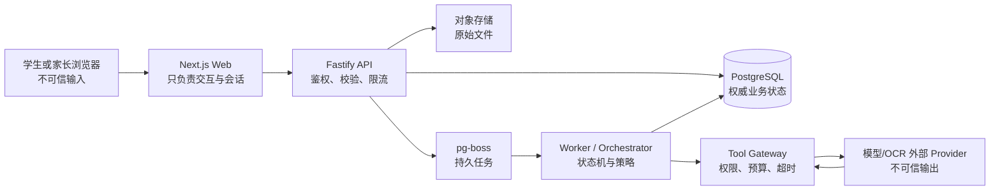
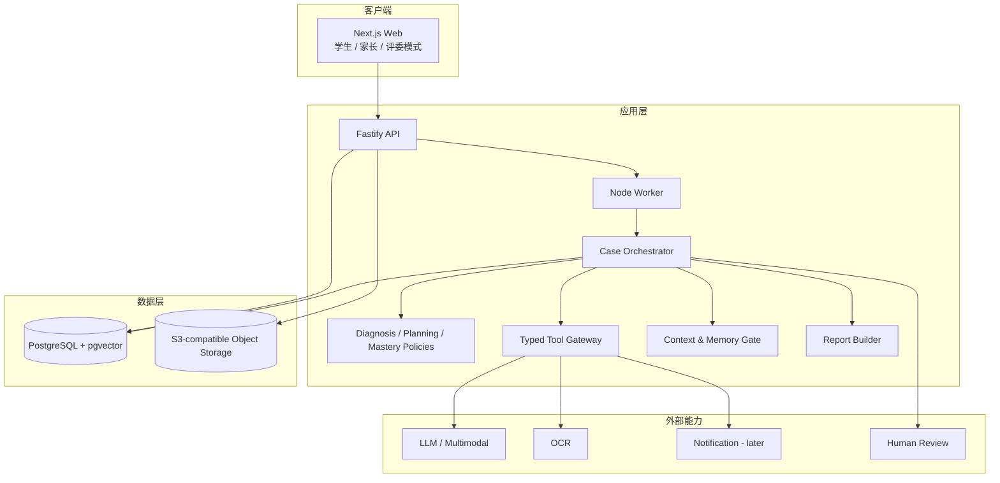

# 知隙 GapProof 技术设计文档（TDD）

> 本文回答“系统如何实现、什么由 AI 决定、什么绝不能由 AI 决定，以及 MVP 到长期产品如何平滑升级”。产品范围和验收以 `PRD.md` 为准，项目定位与跨文档决策以 `PROJECT_MASTER.md` 为准。

## 0. 给项目负责人的结论

### 0.1 最终推荐路线

GapProof 不需要先搭建一个复杂的“多 Agent 平台”。最合适的第一版是：

> 一个 TypeScript 模块化单体，内部由确定性状态机编排；AI 只在错因候选、解释、题目草案和报告措辞等边界清楚的节点工作；所有写库、评分、状态推进、权限、重试和回滚都由普通程序控制。

推荐技术栈：

| 层 | 采用方案 | 结论 |
|---|---|---|
| 代码语言 | TypeScript（`strict`） | 前后端、Schema、测试和工具契约统一一种语言 |
| 包管理 | Bun workspace | 保留用户熟悉且快速的安装与脚本体验 |
| 生产运行时 | Node.js 24 LTS | 比 Bun runtime 更稳妥地承载 Next.js、队列、监控和 Provider SDK |
| 仓库 | Bun workspaces；先不额外引入 Turborepo | 项目初期减少工具层；包数或 CI 明显变慢后再加入 Turborepo |
| Web 前端 | Next.js App Router + React + TypeScript | 桌面优先的响应式 Web，后续可扩展 PWA |
| API | Fastify + TypeBox/JSON Schema + OpenAPI | 独立、可验证、可供未来 App/教师端复用的 API 边界 |
| 后台任务 | 独立 Node Worker + pg-boss | OCR、模型调用、复测和报告不阻塞 Web 请求；无需额外 Redis |
| 数据库 | PostgreSQL 16+；开发与生产同引擎 | 避免 SQLite 到 PostgreSQL 的二次迁移；支持事务、JSONB、全文检索和审计 |
| ORM/迁移 | Drizzle ORM + 生成 SQL migration | TypeScript 友好、SQL 可见、适合复杂事件和 pgvector 查询 |
| 向量检索 | pgvector | 与权限、版本、教材元数据在同一事务和查询中处理 |
| 技能图谱 | PostgreSQL 邻接表 + 递归 CTE | MVP 不引入 Neo4j；图谱首先是受控课程数据，不是大规模图计算 |
| 文件存储 | `StorageAdapter`；本地开发用 MinIO/目录，部署用 S3 兼容对象存储 | 避免数据库存大图；可按地区替换供应商 |
| Agent 编排 | LangGraph.js + 自建 Case 业务状态机 | LangGraph 负责 Agent Run 的图、暂停、恢复和检查点；Case 状态机仍是业务真相 |
| 模型调用 | DeepSeek `deepseek-v4-flash` + MiniMax `minimax-m3`，统一 `ModelGateway` 和 Provider Adapter | 方向已决；具体接口、价格、QPS、限流、合规和数据处理协议待验证 |
| OCR | 阿里云读光教育试卷识别为主 + 腾讯云高精度 OCR 备用 | 方向已决；具体接口、价格、QPS、手写准确率、合规和服务合同参数待验证 |
| 校验 | TypeBox/JSON Schema 用于 HTTP/OpenAPI；Zod 用于模型输出和内部边界 | 两者职责明确，避免 Schema 散落在 Prompt 中 |
| 可观测 | Pino JSON 日志 + OpenTelemetry Trace + 数据库审计事件 | 同时满足开发排错、比赛演示和学习决策回放 |
| 测试 | Vitest + Playwright + 固定金标/合成 Case | 普通代码测试与 AI 非确定性评测分开 |
| 部署 | 杭州阿里云单区域联网 Docker Compose；`web`、`api`、`worker`、`postgres`、对象存储 | 方向已决；具体云资源、服务规格、价格、QPS、合规和合同参数待验证；暂不使用 Kubernetes、Kafka 和微服务 |

### 0.2 为什么改变主文档中的早期候选

主文档早期建议过 `FastAPI + SQLite + FAISS/pgvector + NetworkX`。那套方案本身可行，但对本项目不是最优：

- 用户已有 Next.js、React、JavaScript/TypeScript 和 Bun 经验；若后端改用 Python，会增加第二套类型、构建、测试、部署和排错体系。
- GapProof 从第一天就需要事件账本、幂等、并发版本、JSONB、全文/向量混合检索和延迟任务。SQLite 可做一次性原型，却会很快产生迁移成本。
- 技能图谱规模很小，关系表和递归查询足够。NetworkX 会额外引入 Python 运行环境，Neo4j 则会增加数据库运维。
- Agent 的主流程已经明确，不属于“路径未知、让模型自由探索”的问题；自建状态机更直接，也更容易向评委证明系统没有越权。

这不是否定 Python。若以后需要本地 PaddleOCR、复杂 NLP、IRT/BKT 训练或离线图算法，可把 Python 作为边界清晰的离线任务或独立适配器加入，而不是让 MVP 从第一天成为双语言系统。Agent Run 采用 LangGraph.js，但 Case 的业务状态仍由自建 TypeScript 状态机和 PostgreSQL 事件账本负责。

### 0.2.1 本轮已确定的模型与 OCR 组合

`[DECISION]` 本项目采用以下 Provider 优先级，但仍通过适配层隔离。模型、OCR、Embedding 和部署方向已决；具体接口、价格、QPS、限流、合规、数据处理协议和服务合同等落地参数待验证：

| 能力 | 主 Provider | 备用 Provider | 已确定内容 | 保留开放内容 |
|---|---|---|---|---|
| Agent 分析模型 | DeepSeek `deepseek-v4-flash` | MiniMax `minimax-m3` | DeepSeek 负责错因分析、工具调用、探针选择和失败重排；MiniMax 负责教学表达、报告和主模型降级 | 接口版本、思考开关、限流、价格和 API 数据处理协议 |
| 试卷 OCR | 阿里云读光教育试卷识别 | 腾讯云通用文字识别高精度版 | 读光优先处理整页试卷、题目结构和坐标；腾讯云负责通用 OCR、备用和交叉验证 | 具体读光接口、QPS、手写准确率、价格和服务合同 |
| 文档 Embedding | 腾讯混元 Embedding（1024 维） | 暂不启用本地 BGE-M3 | 进入 `EmbeddingProvider`，不与语言模型绑定 | 真实样例召回率、成本、QPS 和服务协议 |

主链路为：

```text
DeepSeek + 阿里云读光
```

购买教材/试题原文件及完整转换结果不是仓库内容：它们只允许位于 `.gitignore` 覆盖的 `reference/*/incoming`、`reference/*/private-ai-readable` 或等价私有目录。Git 可保存转换器、来源登记、文件哈希、许可/用途状态和可公开的项目原创/合成 Fixture，不保存购买内容全文、图片、答案页或听力原文件。

备用链路为：

```text
MiniMax + 腾讯云 OCR
```

模型和 OCR 均不得在浏览器调用。真实初中生数据接入前，必须单独确认中国大陆处理地区、保存期限、训练用途、未成年人条款、监护人同意和删除机制；“中国大陆可访问”不等于已经完成合规。

### 0.3 复杂度判断

| 子系统 | MVP 难度 | 主要难点 | 建议 |
|---|---:|---|---|
| 响应式前端与演示 Case | 中 | 多状态页面和可信 Demo 标记 | 先做一条主路径，不先做完整后台 |
| API、数据库和事件账本 | 中 | Schema、事务、幂等 | 第一周先固定契约再做 UI |
| OCR 与人工确认 | 中高 | 手写、批改痕迹、版面切分 | 只保证 Demo 样例；低置信必须确认 |
| 错因诊断 | 高 | 从表面错误到根因需要探针 | 用受控候选与规则，不做开放猜测 |
| Agent 状态机 | 中高 | LangGraph 检查点与业务事件账本的边界 | LangGraph 管 Agent Run；纯函数 Case 状态机管业务状态 |
| 知识库/RAG | 中高 | 版本适用性比“相似度”更重要 | 先元数据过滤，再全文与向量检索 |
| 掌握度更新 | 高 | 参数未经真人数据校准 | MVP 用可解释规则，不能宣称科学定标 |
| 未成年人隐私/版权 | 高 | 同意、删除、数据地区、教材授权 | Demo 只用合成/原创；真人试点前单独评审 |

## 1. 文档治理与术语

### 1.1 权威关系

- [PROJECT_MASTER.md](./PROJECT_MASTER.md)：项目定位、阶段、关键决策、状态和来源治理。
- [PRD.md](./PRD.md)：用户、业务范围、功能需求、流程和产品验收。
- [TDD.md](./TDD.md)：技术路线、系统边界、架构、数据、接口、部署和工程验收。
- [DESIGN.md](./DESIGN.md)：信息架构、页面、视觉、交互、状态与无障碍。

若发生冲突：产品范围以 PRD 为准；实现方式以 TDD 为准；重大变更同时回写主文档。TDD 不得用技术便利反向扩大 PRD。

### 1.2 状态标签

- `[DECISION]`：本轮已选择的技术方向。
- `[PROPOSED]`：有推荐但需要外部信息后确认。
- `[OPEN]`：当前不能安全锁定。
- `[MVP]`：比赛最小实现。
- `[LATER]`：可用产品或规模化阶段。
- `[OUT]`：明确不在当前系统边界内。

### 1.3 关键术语

- **Case**：围绕一组学习证据形成的持久化诊断与修复任务，不等于聊天会话。
- **Agent Run**：一次由事件触发、可以调用受限工具并产生结构化建议的执行。
- **Evidence Event**：学生作答、提示使用、OCR 确认、复测或人工修正等可追溯事实。
- **Skill State**：由证据规则计算的技能状态快照，不是永久能力标签。
- **Context Pack**：一次模型调用所需的最小授权上下文。
- **Knowledge Item**：有来源、版本、适用范围、许可和审核状态的知识条目。
- **Tool**：具有固定输入输出 Schema、权限、超时和失败语义的能力。

## 2. 架构目标与非目标

### 2.1 架构目标

1. 把产品闭环实现为可验证的状态转换，而不是若干聊天页面。
2. 让每个诊断、任务、重排和掌握结论都能回到证据、规则和版本。
3. 模型、OCR、对象存储和部署供应商可以替换，核心业务不随 Provider 改写。
4. 比赛 MVP 能由小团队在单机或单区域部署，长期可拆分但不提前微服务化。
5. 同一 Web 应用完整适配桌面和平板；手机保留网页访问、比例和内容适配，不承诺 MVP 完整端到端体验，也不为 MVP 建原生 iOS/Android App。
6. 默认保护未成年人数据：最小化、隔离、短期保存、可删除、可审计。
7. 对 AI 开发友好：目录清晰、类型统一、契约先行、测试夹具稳定、错误可复现。

### 2.2 架构非目标

- 不构建通用 Agent 平台。
- 不做自由群聊式多 Agent。
- 不把聊天记录当数据库或长期记忆。
- 不让 LLM 直接执行 SQL、改变 Case 状态或发送外部通知。
- 不在 MVP 引入 Kubernetes、Kafka、服务网格、事件流平台或独立向量数据库。
- 不在 MVP 做强化学习、自训练、在线微调或自动优化 Prompt。
- 不在 MVP 做真实学校系统、班级管理、支付、商业题库和大规模账号体系。
- 不承诺离线完整运行；仅为 Demo 准备预置 Case 和 Provider 失败回退。

## 3. 系统边界

### 3.1 MVP 功能边界

| 能力 | MVP 边界 | 长期扩展 |
|---|---|---|
| 用户入口 | 无需注册的预置 Case、上传、文字录入、快速诊断 | 真实学生/监护人账号、家庭多学生 |
| 证据输入 | 图片和文本；只保证受控 Demo 样例 | 多页试卷、PDF、音频、口语 |
| OCR | 图片质量、识别、切题、坐标、置信度、人工确认 | 多 Provider、批改痕迹和手写专用模型 |
| 课程范围 | 上海五四学制八上前四单元；内容需原创/授权 | 多版本、全年级、更多地区与学科 |
| 诊断 | 受控技能节点、竞争错因、短探针 | 数据驱动的信息增益与校准 |
| 教学 | 提示阶梯、微任务、原创练习 | 更丰富模态和教师共创 |
| 计划 | 7 日计划、时间预算、失败重排 | 实际日历、学期计划、跨 Case 优先级 |
| 主动性 | 演示时钟和事件按钮；仅应用内 | 经同意的真实通知和安静时段 |
| 评测 | 客观题规则评分；短写作形成性分析 | 人工复核、校准量表、语音/写作生产闭环 |
| 报告 | 学生版、家长版、评委 Trace 视图 | 教师、班级、趋势和机构视图 |

### 3.2 外部系统边界

MVP 可以调用但不拥有：

- 大模型/多模态模型 API。
- OCR API 或本地 OCR 容器。
- S3 兼容对象存储。
- 邮件、短信、微信等通知渠道（MVP 不实发）。
- 人工复核人员或教研审核流程。

所有外部能力必须通过 Adapter 接口进入。业务模块不得直接散落 Provider SDK 调用。

### 3.3 信任边界



边界规则：

1. 浏览器不能持有模型、OCR、数据库或对象存储长期密钥。
2. 上传文件、OCR 文本、教材内容和模型输出全部按不可信数据处理。
3. Provider 输出先过 Schema、引用、置信度和业务 Guard，才能成为建议。
4. 只有 Orchestrator 的命令处理器可发起 Case 状态转换。
5. 只有 Memory Gate 可提交长期记忆；Agent 只能提出候选更新。
6. 报告只读取已提交证据和状态，不从聊天文本重新猜结论。

### 3.4 AI 自主权矩阵

| 操作 | AI 可独立建议 | 程序自动执行 | 需用户/人工确认 | 禁止 |
|---|---:|---:|---:|---:|
| 生成多个错因候选 | 是 | 否 | 低置信时是 | 否 |
| 从审核题库选择探针候选 | 是 | Guard 通过后是 | 无合格题时是 | 否 |
| 客观题评分 | 否 | 是 | 答案冲突时是 | LLM 单独评分 |
| 更新掌握状态 | 否 | 规则满足后是 | 高风险/冲突时是 | 模型直接写库 |
| 重排 7 日任务 | 是 | 授权预算内是 | 延长时间时是 | 无上限加时 |
| 发送真实通知 | 可建议 | 仅已授权渠道 | 改频率/收件人时是 | 私自联系学校 |
| 写入长期偏好/画像 | 可建议 | Memory Gate 通过后 | 稳定档案变化时是 | 人格、心理、懒惰标签 |
| 删除数据 | 否 | 经授权工作流 | 是 | 只隐藏前端 |

## 4. 质量属性与工程预算

### 4.1 优先级

本项目优先级为：正确边界与可追溯 > 数据安全 > 可恢复 > 开发速度 > 延迟 > 极限吞吐。

### 4.2 MVP 目标值

以下是工程目标，不是学习效果承诺：

| 项目 | MVP 目标 |
|---|---|
| Web 首屏 | Demo 网络下主要页面可交互时间目标 ≤ 3 秒 |
| 普通 API | 不含外部 AI/OCR 的 P95 目标 ≤ 500 ms |
| AI/OCR 任务 | 异步运行；前端持续显示阶段、超时和可重试状态 |
| 状态一致性 | 同一 Case 关键转换串行；旧 `state_version` 更新 100% 拒绝 |
| 幂等 | 相同 Idempotency Key 不重复写证据、不重复更新掌握度 |
| 回放 | 30 个合成 Case 可从事件重建到相同业务状态 |
| 失败处理 | OCR 低置信、RAG 无来源、模型超时至少三类真实回退 |
| 可用性 | 主 Demo 在干净环境连续运行 10 次无阻断 |
| 浏览器 | 当前受支持的 Chrome、Edge、Safari；Playwright 完整覆盖桌面/平板，手机至少覆盖基础显示比例、内容适配和不溢出检查 |
| 可访问性 | 键盘可操作、可见焦点、语义标签、色彩不是唯一状态表达 |

精确阈值应在有真实运行基线后更新，不能把尚未测量的目标写成 `[RESULT]`。

## 5. 总体架构

### 5.1 模块化单体

逻辑上分模块，部署上先保持少量进程：



### 5.2 进程职责

- `web`：页面渲染、表单、上传交互、状态轮询/流式更新；不执行核心决策。
- `api`：HTTP 边界、身份/租户、Schema 校验、幂等、读取模型、创建命令。
- `worker`：消费持久任务，执行 OCR、检索、模型、报告和到期复测。
- `postgres`：业务事实、事件、知识、队列元数据和向量。
- `object-store`：原图、裁剪图、导出报告等二进制文件。

`api` 和 `worker` 使用同一套 domain packages，但以不同进程启动。后续负载增大时可独立扩容，不需要先改写业务代码。

## 6. 仓库与代码组织

### 6.1 推荐结构

```text
gapproof/
  apps/
    web/                    # Next.js
    api/                    # Fastify HTTP API
    worker/                 # pg-boss consumers and scheduler
  packages/
    contracts/              # TypeBox/JSON Schema、事件和错误码
    domain/                 # 实体、值对象、状态机、纯策略
    db/                     # Drizzle schema、queries、migrations
    agent/                  # orchestrator、context pack、memory gate
    tools/                  # typed tools 与 provider adapters
    knowledge/              # ingestion、hybrid retrieval、citations
    observability/          # logger、trace、redaction
    config/                 # env schema、feature flags、kill switches
    testkit/                # fixtures、fake providers、golden cases
  knowledge/
    skillpacks/             # 版本化 YAML/JSON/Markdown 受控知识
    sources/                # 只存可合法纳入仓库的来源元数据
  evals/
    golden/
    synthetic-cases/
    red-team/
  docs/
  infra/
    compose/
  scripts/
  bun.lock
  package.json
```

### 6.2 依赖方向

```text
apps -> application/domain -> contracts
apps -> adapters -> external SDKs
domain -X-> Fastify / Next.js / Provider SDK / Drizzle
```

核心状态机和掌握规则不得 import Web 框架、数据库驱动或模型 SDK。这样可用纯内存夹具测试，也最适合 AI 编码工具理解和修改。

### 6.3 TypeScript 规则

- `strict: true`、`noUncheckedIndexedAccess: true`、`exactOptionalPropertyTypes: true`。
- ESM 为默认模块格式。
- 禁止跨 package 深层路径引用；只走公开 `exports`。
- 时间统一保存 UTC ISO-8601；显示时使用用户时区。
- ID 统一使用 UUIDv7。
- 金额、概率和评分避免隐式浮点比较；规则阈值必须版本化。

## 7. 前端路线与多设备适配

### 7.1 采用 Next.js App Router

采用原因：

- 用户熟悉 Next.js/React，学习成本最低。
- 同一代码库可做服务端渲染、客户端交互和后续 PWA。
- 可按路由组织学生、家长和评委视图。
- Node.js 或 Docker 均可部署，不强绑定 Vercel。

约束：

- 核心业务写操作只能调用 Fastify API，不在 Server Action 内复制领域逻辑。
- Server Components 用于读取和首屏，复杂任务状态使用客户端组件。
- 上传采用直传对象存储的短期签名 URL；签发、确认和元数据仍走 API。
- 任务进度 MVP 可轮询；需要更实时体验时升级 Server-Sent Events，暂不引入 WebSocket。

### 7.2 响应式策略

| 设备 | MVP 支持 | 布局策略 |
|---|---|---|
| 桌面/笔记本 | 一级 | 双栏/三栏，显示任务、证据和 Trace |
| 平板横竖屏 | 一级 | 主任务 + 可折叠证据抽屉；触控目标 ≥ 44px |
| 手机 | 基础兼容与内容适配，不承诺完整体验 | 保持单列、比例、可读性和关键内容不溢出；底部主操作、相机上传和报告卡片化为后续完整体验空间 |
| 原生 App | 不做 | 后续从 PWA 或 React Native 单独评估 |

不使用仅鼠标悬停才能发现的关键操作。图片标注和答案确认必须同时支持鼠标、触控和键盘替代路径。

### 7.3 状态 UX 的技术要求

每个异步步骤必须有：

- `queued / running / needs_confirmation / succeeded / retryable_error / failed` 状态；
- 可理解的当前阶段；
- 超时后重试或转预置 Demo 的入口；
- `simulation=true`、`synthetic=true`、`fallback=true` 的显式标识；
- 刷新页面后从服务端恢复，不依赖前端内存。

### 7.4 UI 技术候选

Tailwind CSS 可随 Next.js 默认方案使用；组件层推荐 Radix Primitives + 项目自有组件封装，是否采用 shadcn/ui 由 [DESIGN.md](./DESIGN.md) 决定。TDD 不冻结颜色、字体和视觉风格。

### 7.5 当前“今日”页实现约束

- 学生首页的页面结构、色彩、圆角、文案和视觉验收以 `DESIGN.md` 5.6.1 与第 9、19 节为准；TDD 不复制或另行定义视觉 Token。
- “重点任务卡” CTA 和侧栏固定“开始学习”必须从同一 `current_task_id` 读取，并导航至同一路由/同一任务状态；不能在前端分别创建任务、写入完成状态或绕开 API。
- 本周学习足迹、待确认、最近进展、稍后继续和下次检查均为服务端任务/计划状态的只读投影；无数据、加载、失败和演示数据时必须使用 7.3 的状态 UX，不得伪造已完成或已掌握。
- 当前首页不依赖显式全局搜索或“新报告”提醒；后续增加紧凑搜索时，必须有键盘焦点、可访问名称和独立的空/失败状态。
- F0 Mock、F1b 只读 API、F1c ready D1 客户端作答与真实 overview 均已合并 `main` 并通过对应门禁。顶部栏、Logo/品牌位与侧栏固定，仅 `.content` 内容区滚动。无参数入口默认使用 API，只有显式 `?source=mock` 使用合成页面；D7 继续只读。

### 7.6 前端—API 集成执行规范 V1

本节是前端 Worktree 的当前执行基线，优先于前端自行约定：

- 本地端口固定为 Web `3000`、Fastify API `4000`、PostgreSQL `55432`；Worker 不开放 HTTP 端口。同一电脑并行启动第二个 Web 实例时才允许通过 `WEB_PORT` 改端口。
- 浏览器只请求同源 `/api/v1/**`。Next.js 将 `/api/:path*` 重写到服务端环境变量 `GAPPROOF_API_ORIGIN`（本地默认 `http://127.0.0.1:4000`）的 `/:path*`；不得把内网 API Origin 写入 `NEXT_PUBLIC_*`。
- MVP 不支持浏览器直接跨域访问 Fastify，因此不依赖 CORS。未来确需分域时，API 只接受显式 `WEB_ORIGINS` 白名单，并明确允许 `Content-Type` 与 `Idempotency-Key`；禁止生产环境 `Access-Control-Allow-Origin: *`。
- `packages/contracts` 是当前 HTTP DTO、TypeBox Schema 与错误包络的唯一可执行契约源；前端必须从 `@gapproof/contracts` 公共导出消费，不复制接口类型，不从数据库 Row 或自然语言文档反推字段。
- OpenAPI 3.1 自动生成仍为 `[PLANNED]`：后端后续从同一 Fastify/TypeBox 路由 Schema 导出并在 CI 检查漂移。前端 F0/F1 不等待生成客户端，先使用一个薄 `api-client` 包装器和共享 contracts；不得另建第二套 Schema。

`run-next` 返回 `202 + jobId` 后，当前没有公开 Job 查询路由。前端必须：

1. 保留 `jobId` 仅用于 Trace/问题报告，不根据它猜测业务状态；
2. 以提交时的 `expectedVersion` 为基准轮询 `GET /v1/cases/{caseId}`；
3. 间隔采用 `1s → 2s → 3s`，之后保持 `3s`，总计最多 `30s`；页面隐藏、路由离开或请求取消时停止；
4. 当 `stateVersion > expectedVersion` 且状态发生变化时停止并按服务端状态渲染；
5. 超时后显示“仍在处理，可稍后刷新”，不得自动重新提交 `run-next` 或伪造失败。

重试必须同时遵守 HTTP 语义、`error.retryable` 和幂等规则：

| 场景 | 自动行为 |
|---|---|
| GET 网络失败或临时 5xx | 最多自动重试 2 次并退避 |
| POST 网络结果未知或 `retryable=true` | 仅允许用完全相同的 Body 与同一个 `Idempotency-Key` 重试 1 次 |
| `VERSION_CONFLICT` | 自动 GET 最新 Case 1 次；不自动重复写操作 |
| `SCHEMA_INVALID`、`INVALID_INPUT` | 不重试；保留用户输入并显示可理解提示 |
| `INVALID_CASE_TRANSITION`、`INVALID_TASK_STATE`、`RESOURCE_NOT_FOUND`、`FORBIDDEN` | 不重试；刷新/退出到安全页面 |
| `IDEMPOTENCY_KEY_REUSED`、`STORED_EVENT_INVALID`、非可重试 `INTERNAL_ERROR` | 视为客户端或服务端缺陷；停止操作并显示 `requestId` 供排查 |

`POST /v1/cases/{caseId}/attempts` 已冻结为：请求 `{ expectedVersion, probeId, selectedChoiceId }`；成功数据为 `{ attemptId, caseId, state, stateVersion, probeId, selectedChoiceId, passed, selectedHypothesisId, scoringMethod: "exact_choice_v1" }`。所有写请求由一次用户意图生成一个 UUIDv7 幂等键，在最终成功、明确失败或用户主动重新开始前保持不变。

学习任务接口已冻结为：

- `GET /v1/students/{studentId}/today` 成功数据为 `TodayTasksView { studentId, timeZone, currentTaskId, tasks, overview }`。`timeZone` 必须是目标学生记录中可由 `Intl.DateTimeFormat` 接受的 IANA 标识；无效存储值返回 `STORED_STUDENT_INVALID`，不得回退系统或浏览器时区。
- API 必须始终填充 `overview`：`activityDays` 为截至注入 `Clock.now()`、按学生 IANA 时区计算的连续 7 个本地日及真实 completed task 数；`weeklyGoal` 在没有权威存储前固定为 `null`；`pendingConfirmationCount` 仅统计该学生未删除的 `awaiting_confirmation` Case；`recentProgress` 按 `occurredAt DESC, eventId DESC` 稳定取最多 2 条公开映射，禁止输出 payload、答案或选项；`nextCheck` 只取最早 scheduled D1/D7，不能复制 ready current task。
- `TodayTasksView.overview` 仅为 contract-first 合并期间保持 Schema 可选；当前 API 实现必须返回，显式 API 前端必须视为必需字段。缺失时进入 `TODAY_OVERVIEW_MISSING`，不得回退 Mock。周目标、掌握度和学习效果不得从任务数量、视觉稿或 Fixture 推断。
- `currentTaskId` 为 `uuid | null`，只指向服务端判定的当前可行动 ready D1、ready D7 或 ready guided 任务。只有 scheduled、无任务或全部完成时为 `null`。多个候选按 `dueAt ASC NULLS LAST → taskType（d1_retest → d7_retest → guided_intervention）→ createdAt → taskId` 稳定选择；前端不得猜测替代任务。
- `LearningTaskView` 是 `guided_intervention | d1_retest | d7_retest` 的 TypeBox 判别联合。三类共享 `id`、`caseId`、`studentId`、`status`、`title`、`rationale`、`estimatedMinutes`、`scheduledFor`、`dueAt`、`completedAt`；guided 独有 `steps`，D1/D7 独有公开 `item { id, prompt, choices[] }`。公开题目不得包含答案键或内部评分映射。
- `GET /v1/tasks/{taskId}` 返回同一公开 `LearningTaskView` 判别联合；资源缺失返回 `RESOURCE_NOT_FOUND`。
- `POST /v1/tasks/{taskId}/submit` 要求 `Idempotency-Key`，请求为 `{ expectedVersion, completedStepIds: string[] }`；成功数据为 `{ caseId, state: "d1_scheduled", stateVersion, completedTask, scheduledRetest }`。
- 干预任务提交必须恰好覆盖服务端任务的全部步骤；不完整或额外步骤返回 `INVALID_INPUT`。非 `ready` 干预任务返回 `INVALID_TASK_STATE`；旧 Case 版本返回 `VERSION_CONFLICT`；非法 Case 状态返回 `INVALID_CASE_TRANSITION`；资源缺失沿用 `RESOURCE_NOT_FOUND`。
- 幂等重放返回 `200`，同一个 key 配不同 Body 返回 `IDEMPOTENCY_KEY_REUSED`；并发相同提交只允许一个 `intervention_completed` 事件和一个 D+1 任务。
- 公开 DTO 禁止包含 `selectedHypothesisId`、答案键、工具 `warnings` 或内部版本；前端只能消费共享 contracts，不得从数据库 payload 反推私有字段。

D1 客观复测 attempts 已冻结为：

- `POST /v1/tasks/{taskId}/attempts` 必须携带 `Idempotency-Key`，请求为 `{ expectedVersion, itemId, selectedChoiceId }`；仅接受 `ready d1_retest + Case.state=d1_scheduled`。
- 成功数据为 `{ attemptId, caseId, taskId, itemId, selectedChoiceId, passed, scoringMethod:"exact-choice-v1", state, stateVersion, completedTask, scheduledRetest }`；D1 `state` 为 `d7_scheduled | replan_required | support_required`，D7 `state` 为 `repair_verified | replan_required | support_required`。`selectedChoiceId` 只回显当前用户自己的提交；答案键、内部映射和完整评分证据禁止进入 Today、任务详情或公开响应。
- 评分时刻 `evaluatedAt` 由服务端注入的 `Clock.now()` 提供并以 UTC 持久化。通过分支在同一事务完成 D1、追加唯一 `retest_evaluated { kind:"d1", passed:true }`、推进 Case 至 `d7_scheduled`、创建 D7 任务与延迟 `retest.due` Job；`d7ScheduledFor = d1EvaluatedAt + 144h`，`dueAt = d7ScheduledFor + 12h`。若 D1 延迟完成，用户文案不得误导为严格自然日“第 7 天”。
- D1/D7 失败读取服务端持久 `cases.replan_count`：小于 2 时在同一事务推进 `replan_required` 并只入队一个 `case.replan`；等于 2 时推进 `support_required` 且不得再入队。Worker 以 `plan_replanned { replanIndex:1|2, strategy }` 原子递增计数；策略依次为 `alternate_explanation_and_practice`、`prerequisite_skill_with_example`。当前内容仍是明确标记的规则化合成骨架，不得描述为真实个性化或已接人工服务。
- 首次成功响应按幂等键冻结；相同 key/body 的顺序或并发重放返回同一响应，不重复事件、任务或 Job。同 key 异 Body 返回 `IDEMPOTENCY_KEY_REUSED`；旧版本返回 `VERSION_CONFLICT`；Schema、输入、任务状态和资源错误分别使用 `SCHEMA_INVALID`、`INVALID_INPUT`、`INVALID_TASK_STATE`、`RESOURCE_NOT_FOUND`。前端只在网络结果未知或 `retryable=true` 时用同 key/body 重试一次；版本冲突先 GET Case，禁止自动重交。
- D7 到期激活复用 `retest.due`，ready D7 复用同一 `POST .../attempts` 请求体与私有 `exact-choice-v1` 评分；通过时完成 D7、写 `retest_evaluated { kind:"d7", passed:true }` 并进入 `repair_verified`，不进入 `report_ready`。失败按上述持久上限进入 `replan_required` 或 `support_required`。D1 保留既有 `d1-retest-attempt:` 内部幂等命名空间以支持部署前事件重放，D7 使用独立 `d7-retest-attempt:`，同一公开 key/body 的顺序与并发重放保持单事件。
- 异步报告本轮 deferred。后续状态契约必须区分 `report_generating`、`report_ready` 与受控失败态；只有报告资源已成功生成、包含权威证据引用且当前可读取时才能写 `report_ready`，Job queued/processing 不得冒充 ready。

F1b Server Component 在服务端使用私有 `GAPPROOF_API_ORIGIN` 组成绝对 URL 并设置 `cache:"no-store"`；浏览器端仍只允许同源 `/api/v1/**`。无参数与 `?source=api` 均进入正式 API 模式，只有 `?source=mock` 可启用合成页面；API 空列表、缺失 current/overview、无效学生时区或配置/网络错误不得回退 Mock。

F1c 为服务端 `currentTaskId` 指向的 ready D1/D7 增加客户端作答：提交前 GET Case 获取权威 `stateVersion`，请求/响应直接消费共享 contracts。一次已确认用户意图生成一个浏览器 UUIDv7 幂等键；`apiPost` 对网络结果未知或显式可重试错误只用同 key/body 重试一次。`VERSION_CONFLICT` 只刷新最新 Case 并要求再次确认，不自动重交；两次网络结果仍未知时锁定选择和提交。`support_required` 只显示达到两次自动重排上限、需要老师或家长协助，不声称已接人工服务。

Demo 虚拟时钟接口已冻结为：

- `POST /v1/demo/clock/advance` 仅在 `GAPPROOF_DEMO_CLOCK_ENABLED === "true"`（或测试显式注入）时注册，关闭时路由为 `404`；必须携带 `Idempotency-Key`。
- 请求为 `{ caseId, clockId, expectedClockVersion, advanceBySeconds }`；三个 ID/版本字段按共享 Schema 校验，`advanceBySeconds` 为 `1..2678400` 秒。
- 成功数据为 `{ caseId, clockId, clockVersion, previousEffectiveNow, effectiveNow, activatedTaskIds }`；时间为 ISO 8601，任务 ID 稳定排序，不返回答案或内部 payload。
- 相同幂等键同 Body 重放返回原响应；同 key 异 Body 返回 `IDEMPOTENCY_KEY_REUSED`。旧时钟版本返回 `VERSION_CONFLICT`，`details={ resource:"demo_clock", resourceId, expected, actual }`；Case 已绑定其他时钟返回 `DEMO_CLOCK_MISMATCH`；非 `simulation` Case 返回 `DEMO_CASE_REQUIRED`。

## 8. API 与后端选择

### 8.1 为什么选择 Fastify

Fastify 提供清晰的插件边界、生命周期、请求/响应 Schema、结构化日志和 OpenAPI 生态，适合独立 API 与 Worker。与 NestJS 相比更轻，与 Hono 相比在传统 Node 服务、插件和后端运维方面更成熟；与 Next.js Route Handlers 相比更容易承载长任务、版本化 REST API 和未来多客户端。

### 8.2 API 风格

选择 REST + OpenAPI 3.1，不选择 tRPC 作为公开边界：

- OpenAPI 可供 Web、未来 App、测试脚本和其他语言复用。
- API Schema 可作为比赛开源成果。
- 与 Provider、Python 辅助服务或第三方集成更解耦。
- tRPC 的端到端类型体验很好，但会把未来客户端更紧地绑定 TypeScript 实现。

### 8.3 Schema 分工

- HTTP 请求/响应、事件公共契约：TypeBox/JSON Schema，生成 OpenAPI。
- 模型结构化输出：Zod；解析后转换为领域命令/建议。
- 数据库：Drizzle schema；不能直接当 API Schema 暴露。
- 跨层共享的是明确 DTO，不共享数据库 Row 类型。

### 8.4 API 约束

- 所有写请求接受 `Idempotency-Key`。
- 所有响应返回或记录 `request_id` 与 `trace_id`。
- 采用 `/v1` 版本前缀；破坏性变更新建版本。
- 错误使用稳定错误码，如 `OCR_LOW_CONFIDENCE`，不能只返回自然语言。
- 文件不经过 API 内存中转；使用签名 URL 和上传完成确认。
- 客户端不能调用通用 `advance` 来任意跳状态；服务端根据事件与 Guard 决定合法下一步。

### 8.5 MVP API（唯一正式路由）

```text
POST   /v1/cases
POST   /v1/cases/{caseId}/evidence/upload-intent
POST   /v1/cases/{caseId}/evidence/confirm-upload
POST   /v1/cases/{caseId}/extraction/confirm
POST   /v1/cases/{caseId}/commands/run-next
POST   /v1/cases/{caseId}/attempts
GET    /v1/cases/{caseId}
GET    /v1/cases/{caseId}/hypotheses
GET    /v1/cases/{caseId}/timeline
GET    /v1/students/{studentId}/today
PATCH  /v1/students/{studentId}/learning-budget
GET    /v1/students/{studentId}/skill-map
POST   /v1/tasks/{taskId}/submit
GET    /v1/tasks/{taskId}
POST   /v1/tasks/{taskId}/attempts
GET    /v1/reports/{reportId}
POST   /v1/reviews
DELETE /v1/students/{studentId}/data

# 仅 Demo 环境且有环境级开关
POST   /v1/demo/clock/advance
POST   /v1/demo/faults/inject
POST   /v1/demo/cases/reset
```

`run-next` 只请求系统继续处理，不携带目标状态。状态机拒绝任何不合法跳转。所有写请求使用 `Idempotency-Key`；异步操作返回 `jobId`；列表使用 `limit` + `cursor`。

`PATCH /v1/students/{studentId}/learning-budget` 是家长调整每日学习时间的正式接口。请求至少包含 `dailyMinutes`、`effectiveFrom` 和 `expectedVersion`；服务端必须校验家长权限、记录 `LEARNING_BUDGET_UPDATED` 事件、重算尚未开始的未来任务，并保留 D+1/D+7 复测节点。已完成任务和历史证据不得被静默改写；计划变化必须返回原因、影响和新的版本号。

统一成功响应：

```ts
type ApiResponse<T> = { data: T; requestId: string; traceId: string; jobId?: string };
```

统一错误响应：

```ts
type ApiErrorResponse = {
  error: { code: string; message: string; retryable: boolean; details?: unknown };
  requestId: string;
  traceId: string;
};
```

API 错误码至少包括：`INVALID_INPUT`、`SCHEMA_INVALID`、`UNAUTHORIZED`、`FORBIDDEN`、`RESOURCE_NOT_FOUND`、`VERSION_CONFLICT`、`INVALID_CASE_TRANSITION`、`INVALID_TASK_STATE`、`IDEMPOTENCY_KEY_REUSED`、`STORED_EVENT_INVALID`、`STORED_STUDENT_INVALID`、`DEMO_CLOCK_MISMATCH`、`DEMO_CASE_REQUIRED`、`LOW_CONFIDENCE`、`NO_SOURCE`、`SOURCE_CONFLICT`、`PROVIDER_TIMEOUT`、`PROVIDER_RATE_LIMITED`、`PROVIDER_UNAVAILABLE`、`HUMAN_REVIEW_REQUIRED`、`TOOL_DISABLED`、`INTERNAL_ERROR`。

## 9. Agent 技术路线

### 9.1 Agent 在本项目中的定义

GapProof 的 Agent 是“能围绕持久目标观察事件、选择受限工具、更新计划并验证结果的应用系统”，不是一个带长 Prompt 的聊天机器人。

实现分三层：

1. **确定性控制层**：状态机、Guard、权限、预算、重试、幂等、评分、掌握更新和调度。
2. **受控 AI 能力层**：提出候选错因、解释证据、生成受约束草案、形成角色化文案。
3. **工具与知识层**：OCR、RAG、题库、评分、对象存储、报告和人工复核。

### 9.2 不采用自由多 Agent

“诊断器、教学器、评测器、报告器”是逻辑职责模块，不是能彼此自由聊天的自治进程。它们通过版本化 DTO 和事件交接，不传长篇自然语言历史。

优点：

- 状态与权限清楚；
- 成本和延迟可控；
- 能重放失败；
- 可对每一职责单独评测；
- 更符合未成年人教育的可解释和人工覆盖要求。

缺点：

- 初期需要认真定义 Schema 和 Guard；
- 比“让模型自己循环”代码更多；
- 新流程需要显式增加状态与迁移。

这些成本正是本项目的核心工程价值，不应交给框架隐藏。

### 9.3 状态机实现

主状态沿用主文档：

```text
CASE_CREATED
→ EVIDENCE_PENDING
→ PARSING
  ↘ NEEDS_CONFIRMATION → PARSING
→ EVIDENCE_ACCEPTED
→ HYPOTHESIZING
→ PROBE_READY
→ PROBING
  ↘ MORE_EVIDENCE → PROBING
→ ROOT_CAUSE_READY
→ INTERVENTION_READY
→ INTERVENTION_ACTIVE
→ D1_SCHEDULED
→ VERIFYING
  ↘ REMEDIATING → HYPOTHESIZING
→ VERIFIED
→ REPORT_DELIVERED
```

全局异常状态：`ESCALATED`、`BLOCKED_BY_POLICY`、`CANCELLED`、`RETRYABLE_ERROR`。

状态机使用普通 TypeScript 的 transition table 与纯函数 reducer；LangGraph 只作为 Agent Run 执行层，不作为 Case 业务状态的权威来源。每个 transition 定义：

```ts
type TransitionSpec = {
  from: CaseState;
  eventType: CaseEventType;
  guard: (snapshot: CaseSnapshot, event: CaseEvent) => GuardResult;
  decide: (snapshot: CaseSnapshot, event: CaseEvent) => DomainCommand[];
  to: CaseState | ((result: CommandResult[]) => CaseState);
  timeoutMs?: number;
  retryPolicy?: RetryPolicy;
  compensation?: CompensationCommand;
};
```

一次状态转换的数据库事务至少写入：业务变更、`case.state_version + 1`、领域事件和审计摘要。外部 Provider 调用不能放在数据库事务内；先写 Outbox/Job，再由 Worker 执行，完成后产生新事件。

### 9.3.1 LangGraph.js 的职责边界

LangGraph.js 负责一次 Agent Run 内部的有向执行图：

```text
读取事件
→ 组装 Context Pack
→ 检索课程/技能知识
→ 生成竞争性错因候选
→ 选择或调用诊断探针
→ 生成结构化 DecisionProposal
→ 等待确认或返回 Orchestrator
```

它可以使用 PostgreSQL Checkpointer 保存运行快照，但 PostgreSQL 中的 GapProof `case`、`learning_evidence_event`、`student_skill_state` 和审计事件仍是业务事实源。LangGraph checkpoint 与 Case event 不得互相替代。

### 9.4 Agent 运行协议

每次 Agent Run：

1. 读取触发事件和当前 `state_version`。
2. Context Gateway 组装最小 Context Pack。
3. Policy 决定是否需要模型/工具以及允许范围。
4. Tool Gateway 校验权限、预算、Schema、超时和 Kill Switch。
5. Provider 返回后进行结构校验和语义 Guard。
6. 生成 `DecisionProposal`，不直接改状态。
7. Orchestrator 在事务内提交合法命令与事件。
8. 记录模型、Prompt、知识、工具和策略版本。

### 9.5 模型输出契约

模型不得返回隐藏推理链。只允许返回：

```ts
type DecisionProposal = {
  conclusion: string;
  evidenceRefs: string[];
  confidence: number;
  unresolvedQuestions: string[];
  proposedActions: ProposedAction[];
  knowledgeRefs: string[];
  warnings: string[];
};
```

失败策略固定为：结构修复一次 → 更保守 Provider/规则降级一次 → 停止并进入确认/人工复核。禁止无限自我调用。

### 9.6 模型网关

```ts
interface ModelGateway {
  generateStructured<T>(request: StructuredModelRequest<T>): Promise<ModelResult<T>>;
  analyzeImage<T>(request: VisionModelRequest<T>): Promise<ModelResult<T>>;
  embed(request: EmbeddingRequest): Promise<EmbeddingResult>;
}
```

每个 Provider Adapter 负责：

- 鉴权、地区 Endpoint 和数据处理配置；
- 模型名映射；
- 超时、重试和限流；
- Token/费用记录；
- 结构化输出差异；
- 内容安全返回；
- 可观测字段脱敏。

业务模块只依赖 `ModelGateway`。模型选择通过配置和能力注册表完成，不把具体模型名写死在领域代码或数据库业务规则中。

### 9.7 Agent 框架选择

| 方案 | 优点 | 缺点 | 决定 |
|---|---|---|---|
| 自建 TS 状态机 | 完全贴合冻结业务状态；最强可测试、可回放、可解释 | 需要自己写 Guard、迁移和可视化 | `[DECISION]` Case 业务状态权威 |
| LangGraph.js | 有 checkpoint、interrupt、持久化和图工作流，适合 Agent Run | 引入 thread/checkpoint 语义，需要与业务事件账本分层 | `[DECISION]` Agent 工作流框架 |
| AI SDK Agent/ToolLoop | TS/React 生态好、Provider 和工具调用方便 | 默认是模型循环，不应承载教育状态和权限 | `[PROPOSED]` 仅用于 UI 流式交互或模型调用封装 |
| XState | 状态图成熟、可视化强 | 持久事件、作业、Provider 调用仍需自建；会增加抽象层 | `[LATER]` 状态维护困难时评估 |
| Temporal | 长流程、重试、恢复极强 | 运维和学习成本远超 MVP | `[LATER]` 跨月流程和较大规模后评估 |

替换门槛：只有当 LangGraph.js + pg-boss 无法满足跨月暂停、复杂补偿或大规模并发，且已有自动测试基线时，才引入 Temporal。迁移时 PostgreSQL 事件账本仍是业务事实源。

### 9.8 模型 Provider 选择

#### DeepSeek：主 Agent 分析模型

用于错因假设、工具调用、探针选择、上下文分析和失败重排。优先使用非思考模式完成结构化抽取，使用思考模式处理复杂诊断；思考模式的 `reasoning_content` 由 Adapter 处理，不写入学生长期记忆，也不展示给学生。

DeepSeek 使用 `deepseek-v4-flash`。默认非思考模式处理结构化任务；复杂诊断才启用思考模式。严格 Tool Schema 和 JSON Output 仍必须经过本地 Schema 校验、超时、重试和保守降级；`reasoning_content` 不写入学生记忆或展示给学生。

#### MiniMax：教学表达与备用模型

使用 `minimax-m3`，前提是当前账号已确认可调用。用于苏格拉底式反馈、学生解释、家长报告和 DeepSeek 不可用时的降级。Adapter 必须保留模型配置开关；若供应商调整模型 ID，只改配置，不改领域代码。

#### 统一 Provider 接口

```ts
interface ModelGateway {
  generateStructured<T>(request: StructuredModelRequest<T>): Promise<ModelResult<T>>;
  callTools(request: ToolCallRequest): Promise<ToolCallResult>;
  analyzeImage<T>(request: VisionModelRequest<T>): Promise<ModelResult<T>>;
}
```

模型分工固定为：客观题评分和掌握状态更新不由模型直接决定；模型只能返回有证据引用的结构化建议。

## 10. Context 与长期记忆

### 10.1 Context Pack

每次模型调用只装配：

```text
安全与授权约束
+ 当前 Case 状态和允许动作
+ 当前技能直接相关的学生事实
+ 最近有效证据
+ 经地区/年级/版次/单元过滤的知识
+ 可用工具及预算
+ 强制输出 Schema
```

Context Pack 保存 Manifest，不保存模型内部推理：

```ts
type ContextManifest = {
  manifestId: string;
  traceId: string;
  caseId: string;
  stateVersion: number;
  itemRefs: Array<{ id: string; version: string; purpose: string }>;
  omittedCount: number;
  estimatedTokens: number;
  policyVersion: string;
};
```

### 10.2 长期记忆类型

- 稳定档案：用户/监护人声明，改变需确认。
- 技能状态：由版本化规则从证据计算，可衰减和被新证据推翻。
- Case 状态：Case 关闭后归档。
- 偏好：有 TTL，不能转成“学习风格”标签。
- 推断性记忆：必须有来源、置信度、TTL 和冲突状态。
- 原图、音频、完整对话：短期资产，不作为永久记忆。

### 10.3 Memory Gate

`MemoryCandidate` 必须通过：证据绑定、事实类型、置信度、权限、敏感性、冲突、TTL、是否需确认。通过后写入新版本；冲突不覆盖旧值，而是生成 conflict 记录等待解决。

## 11. 知识库与 RAG

### 11.1 不是“把教材扔进向量库”

GapProof 的知识库首先是受治理的数据产品。每条内容必须有：

- 地区、学制、年级、教材、版次、单元和技能；
- 来源、页码/位置、版权/许可、允许用途；
- 作者、审核人、审核状态、版本和 checksum；
- 生效/失效时间；
- 是否可以出题、展示、派生、向量化和再分发。

没有授权的教材正文不得进入可分发仓库或公开向量库。引用许可和数字化/派生许可不是同一件事。

当前教材/试题的来源与权利事实分开存储：`acquisition_method=online_purchase`，`permission_assertion=user_asserted_permitted`，`external_license_evidence=pending`。系统不得把“线上购买”或“用户声明可公开展示”自动映射为 `licensed` 或“出版社授权已核验”。

混合试题不得批量直接向量化。进入受控知识库前必须先完成 `source_asset` 清点、SHA-256、学生版/答案版/解析版角色分流、单元/题型分类、答案关联、适用范围与权利状态审核；答案键和解析内容使用独立权限域，默认不进入学生检索上下文。

### 11.2 存储设计

PostgreSQL 同时保存：

- 课程规范与来源元数据；
- 技能节点和前置边；
- 错因、探针、教学策略；
- 原创/授权题目和量表；
- 可检索文本块、全文索引和向量；
- 版本、审核和许可状态。

私人学生记忆与全局课程知识使用不同 schema/table 和权限策略。任何检索先确定租户与知识域，再检索，不能先全库向量召回后再过滤。

### 11.3 混合检索流程

```text
Query Intent
→ 强制元数据过滤（地区/年级/教材/版次/单元/技能/审核/许可）
→ PostgreSQL 全文检索 + pgvector 相似度
→ 规则重排、去重和来源多样性检查
→ 适用范围/版本冲突检查
→ 返回片段、引用 ID、版本和 warnings
```

小规模数据优先精确向量搜索，不急于建立 HNSW。只有在数据量和延迟实测需要时增加 HNSW，并用黄金查询测召回率变化。

### 11.3.1 检索框架与数据库查询边界

- `[DECISION]` 知识检索可使用 LangChain.js 的 `Document`、`Retriever` 和文本切分工具，但 `KnowledgeService` 仍由项目自建，负责版次/地区/单元/技能过滤、权限、来源引用、许可状态和冲突处理。
- 学生主链默认使用 2-Step RAG：先由程序确定检索范围，再执行全文 + 向量检索；只有诊断分支在固定工具白名单内允许 Agentic Retrieval。
- 业务数据查询必须经过 Drizzle Repository 或固定的只读工具，例如 `get_student_skill_state`、`get_case_timeline`、`retrieve_curriculum`、`find_diagnostic_probes`、`get_today_tasks` 和 `get_retest_status`。
- `[OUT]` 不允许 LLM 直接生成或执行任意 SQL，也不允许通过自然语言查询绕过租户、学生、教材版本和权限过滤。后续家长/教师分析如需自然语言查询，只能基于只读视图、字段白名单、SQL AST 检查、行数/超时限制和审计日志实现。

### 11.4 技能图谱

核心表：

```text
skill_nodes(id, canonical_name, can_do, grade, unit, version, review_status, ...)
skill_edges(from_skill_id, to_skill_id, edge_type, rationale, confidence, version, ...)
misconceptions(id, skill_id, observable_pattern, competing_with[], ...)
diagnostic_probes(id, target_skill_id, hypotheses_tested[], scoring_method, ...)
```

前置查询使用递归 CTE；路径深度设上限；发布前检查环、孤立节点、重复边和版本混用。MVP 不使用 Neo4j。若未来跨学科图谱达到大规模且需要复杂路径算法，再以只读副本或专用图服务扩展。

### 11.5 内容生产与上线门禁

```text
draft → machine_checked → human_reviewed → approved → published
                                         ↘ rejected / superseded
```

模型生成的题只能进入 `draft`。确定性校验至少检查答案唯一性、选项数量、语言格式、目标技能、难度声明、版权来源和敏感内容。Demo 主链优先使用 `approved` 的人工预审题；现场生成仅展示为受控能力，不作为唯一成功路径。

## 12. 数据架构

### 12.1 为什么 PostgreSQL 从第一天开始

优点：

- 事务、外键、唯一约束和乐观锁适合状态机；
- JSONB 可保存版本化事件 payload，但核心字段仍可索引；
- 全文检索和 pgvector 能构成一个可治理的知识查询；
- pg-boss 复用同一数据库提供持久任务；
- 后续托管、自建、国内云或海外云都可选择。

缺点：

- 本地开发比 SQLite 多一个容器；
- 备份、升级和连接池需要运维；
- 大规模队列和向量最终可能需要独立系统。

对 GapProof 来说，这些成本小于 SQLite 迁移带来的双重测试、方言差异和数据迁移风险。

### 12.2 Drizzle 使用规则

- TypeScript schema 为代码侧源，生产变更必须生成并审查 SQL migration。
- 开发临时 `push` 不得用于生产。
- 复杂 pgvector、全文、递归 CTE 可写审查过的 SQL，不强求所有查询都用 ORM DSL。
- Migration 只向前；破坏性列变更采用 expand → backfill → switch → contract。
- 每次发布记录 schema version。

### 12.3 PostgreSQL schema 分区

建议使用逻辑 schema：

```text
app       学生、Case、任务、报告
evidence  只追加证据、尝试和技能状态
agent     run、decision、tool、context、prompt/model version
knowledge 课程、技能、错因、题目、向量和来源
privacy   同意、保留、删除任务、审计
demo      合成 Case 和虚拟时钟，仅 Demo 环境
```

### 12.4 核心不变量

1. Case 的 `state_version` 单调递增。
2. 每个 Evidence Event 有唯一 `event_id` 和业务幂等键。
3. `student_skill_state` 是缓存快照；权威依据是证据事件和策略版本。
4. 人工修正生成新事件，不静默改历史。
5. 报告中的每个重要结论都有 `evidence_refs`。
6. Demo 虚拟时间不能修改系统真实时间，也不能进入生产表。
7. Provider 原始响应默认短期保存且需脱敏；长期保存结构化必要字段。

### 12.5 对象存储

- 数据库只存对象 key、hash、MIME、大小、来源、所有者、保留期限和处理状态。
- 上传使用短期签名 URL；完成后验证大小、MIME、hash 和恶意文件风险。
- 原图和派生裁剪图分开记录 lineage。
- 默认拒绝公开 ACL。
- 删除工作流同时处理原图、派生图、缓存、向量和报告。

`[PROTOTYPE]` 当前最小实现使用 `SourceAssetStorage` 与 `LocalDirectorySourceAssetStorage`，只有同时配置 `GAPPROOF_UPLOAD_DIR` 和 `GAPPROOF_UPLOAD_SIGNING_SECRET` 才启用。`POST /v1/source-assets/uploads` 要求 `Idempotency-Key`，对学生及可选 Case 做归属校验，创建 `pending_upload` 元数据并返回 10 分钟 HMAC-SHA256 上传 token；token 绑定 asset/student/hash/size/MIME/expiry。浏览器随后经同源 `/api/v1/source-assets/{assetId}/content` PUT 原始字节，API 使用 `x-gapproof-upload-token`、常量时间签名校验及实际 MIME/大小/hash 校验，受控目录以完整临时文件的原子硬链接落盘，再将元数据标记为 `uploaded`。相同字节的重复 PUT 幂等；内容不匹配保持 `pending_upload` 可重试。该目录适配器只用于本地 Demo，不等同于生产 S3、恶意文件扫描、OCR 或完整删除工作流。

`[PROTOTYPE]` 上传完成后，`POST /v1/source-assets/{assetId}/commands/prepare` 以空 DTO 和 `Idempotency-Key` 将 `uploaded` 原子推进为 `queued`，事务内向 `source_asset.quality_check` 发送仅含 `{assetId}` 的稳定 ID Job；重放或在 queued/processing/final 状态使用其他 key 都只返回权威状态，不重复入队。Worker 必须配置非空 `GAPPROOF_UPLOAD_DIR`，否则在数据库/队列启动前以 `WORKER_NOT_CONFIGURED` fail fast。Worker 从受控目录重新读取字节并核对 size/SHA-256，解析 JPEG SOF、PNG IHDR、WebP VP8/VP8L/VP8X header 与尺寸；MIME 不匹配、截断/非法图片、超过 1 亿像素、存储缺失/不匹配进入受控失败，宽或高低于 640×480 进入 `needs_confirmation`，其余进入 `succeeded`。`GET /v1/source-assets/{assetId}` 只公开 stage/status、声明 MIME、大小和 `image-header-v1` 质量事实，不公开对象键、token、文件名、hash、OCR 文本或置信度。该检查不等同于模糊度、方向、缺页、恶意文件扫描或 OCR。

基础检查成功响应不得创建/绑定 Case 或启动 OCR。后续真实链路必须另行冻结“开始识别并创建案例”命令：独立 `Idempotency-Key`、明确 asset/学生归属、可审计的处理告知与监护确认事实，并在同一事务建立 Case 绑定和识别 Job；凭据/Provider 缺失时 fail closed。当前命令、asset↔Case DTO、识别读取与确认写入均未实现，不能从 Demo 页面反推。

## 13. 后台任务、调度与主动性

### 13.1 选择 pg-boss

pg-boss 运行在 PostgreSQL 上，适合初期的 OCR、模型、报告、D+1/D+7 到期任务、重试和死信队列，无需额外维护 Redis。

优点：基础设施少、事务内入队、延迟任务和重试直接可用。缺点：高吞吐时会与业务数据库竞争资源；工作流可视化和跨语言能力弱于 Temporal。

### 13.2 Job 规则

- Job payload 只放 ID 和版本，不放大段隐私文本或图片。
- Queue 按能力划分：当前已实现 `source_asset.quality_check`、`case-run-next`、`case.replan`、`retest.due`；规划中的 `ocr.parse`、`knowledge.embed`、`report.render`、`privacy.delete` 只有在对应能力实现时才能启用。
- 每个 Job 有业务幂等键、超时、有限重试、退避和死信队列。
- Provider 429/5xx 为可重试；Schema 错误、权限拒绝和无授权来源通常不可盲重试。
- 到期复测创建应用内任务；MVP 不自动对外发送通知。

### 13.3 虚拟时钟

Demo 使用 `demo_clock` 服务：只计算“Case 的演示当前时间”，不修改操作系统时钟。每个 Case 在 `app.demo_clocks` 只有一条权威、带 `clock_version` 的时间线；推进时锁定 Case/时钟，在同一事务累加时间、仅激活该 Case 已到期的 `scheduled` D+1 任务并写 `demo_clock_advanced` 审计。

`demo_clock_advanced` payload 保存原始 request、冻结 response 和 `{ simulation:true, clockId, previousEffectiveNow, effectiveNow, activatedTaskIds }`。它是审计事件，不属于 `CaseEventSchema`，不得进入 `transitionCase` reducer；因此推进虚拟时间不改变 Case `state/stateVersion` 或 mastery。生产默认不注册该路由，仅在显式环境开关开启时可用。

生产时间使用可注入的 `Clock` 契约：API/Worker 默认 `SystemClock`，测试使用 `FixedClock`。`retest.due` Worker 以系统时间判断 `scheduledFor <= now`；如 pg-boss 提前投递则抛错并有限重试，不能成功吞掉未到期 Job。

## 14. OCR 与多模态边界

### 14.1 OCR 流水线

```text
上传验证
→ 图片质量检查（方向、清晰度、缺页、分辨率）
→ PII 区域候选
→ OCR/版面识别
→ 题目、选项、学生答案、批改痕迹候选
→ 坐标与字段置信度
→ 低置信用户确认
→ Evidence Accepted
```

### 14.2 Provider 策略

本轮已经确定优先级：阿里云读光教育试卷识别为 OCR 主 Provider，腾讯云高精度 OCR 为通用/备用 Provider；DeepSeek 为 Agent 分析主模型，MiniMax 为教学表达和降级 Provider。所有调用必须通过 `OcrProvider`/`ModelGateway`，浏览器不得直连。

真实 OCR 初期只允许合成或已脱敏材料，经中国大陆可用地域的服务端 HTTPS Adapter 调用；浏览器、日志和响应不得接触 AccessKey。优先使用最小权限 RAM/临时授权，凭据缺失必须 fail closed。启动真实识别前必须持久化处理告知与监护确认事实：未满 18 岁用户统一要求监护确认。GapProof 原图在识别确认后 24 小时内删除且自上传起最多保留 7 天，并提供主动删除入口；派生 OCR 文本、Case 证据和报告留存仍未冻结。阿里云公共云 OCR“不保留原图与识别结果”的官方说明只描述 Provider，不覆盖 GapProof 自身存储。

仍保持开放的是会变化的落地参数：具体 Region/Endpoint、账户协议版本、QPS/并发、价格，以及 30–50 页独立脱敏/合成基准上的准确率和延迟。当前缺少该基准，不能声称真实 OCR 质量已验收。模型 ID 已按本轮决策固定，但仍必须由配置管理，不能写死在领域代码中。

```ts
interface OcrProvider {
  parse(input: OcrInput, context: ProviderContext): Promise<OcrResult>;
}

type OcrResult = {
  pages: ParsedPage[];
  fields: ExtractedField[];
  overallConfidence: number;
  warnings: string[];
  providerMeta: ProviderMeta;
};
```

供应商选择必须用 30–50 页代表性样例比较：字段准确率、版面/手写能力、P95 延迟、失败率、单页成本、数据地区、保留/训练政策和可签协议。不能只比较宣传页。

### 14.3 Demo 回退

预置 OCR 结果按原图 hash 绑定。正常链路先调用读光，失败或低置信时按策略切换腾讯云；两个 Provider 均不可用或明确选择演示模式时才启用预置结果，并显示“预置识别结果/非实时 OCR”。回退事件写入 Trace，不能伪装为真实调用。

## 15. 安全、隐私与权限

### 15.1 身份阶段

- `[MVP]` 预置 Case 使用不可猜测的短期 Demo session；不实现完整注册。
- `[LATER]` 真实产品引入学生、监护人、教师/审核员角色和明确授权关系。
- 身份服务选型延后到部署地区和商业模式确定后，避免过早绑定海外 Auth SaaS。

### 15.2 权限模型

至少包含：`tenant_id`、`subject_id/student_id`、`case_id`、`role`、`purpose`。服务端每次读写都必须进行租户与对象授权；前端隐藏按钮不是权限控制。

### 15.3 Prompt 注入防护

- 上传/OCR/检索内容全部包在数据边界中，不拼接成系统指令。
- 工具集合由当前状态和策略白名单决定，不由模型请求扩大。
- 工具参数再次进行 Schema、权限、资源归属和预算校验。
- 检索条目中的“忽略之前指令”等文本不获得控制权。
- 禁止模型获得通用网络、Shell、SQL 或任意 URL 读取工具。

### 15.4 数据最小化与删除

- Demo 使用虚构身份和合成轨迹。
- 真实试点前必须确定监护人同意、处理目的、地区、保存期和退出文本。
- 原始图片建议默认短期保存；具体天数在法律/试点评审后确定。
- 不默认用学生数据训练模型；Provider 的数据训练/保留开关必须审查。
- 删除是后台可验证工作流，产生删除清单和完成证明；仅保留必要的不可识别合规记录。
- 原始教材/试题和完整转换文本只写入 Git 忽略的私有目录；运行日志不得记录题目全文、答案键、文件绝对路径或购买凭证内容。
- `answer_sheet` 与 `listening_audio` 默认标记为 `mvp_ingestion_excluded`：不切分、不向量化、不进入 Prompt，也不要求视觉 QA；保留源文件仅用于私有追溯。其余资产先结构清点，只有进入 Demo/题库白名单的文件才执行逐份题面、答案关联与版式核验。
- CI/推送门禁必须执行忽略规则与大文件/敏感材料检查，防止 PDF、DOCX、MP3、转换全文或未来学生证据进入 Git 历史。

### 15.5 Kill Switch

可独立关闭：`MODEL_GENERATION`、`OCR_PROVIDER_X`、`WRITING_SCORING`、`SPEECH_SCORING`、`PROACTIVE_NOTIFICATION`、`EXTERNAL_SHARING`、`DEMO_ROUTES`。开关更改要审计并可回滚。

## 16. 可观测、审计与回放

### 16.1 三类记录

1. **运行日志**：Pino JSON，服务排错；默认脱敏。
2. **分布式 Trace**：OpenTelemetry，贯穿 Web → API → Job → Provider。
3. **业务审计事件**：数据库持久化，解释教育决策和状态变化。

运行日志不能替代业务审计，业务审计也不能塞入所有调试细节。

### 16.2 Trace 字段

`trace_id`、`request_id`、`case_id`、`state_version`、`job_id`、`agent_run_id`、`tool_call_id`、`provider`、`model_or_tool_version`、`latency_ms`、`cost_units`、`result_status`、`fallback_used`、`simulation`。

日志中不得写完整学生答案、原始图像 URL、密钥、完整 Prompt 或 Provider 原始隐私载荷。

### 16.3 回放等级

- **状态回放**：从领域事件重建 Case 和技能状态；必须确定。
- **外部调用回放**：使用已保存的结构化结果/Fixture，不重新扣费调用 Provider。
- **实验重跑**：允许重新调用模型，但标记为新 Run，不能覆盖旧结果。

## 17. 测试与 AI 评测

### 17.1 测试金字塔

| 层 | 工具 | 内容 |
|---|---|---|
| 类型/静态 | TypeScript、ESLint | DTO、不可达状态、危险 any |
| 单元 | Vitest | 状态迁移、评分、掌握规则、Context、权限 |
| 属性/不变量 | Vitest + 生成数据 | 幂等、状态版本、删除、时间边界 |
| 集成 | Vitest + 临时 PostgreSQL | 事务、Outbox、队列、pgvector、迁移 |
| 契约 | JSON Schema/OpenAPI + fake providers | API、工具、Provider 输出兼容 |
| E2E | Playwright | 上传、确认、探针、重排、报告、多设备 |
| AI 回归 | Golden/Synthetic Cases | 错因候选、引用、探针选择、失败分支 |
| 安全红队 | 固定攻击集 | Prompt 注入、越权、数据串线、不当文案 |

### 17.2 AI 评测原则

- 模型生成、模型诊断和模型评分不能由同一次调用自证正确。
- 30 个合成 Case 必须预先写明潜在真值、允许行为和禁止行为。
- RAG 分开测检索召回、引用支持、版本适用和冲突处理。
- Prompt/模型/知识库更新必须跑同一黄金集并生成差异报告。
- 非确定性测试不能只断言字符串相等，应检查 Schema、证据引用、禁区和评分量表。
- 线上观察结果不能冒充真实学习效果；真人效果另需试点设计。

### 17.3 多设备验收矩阵

Playwright 至少覆盖：

- Desktop Edge/Chrome：主 Demo 和评委 Trace。
- 1366×768：常见比赛笔记本。
- iPad 横竖屏：任务与报告。
- Mobile Chrome 与 Mobile Safari 仿真：基础单列布局、文字可读性、关键内容不溢出；不把完整相机上传和端到端学习流作为本轮验收。
- 键盘导航和 reduced motion。

完整移动相机/文件上传在后续移动端范围确定后，再在真实 iOS Safari 设备上做发布前抽测；当前不得以仿真或静态视觉稿宣称该能力已验收。

桌面截图回归至少覆盖 1440px 和 1366×768 的学生“今日”页：重点任务、右栏学习足迹、两张绿色概览卡和固定开始学习入口均不得裁切、重叠或出现无数据含义的装饰线。截图对比用于发现回归，业务正确性仍以 API、状态机和端到端测试为准。

## 18. 部署路线

### 18.1 本地开发

```text
bun install
docker compose up -d postgres object-store
bun run db:migrate
bun run dev
```

Windows 直接运行 Next.js/API/Worker，数据库和对象存储放 Docker。这样比所有服务都在 Docker 内开发更容易调试和热更新。

### 18.2 比赛/复赛部署

```text
Reverse Proxy / TLS
├─ web      Next.js standalone Node container
├─ api      Fastify Node container
├─ worker   Node container
├─ postgres PostgreSQL + pgvector
└─ object   S3-compatible storage
```

可以部署在一台云主机或同一平台的多个容器。数据库和对象存储必须持久卷/托管服务；Web/API/Worker 无状态化。静态导出不适合本项目，因为上传、鉴权、动态任务和服务端状态需要运行时。

### 18.3 供应商中立

比赛阶段部署方向已确定为杭州阿里云单区域联网 Docker Compose；TDD 不把具体云资源、托管产品或供应商合同写死在领域代码中。生产长期仍保持可迁移，选择具体部署服务时必须检查：

- 中国目标用户访问质量；
- 未成年人数据处理地区与合同；
- PostgreSQL/pgvector 支持；
- 对象存储跨域与签名 URL；
- 长任务/Worker/定时任务能力；
- 出口带宽和模型 API 可达性；
- 备份、恢复、日志和费用上限。

### 18.4 不使用 Serverless 承载核心 Worker

Serverless 很适合短 API 和自动扩容，但 OCR、多轮模型、报告、延迟复测和回放需要持久任务、明确超时和可恢复性。Web 可以部署在支持 Next.js 的平台，核心 API/Worker 仍按普通 Node 服务设计，避免被函数时限和平台专有队列锁死。

## 19. 技术选型详细对比

评分：5 为最有利；“AI 开发适配”指代码是否容易被 AI 编码工具理解、生成、测试和长期保持一致，不表示模型能力强弱。

### 19.1 语言与运行时

| 方案 | 开发难度 | AI 开发适配 | 维护/升级 | 优点 | 缺点 | 结论 |
|---|---:|---:|---:|---|---|---|
| TS + Node LTS，Bun 管包 | 2/5 | 5/5 | 5/5 | 单语言、生态广、生产兼容稳 | 性能不是所有任务最强 | 采用 |
| 全部 Bun runtime | 2/5 | 4/5 | 3/5 | 快、工具一体化 | 部分 Node/监控/原生依赖仍有边缘兼容风险 | 暂不用于生产核心 |
| Next.js + Python FastAPI | 4/5 | 4/5 | 3/5 | AI/数据生态丰富，Pydantic 强 | 双语言、双 Schema、部署与排错增加 | 有 Python 专项需求时再引入 |

### 19.2 后端框架

| 方案 | 难度 | 长期维护 | 优点 | 缺点 | 结论 |
|---|---:|---:|---|---|---|
| Fastify | 中 | 高 | Schema、插件、日志、性能与 Node 服务成熟 | 需要自己定义项目架构 | 采用 |
| Next.js Route Handlers only | 低 | 中 | 上手最快、仓库简单 | Worker、版本 API、独立扩容和未来客户端边界较弱 | 仅做薄 BFF，不做核心后端 |
| NestJS | 中高 | 高 | 约定完整、团队化和依赖注入强 | 样板和抽象多，小团队初期较重 | 团队扩大后可评估 |
| Hono | 低 | 中高 | 小、快、跨运行时、类型体验好 | 项目核心不需要 Edge；传统后端生态比 Fastify轻 | 不采用 |

### 19.3 数据与检索

| 选择 | 优点 | 缺点 | 结论 |
|---|---|---|---|
| PostgreSQL + pgvector | 事务、权限、元数据、全文和向量统一 | 单库压力需监控 | 采用 |
| SQLite + FAISS | 本地简单、离线方便 | 多用户、队列、权限、迁移和部署会二次建设 | 只可做一次性实验，不作主线 |
| 专用向量库 | 大规模向量功能强 | 多一套权限、备份、同步和成本 | 数据量/延迟实测不足前不引入 |
| PostgreSQL 图关系 | 同一事务、容易版本化和审计 | 超复杂路径性能有限 | 采用 |
| Neo4j | 图查询与可视化强 | 运维、同步和学习成本高 | 跨学科大图谱后评估 |

### 19.4 ORM

| 方案 | 优点 | 缺点 | 结论 |
|---|---|---|---|
| Drizzle | TS schema、SQL 可见、迁移可审、适合 pgvector/CTE 混用 | 高级关系体验不如更重 ORM 自动 | 采用 |
| Prisma | 类型体验、Studio、文档和团队认知度高 | 生成层和抽象较重；复杂原生 SQL/扩展会穿透 | 可替代，但不是首选 |
| 纯 SQL/Kysely | 控制最强、贴近数据库 | Schema/迁移和团队约定需更多自建 | 复杂查询局部使用 SQL |

### 19.5 调度

| 方案 | 优点 | 缺点 | 结论 |
|---|---|---|---|
| pg-boss | 复用 PostgreSQL、事务入队、延迟/重试 | 极大吞吐会争用数据库 | 采用 |
| BullMQ + Redis | 成熟、高吞吐、Dashboard 生态 | 多一个 Redis 和一致性边界 | 吞吐增长后评估 |
| Temporal | 最强长流程恢复与可视化 | 运维和概念成本高 | 跨月复杂工作流后评估 |
| 系统 cron | 简单 | 无业务幂等、回放和细粒度任务状态 | 禁止作为核心调度 |

### 19.6 架构形态

| 方案 | 开发速度 | 扩展性 | 维护 | 结论 |
|---|---:|---:|---:|---|
| 模块化单体 + 独立 Worker | 5 | 4 | 5 | 采用 |
| 微服务 | 2 | 5 | 2 | 当前不采用 |
| 全 Serverless | 4 | 3 | 3 | Web 可用，核心 Worker 不采用 |

## 20. AI 辅助开发规范

为了让 Codex 等 AI 编码工具长期可靠协作：

1. 每个 package 有短 README：职责、入口、依赖方向、禁止事项和测试命令。
2. 先写契约和示例 Fixture，再写实现；Schema 不只存在于文档。
3. 状态转换一条一条编码并配表驱动测试。
4. Provider 用 fake adapter，默认测试不联网、不扣费。
5. 所有 Prompt 为版本化文件，包含输入 Schema、输出 Schema、允许引用和拒答条件。
6. 不让 AI 大范围重写 migration、权限规则或历史事件；这些改动必须人工审查。
7. PR 描述包含：影响的状态、Schema、数据迁移、Prompt/模型版本、回退和证据。
8. 锁文件提交仓库；依赖升级由自动测试和黄金集共同门禁。
9. 代码中的业务词汇与 PRD/TDD 一致，避免同一概念出现 `session/case/job/task` 混用。
10. 禁止在注释或 Fixture 中放真实学生隐私。

## 21. 分阶段实现计划

### 21.0 当前实现快照

`[PROTOTYPE]` Phase A 已完成后端 Thin Slice 的第一段，并有可重复测试证据：

- 已初始化 Bun workspace；`contracts`、`domain`、`db`、`jobs` 与 `testkit` 已建立依赖边界。
- 已实现 PostgreSQL 16 + pgvector、Drizzle Schema/SQL migration、事件追加、写请求幂等和 Case `state_version` 乐观锁。
- 已实现 Fastify `POST /v1/cases`、`GET /v1/cases/{caseId}`、`POST /v1/cases/{caseId}/commands/run-next`、`POST /v1/cases/{caseId}/extraction/confirm`、`GET /v1/cases/{caseId}/hypotheses` 与 `POST /v1/cases/{caseId}/attempts`，并统一成功与错误响应。
- `run-next` 通过 pg-boss 交给独立 Worker；确定性 fake OCR 可将 Case 从 `awaiting_evidence` 推进至 `awaiting_confirmation`，识别确认再通过领域事件推进至 `ready_for_diagnosis`。
- 识别确认请求包含 `expectedVersion`、非空且去重的 `confirmedItemIds` 与 `corrections`；服务端记录 `recognition_confirmed` 事件，拒绝旧版本、非法状态和修正项越界，并保证顺序及并发重放只追加一个事件。
- Worker 在 `ready_for_diagnosis` 调用确定性 fake `form_hypotheses`：至少生成两个 ID 不同、引用确认事件的竞争性候选，同时选择覆盖这些候选的确认小题，并以 `hypotheses_generated` 事件原子推进到 `probe_required`。
- 查询接口返回候选、置信度、解释、证据引用和确认小题，但删除内部 `expectedChoiceId` 与 `scoringRule`，避免向学生端泄露答案和错因映射。
- `POST /attempts` 接受 `expectedVersion`、`probeId` 与 `selectedChoiceId`，读取内部 `exact_choice_v1` 规则确定性评分，并以 `probe_evaluated` 原子推进到 `intervention_ready`；答错时映射受支持候选，答对时 `selectedHypothesisId` 为 `null`。
- attempts 写入具备请求 Schema、幂等重放/键复用拒绝、并发去重、乐观锁、非法状态/探针/选项校验；评分事件保存请求、结果与上游 hypotheses 事件引用。
- Worker 在 `intervention_ready` 调用确定性 `FakeBuildInterventionAdapter`，引用 `probe_evaluated` 事件与评分结果，生成 3 步/8 分钟的最小干预；`intervention_generated { taskId }`、Case `intervention_active` 状态和 `guided_intervention` 任务在同一事务持久化。
- 已实现 `GET /v1/students/{studentId}/today` 与 `POST /v1/tasks/{taskId}/submit`；完成干预后在同一事务写入 `intervention_completed { taskId, d1TaskId, d1ScheduledFor }`、完成原任务、创建 `scheduled` 的 D+1 任务并推进到 `d1_scheduled`。`scheduledFor = completedAt + 24h`，`dueAt = scheduledFor + 12h`，mastery 仅为 `pending_retest`。
- 完成干预的同一 PostgreSQL 事务现通过 pg-boss `fromDrizzle(transaction, sql)` 写入延迟 `retest.due` Job，Job ID 与 D+1 task ID 相同；独立 `RetestDueWorker` 只把指定 Case、指定 `d1_retest` 的 `scheduled → ready`，重复/并发执行只生效一次。
- 新增 `Clock/SystemClock/FixedClock`、`RetestDueJobData { caseId, taskId }`、`app.demo_clocks`、`demo_clock_advanced` 与迁移 `packages/db/drizzle/0004_goofy_vindicator.sql`；虚拟时钟按 Case 隔离、带版本并受环境开关保护。
- 已实现任务详情、Today `timeZone/currentTaskId/overview` 与 guided/D1/D7 判别联合；`currentTaskId` 选择 ready D1/D7/guided，overview 为真实只读投影。guided、D1、D7 前端均按权威 Case 版本和受控写语义可安全作答。
- 已实现 guided 安全完成与 D1/D7 `POST /v1/tasks/{taskId}/attempts`：权威 Case 版本、UUIDv7 用户意图、私有 `exact-choice-v1` 评分、D7 144h + 12h 调度、`repair_verified`、持久 `replan_count`、两次策略与 `support_required` 封顶。幂等重放/旧 D1 namespace、并发去重、乐观锁、事务回滚、不再入队与公开响应脱敏均有测试。
- 已实现 `app.source_assets`、`app.ocr_batches`、`app.ocr_batch_pages` 与 0006/0007/0011 migrations；共享上传/prepare/status/真实批次 contracts、幂等 API、HMAC 短期 token、同源内容 PUT、本地 StorageAdapter、质量 Worker、真实 OCR Worker 与 `/materials/new` 已形成多图上传、逐页确定性基础检查、显式处理同意/监护确认、非合成 Case 和人工核对路径。上传与检查本身不会自动启动识别；本地目录适配器与 `image-header-v1` 不是生产 OSS 或完整图片质量模型。
- 遗留 `run-next` Fake OCR 现只允许 `simulation=true && synthetic=true` 的 Demo Case：API 在入队前拒绝，Worker 在执行前再次拒绝；非 Demo 返回 `DEMO_CASE_REQUIRED` 且不入队、不写证据。该路径仍是固定合成 asset 的 `fake_ocr` / `fake-parse-paper-v1`，不是 OCR Provider。
- `/materials/demo/review` 是独立无网络合成页面，所有修改和“演示确认”只留在浏览器组件状态；受控 Fixture 断言零 `/api/v1` 请求并覆盖确认、空态、错误态和敏感内部字段缺席。它不消费上传 asset、不创建/推进 Case，与已实现的同一 Case `/materials/{caseId}/review` 严格分离。
- 已冻结 `SyntheticExtractionView` 与 `GET /v1/cases/{caseId}/extraction`：只允许同一 Case 的 `awaiting_confirmation` 合成证据，返回 `stateVersion`、`recognitionSource:synthetic_fixture`、`uploadedAssetUsedForRecognition:false` 与公开题干，不暴露工具 warnings、答案键或内部置信度。确认仍使用既有 authoritative version、UUIDv7 幂等键、修正项越界校验与冲突保护。
- `/materials/{caseId}/review` 以 1s→2s→3s 受控轮询读取同一 Case extraction；确认后依次调用 run-next、hypotheses、probe attempts 和下一次 run-next，导航到 Today guided。每个写入为独立 UUIDv7 意图；同 key/body 只重试一次未知结果，冲突先刷新再由用户重新确认，`NETWORK_UNKNOWN` 后锁定。
- Today `overview.hasStartedJourney` 由服务端按学生是否存在未删除 Case 投影，前端据此区分首次使用与已有旅程但当前无任务。`GET /v1/quick-checks/synthetic` 仅返回 3 道 `synthetic_demo/original_fixture` 题目且不包含答案键；`POST /v1/quick-checks/synthetic/attempts` 使用 UUIDv7、同步 in-flight 锁和同 key/body 一次网络未知重试，服务端以私有答案确定性评分。结果强制 `learningRecordCreated:false`、`reportReady:false`，不创建 Case、学习证据或幂等数据库记录；最终未知后前端锁定，避免不确定请求被重复提交。
- `LiveToday` 将 active、started-no-task 与 completed 服务端状态投影到共享 `TodayDashboard`：`.today-grid` 桌面保持 `2fr/1fr` 与 40px 间距，主栏直接包含深色 Hero 和 overview，右栏直接包含 footprint、continuation 与 next-check，不再使用独立 `.live-today-grid` 或整列 `.live-panel`。guided/D1/D7 客户端仅在写接口确认成功并写入本地成功态后调用 `router.refresh()`；版本冲突、Case 读取失败、普通错误与 `NETWORK_UNKNOWN` 均不刷新。
- Stitch V1.1 精确视觉契约继续作用于真实读模型：主栏 Hero 到 overview 的视觉间距为 40px，overview 为 24px padding/14px radius，标题下 16px，双事实卡 16px gap/160px height 并复用原圆形图标与 80px 装饰图；右栏 footprint 不含目标子卡，日期块 32px/8px gap/14px radius，今天为单层 2px 蓝边框和可见标签，周目标摘要投影到页头。视觉 Fixture 只替换 synthetic 服务端事实，不把 Mock 数值写入真实页面。
- `/diagnose` 提供上传与三题合成检查双入口，`/diagnose/quick-check` 承载上述无记录体验；`/student/plan`、`/student/progress`、`/student/report` 只展示各自事实空状态，报告明确未开放。上传选图只在浏览器内生成缩略图和五步状态，不向 UI 暴露本地文件名、对象键、hash、token 或内部编号。
- `packages/tools/src/parse-paper/alibaba-ocr-spike.ts` 提供默认关闭的内部安全 Spike，不实现现有 `ParsePaperAdapter` 生产接线。输入仅允许 `synthetic/desensitized`、无 userinfo/hash 的 HTTPS source URL、最多 8 个机器 token page hints；timeout 限制 100ms–30s。transport 只接收 source URL 与受限提示，不接收 Case/student/trace 标识；401/403/408/429/5xx/网络与无效响应映射为稳定错误，空结果或低置信进入 `needs_confirmation`。原始 Provider payload、URL 查询、headers/凭据、Provider warnings 与精确置信度不会进入 `ToolResult`。
- `alibaba-ocr-official.ts` 使用官方 `@alicloud/ocr-api20210707@3.1.3` 调用 `RecognizeEduPaperOcr`：请求固定 `scan`、`JHighSchool_English`、`OutputOricoord:false`，SDK 自动重试关闭且连接/读取超时继承 adapter 边界。SDK 类型定义的 string `Data` 与官方示例 object 形态均经防御解析；有效 `prism_wordsInfo` 归一化为单页 `ParsePaperOutput`，无效结构 fail closed。`ocr:smoke` 只从 ignored `.env` 读取凭据、只接受 synthetic/desensitized HTTPS source，输出不含凭据、签名 URL 或 Provider 原始响应；当前未执行真实调用。
- `bun run demo:stack` 可复现启动 Docker PostgreSQL、迁移/seed、API、Worker、Web 与 `.local/gapproof/uploads`；数据库默认显式使用 `127.0.0.1`，避免 Windows `localhost` 的 IPv4/IPv6 双监听歧义。Next dev 只允许启动脚本发现的本机 IPv4/localhost，不开放通配来源；签名 secret 每次运行随机生成且不输出。
- `findLatestCaseEvidenceEventByType` 以 `occurred_at DESC, created_at DESC, UUIDv7 id DESC` 确定性选择最新证据，避免两次复测共享业务时钟时第二次 replan 误读第一次事件。
- 当前证据为 190 条快速测试、55 条 tools focused、59 条真实 PostgreSQL/API/Worker 集成测试、98 条 apps/web 测试、migration drift、双 TypeScript 严格类型检查、Next.js production build、真实栈 smoke 和四张更新截图复核通过。上传与首次使用/三题检查 Playwright 在当前 Desktop 环境的浏览器进程启动握手阶段超时，页面未执行，不计为通过；既有已发布浏览器基线不因此改写。DeepSeek seam 默认关闭，仅接受 synthetic/desensitized 输入，未接 API/Worker/UI，真实模型 smoke 未执行；官方 OCR 开发路径同样没有生产路由。

当前真实 OCR Phase A 已形成产品路径：`ocr_batches/ocr_batch_pages` 保存有序多页批次与独立页面状态；API 支持创建、查询、添加、移除、替换、启动与重试；Worker 从服务端存储读取并校验字节、大小和 SHA-256 后调用阿里云教育 OCR，只持久化归一化页面文本和安全错误类。真实 Case 固定 `simulation:false/synthetic:false`，`evidence_ingested.requiresConfirmation:true` 保证进入 `awaiting_confirmation`。Provider 原始响应、凭据、Provider item ID 与精确置信度不持久化或公开。确认文本驱动的受约束诊断、导师、权威任务计划、事实进步/报告与本地原图删除已实现；真实题库、跨设备身份、通知和生产 OSS 仍未实现。

### 21.1 Phase A：Thin Slice（先证明闭环）

目标：一条稳定、真实标记、可回放的演示路径。

- 初始化 monorepo、Next.js、Fastify、Worker、PostgreSQL。
- 固定 8–12 个技能节点、2 组竞争错因和 2 个探针。
- 预置 Case + 一份原创试卷 + 合成证据。
- 实现状态机、事件表、幂等和虚拟时钟。
- 至少真实接入一个 OCR 或模型工具；其他回退明确标注。
- 完成学生任务、失败重排、D+1/D+7 和双报告。
- Playwright 走通桌面主 Demo。

### 21.2 Phase B：复赛工程化

- 接入真实 OCR、模型、混合 RAG 和 Provider fallback。
- 30 个已知根因合成 Case。
- 内容审核状态、来源/许可登记和黄金检索集。
- OCR 低置信、RAG 无来源、API 超时至少三类故障。
- OpenTelemetry、费用、Trace、回放和数据删除。
- 平板/手机适配，干净环境 Docker Compose 启动。

### 21.3 Phase C：可用产品

- 账号、监护人关系、同意与真实通知。
- 更完整写作、语音和人工复核。
- 历史趋势、多设备会话和备份恢复演练。
- 根据实际吞吐决定是否拆队列/向量/模型网关。
- 真人试点前完成隐私、内容、法律和安全评审。

### 21.4 Phase D：规模化

- 教师/班级/机构租户。
- 多教材多版本内容发布流水线。
- 真实数据校准的掌握和探针策略。
- 需要时再评估 Temporal、专用向量库、图数据库和服务拆分。

## 22. 首个开发迭代建议

不要先从聊天 UI 或“接一个大模型”开始。建议按以下顺序：

1. 建 `contracts`：Case state、事件、工具响应、错误码。
2. 建 `domain`：transition table、Guard、幂等、不变量测试。
3. 建 PostgreSQL/Drizzle：Case、event、job、knowledge 最小表。
4. 建 fake Provider：无网络即可跑完整流程。
5. 建 Fastify API 和 Worker，把一个 Case 从创建推进到报告。
6. 再做 Next.js 页面，将服务端状态可视化。
7. 接真实 OCR/模型，并确保关掉 Provider 仍能用预置 Case 演示。
8. 增加 RAG、Trace、故障注入和多设备测试。

这条顺序对 AI 辅助开发尤其重要：先有契约和测试，后续生成的页面与模型调用才不会反向决定业务规则。

## 22.5 MVP Agent 六节点固定规格

MVP 不采用自由多 Agent；LangGraph.js 图固定为以下六个节点，节点之间只传版本化 DTO：

```text
LoadCaseContext
→ RetrieveKnowledge
→ GenerateHypotheses
→ SelectProbe
→ EvaluateEvidence
→ CreateDecisionProposal
```

| 节点 | 输入 | 输出 | 工具/模型边界 |
|---|---|---|---|
| `LoadCaseContext` | trigger event、Case、最新证据 | `ContextPack` | 只读数据库，不调用模型 |
| `RetrieveKnowledge` | ContextPack、检索意图 | `KnowledgeBundle` | 固定 Retriever；不得全库搜索 |
| `GenerateHypotheses` | 证据、知识片段 | 竞争性错因候选 | DeepSeek；必须带 `evidenceRefs` |
| `SelectProbe` | 候选错因、时间预算 | 探针候选 | 规则优先，可调用模型排序 |
| `EvaluateEvidence` | 探针答案、评分结果 | 证据解释、更新建议 | DeepSeek；不得直接写状态 |
| `CreateDecisionProposal` | 全部中间结果 | `DecisionProposal` | DeepSeek 或 MiniMax；提交前过 Guard |

节点统一状态：`queued`、`running`、`waiting_for_user`、`waiting_for_tool`、`succeeded`、`retryable_error`、`failed`、`cancelled`。每个节点必须定义输入/输出 Schema、超时、重试次数、可用工具和失败转移；最终只能由 Orchestrator 提交业务命令。

## 22.6 工具实现状态与统一契约

第一阶段为所有工具完成接口、JSON Schema、fake/mock adapter、错误码和契约测试；真实能力按下表推进：

| 工具 | 当前开发状态 |
|---|---|
| `parse_paper` | TypeBox/JSON Schema、确定性 fake adapter 与阿里云官方教育 OCR adapter 已实现；真实多页 Worker 已接上传与同一 Case，页面级归一化并强制人工确认。正式 30–50 页质量基准仍未完成 |
| `form_hypotheses`、`select_probe` | 已合并为当前确定性 fake 诊断步骤：生成两个有证据引用的竞争性候选并选择一条确认小题；真实模型、课程检索和题库选择未接入 |
| `redact_pii`、`retrieve_curriculum` | 仍按第一阶段计划完成接口、Schema、fake/mock、错误处理并接入 MVP 主链 |
| `score_objective`、`update_mastery` | 已有复测确定性评分与受状态机约束的 mastery 状态；真实内容效果仍未验证 |
| `render_report` | 本轮 deferred；未来必须区分 generating/ready/failed，且 ready 对应含权威引用的可读资源 |
| `verify_item` | MVP 最小实现：唯一答案、技能绑定、答案格式、错因标签、审核状态、教材版本、版权来源 |
| `schedule_retest` | 已实现 D+1/D7 任务创建、到期与确定性评分，事务内延迟 Job、持久两次重排上限/策略、`support_required` 封顶及受开关保护的 Case 级虚拟时钟；D7 前端、取消及短信/微信/邮件尚未实现 |
| `escalate_human` | 只创建 `human_review_tasks` 待处理记录，不接真实人工系统 |
| `analyze_speech` | 仅接口、Schema、Mock 和错误处理；暂缓真实 ASR/发音分析 |
| `score_writing` | 仅接口、Schema、Mock 和错误处理；暂缓真实写作评分 |

统一工具结果必须包含：`status`、`data`、`confidence`、`evidenceRefs`、`citations`、`warnings`、`toolVersion`、`latencyMs`、`error`。禁止工具把 Provider 原始响应直接暴露给前端。

## 22.7 数据表实现基线

数据库采用 PostgreSQL 16+、pgvector、Drizzle SQL migrations 和 UUIDv7。所有时间使用 UTC；事件表只追加，快照表可重建；删除采用“先软删除/停止任务，再后台物理清理”。

核心表及约束：

| 表 | 主键/外键 | 必备索引与约束 |
|---|---|---|
| `students` | `id`；`tenant_id` | `anonymous_key` 唯一；租户+状态 |
| `cases` | `id`；`student_id → students.id` | `state_version` 乐观锁；学生+更新时间 |
| `source_assets` | `id`；可选 `case_id/student_id` | `object_key` 唯一、hash、保留期 |
| `learning_evidence_events` | `id`；Case/Student 外键 | `idempotency_key` 唯一；Case+时间；只追加 |
| `student_skill_states` | `id`；Student、Skill 外键 | Student+Skill 唯一；版本和来源事件 |
| `agent_runs` | `id`；Case、触发事件外键 | Case+开始时间；状态+开始时间 |
| `agent_decision_traces` | `id`；AgentRun 外键 | Run+节点；脱敏结构化输出 |
| `knowledge_items` | `id`；可选 Skill 外键 | 地区/年级/版次/单元；全文索引；`VECTOR(1024)` |
| `diagnostic_probes` | `id`；Skill 外键 | Skill+审核状态；版本 |
| `tasks` | `id`；Student/Case 外键 | Student+计划时间；状态+计划时间 |
| `demo_clocks` | `id`；`case_id → cases.id` | 每 Case 唯一；`clock_version >= 0` |
| `jobs` | `id`；可选 Case 外键 | `dedupe_key` 唯一；状态+可执行时间 |
| `human_review_tasks` | `id`；Case/Student 外键 | 状态+优先级+创建时间 |

核心字段定义（Drizzle 的最终实现应与此保持一致）：

```text
students(id uuidv7 PK, tenant_id uuidv7 NOT NULL, anonymous_key text UNIQUE NOT NULL,
  grade text, region text, curriculum_version text, timezone text NOT NULL DEFAULT 'Asia/Shanghai',
  status student_status NOT NULL, created_at timestamptz NOT NULL, updated_at timestamptz NOT NULL,
  deleted_at timestamptz NULL)

cases(id uuidv7 PK, tenant_id uuidv7 NOT NULL, student_id uuidv7 FK students(id),
  state case_state NOT NULL, state_version integer NOT NULL DEFAULT 0, title text,
  replan_count integer NOT NULL DEFAULT 0 CHECK (replan_count BETWEEN 0 AND 2),
  current_skill_id uuidv7 NULL, simulation boolean NOT NULL DEFAULT false,
  synthetic boolean NOT NULL DEFAULT false, created_at timestamptz NOT NULL,
  updated_at timestamptz NOT NULL, closed_at timestamptz NULL, deleted_at timestamptz NULL)

source_assets(id uuidv7 PK, tenant_id uuidv7 NOT NULL, student_id uuidv7 NULL, case_id uuidv7 NULL,
  object_key text UNIQUE NOT NULL, sha256 char(64) NOT NULL, mime_type text NOT NULL,
  byte_size bigint NOT NULL, asset_type asset_type NOT NULL, retention_until timestamptz NULL,
  processing_status asset_processing_status NOT NULL, created_at timestamptz NOT NULL,
  quality jsonb NULL, updated_at timestamptz NOT NULL, deleted_at timestamptz NULL)

learning_evidence_events(id uuidv7 PK, tenant_id uuidv7 NOT NULL, student_id uuidv7 NOT NULL,
  case_id uuidv7 NOT NULL, event_type evidence_event_type NOT NULL, source_type text NOT NULL,
  source_ref text, payload jsonb NOT NULL, confidence numeric(5,4) NULL,
  occurred_at timestamptz NOT NULL, created_at timestamptz NOT NULL,
  idempotency_key text UNIQUE NOT NULL)

student_skill_states(id uuidv7 PK, tenant_id uuidv7 NOT NULL, student_id uuidv7 NOT NULL,
  skill_id uuidv7 NOT NULL, mastery_status mastery_status NOT NULL,
  mastery_score numeric(5,4) NOT NULL, evidence_count integer NOT NULL DEFAULT 0,
  last_evidence_at timestamptz NULL, policy_version text NOT NULL,
  source_event_id uuidv7 NOT NULL, version integer NOT NULL, created_at timestamptz NOT NULL,
  updated_at timestamptz NOT NULL, UNIQUE(student_id, skill_id))

agent_runs(id uuidv7 PK, case_id uuidv7 NOT NULL, trigger_event_id uuidv7 NOT NULL,
  graph_version text NOT NULL, status agent_run_status NOT NULL, current_node text NULL,
  state_version integer NOT NULL, context_hash char(64) NOT NULL,
  started_at timestamptz NOT NULL, finished_at timestamptz NULL, error_code text NULL)

agent_decision_traces(id uuidv7 PK, agent_run_id uuidv7 NOT NULL, node_name text NOT NULL,
  model_provider text NULL, model_id text NULL, prompt_version text NULL,
  input_refs jsonb NOT NULL, output_schema text NOT NULL, output_payload jsonb NOT NULL,
  evidence_refs jsonb NOT NULL, confidence numeric(5,4) NULL, latency_ms integer NOT NULL,
  cost_units numeric NULL, fallback_used boolean NOT NULL DEFAULT false, created_at timestamptz NOT NULL)

knowledge_items(id uuidv7 PK, knowledge_type knowledge_type NOT NULL, region text NOT NULL,
  grade text NOT NULL, curriculum_version text NOT NULL, unit text NOT NULL,
  skill_id uuidv7 NULL, title text NOT NULL, content text NOT NULL, content_hash char(64) NOT NULL,
  source_ref text NOT NULL, license_status text NOT NULL, review_status content_review_status NOT NULL,
  version text NOT NULL, valid_from timestamptz NOT NULL, valid_until timestamptz NULL,
  embedding vector(1024) NULL, created_at timestamptz NOT NULL, updated_at timestamptz NOT NULL)

diagnostic_probes(id uuidv7 PK, skill_id uuidv7 NOT NULL, title text NOT NULL, prompt text NOT NULL,
  answer_schema jsonb NOT NULL, scoring_rule jsonb NOT NULL, hypotheses jsonb NOT NULL,
  difficulty numeric(5,4) NULL, estimated_minutes integer NOT NULL,
  review_status content_review_status NOT NULL, version text NOT NULL,
  created_at timestamptz NOT NULL, updated_at timestamptz NOT NULL)

tasks(id uuidv7 PK, student_id uuidv7 NOT NULL, case_id uuidv7 NULL, task_type task_type NOT NULL,
  scheduled_for timestamptz NOT NULL, due_at timestamptz NULL, status task_status NOT NULL,
  payload jsonb NOT NULL, source_event_id uuidv7 NOT NULL, created_at timestamptz NOT NULL,
  completed_at timestamptz NULL)

demo_clocks(id uuid PK, case_id uuid UNIQUE NOT NULL FK cases(id),
  clock_version integer NOT NULL DEFAULT 0 CHECK(clock_version >= 0),
  effective_now timestamptz NOT NULL, created_at timestamptz NOT NULL,
  updated_at timestamptz NOT NULL)

jobs(id uuidv7 PK, job_type text NOT NULL, status job_status NOT NULL, case_id uuidv7 NULL,
  dedupe_key text UNIQUE NOT NULL, payload jsonb NOT NULL, attempt_count integer NOT NULL DEFAULT 0,
  max_attempts integer NOT NULL DEFAULT 3, available_at timestamptz NOT NULL,
  locked_at timestamptz NULL, last_error_code text NULL, created_at timestamptz NOT NULL,
  finished_at timestamptz NULL)

human_review_tasks(id uuidv7 PK, case_id uuidv7 NOT NULL, student_id uuidv7 NOT NULL,
  reason_code text NOT NULL, priority integer NOT NULL DEFAULT 50, related_refs jsonb NOT NULL,
  status human_review_status NOT NULL DEFAULT 'pending', created_at timestamptz NOT NULL,
  claimed_at timestamptz NULL, resolved_at timestamptz NULL, resolution_note text NULL)
```

枚举：`case_state`、`student_status`、`mastery_status`、`agent_run_status`、`job_status`、`task_status`、`task_type`、`asset_type`、`asset_processing_status`、`evidence_event_type`、`knowledge_type`、`content_review_status`、`human_review_status`。删除策略必须由 `privacy.delete` Job 执行并产生审计事件。

工具契约：

```ts
type ToolRequest<T> = { toolCallId: string; caseId: string; studentId: string; traceId: string; input: T; policyVersion: string };
type ToolResult<T> = { status: "succeeded" | "needs_confirmation" | "retryable_error" | "failed"; data?: T; confidence?: number; evidenceRefs: string[]; citations: string[]; warnings: string[]; toolVersion: string; latencyMs: number; error?: ToolError };
type ToolError = { code: string; message: string; retryable: boolean; providerCode?: string; details?: Record<string, unknown> };
```

每个工具必须同时提交 `input.schema.json`、`output.schema.json`、`error.schema.json`、fake adapter 和至少一个成功/低置信/超时/权限失败 Fixture；禁止只写 Prompt 而没有可执行 Schema。

MVP 工具 Schema 最小字段：

| 工具 | 输入必备字段 | 输出必备字段 |
|---|---|---|
| `redact_pii` | `assetId`、`regions`、`mode` | `redactedAssetId`、`regions`、`confidence` |
| `parse_paper` | `assetId`、`provider`、`pageHints` | `pages`、`items`、`coordinates`、`confidence`、`warnings` |
| `retrieve_curriculum` | `region`、`grade`、`curriculumVersion`、`unit`、`skillIds`、`query` | `items`、`citations`、`conflicts` |
| `form_hypotheses` | `evidenceRefs`、`skillRefs`、`knowledgeRefs` | `hypotheses`、`evidenceRefs`、`confidence` |
| `select_probe` | `hypothesisIds`、`skillIds`、`timeBudgetMinutes` | `probeId`、`reason`、`alternatives` |
| `build_intervention` | `caseId`、`studentId`、`probeEvaluatedEventId`、评分结果/错因引用 | `title`、`rationale`、`estimatedMinutes`、`steps`、`evidenceRefs` |
| `verify_item` | `probeId`/`item`、`curriculumVersion` | `valid`、`violations`、`reviewStatus` |
| `score_objective` | `itemId`、`answer`、`rubricVersion` | `score`、`correct`、`evidence` |
| `update_mastery` | `studentId`、`skillId`、`evidenceRefs`、`policyVersion` | `proposal`、`before`、`after`、`reason` |
| `schedule_retest` | `studentId`、`caseId`、`offset`、`taskTemplateId` | `taskId`、`scheduledFor`、`status` |
| `render_report` | `caseId`、`audience`、`evidenceRefs` | `reportId`、`sections`、`warnings` |
| `escalate_human` | `caseId`、`reasonCode`、`priority`、`relatedRefs` | `reviewTaskId`、`status` |
| `analyze_speech` | `assetId`、`language`、`rubricVersion` | `transcript`、`segments`、`confidence`（Mock only） |
| `score_writing` | `submission`、`rubricVersion`、`skillRefs` | `dimensionScores`、`evidence`、`confidence`（Mock only） |

枚举至少包括 `case_state`、`job_status`、`content_review_status`、`human_review_status`、`task_status`、`asset_processing_status`。学生删除按“停止任务 → 撤销 Job → 删除原始/派生文件 → 删除向量/报告/记忆 → 删除技能快照 → 保留不可识别审计记录”执行。

## 22.8 上下文、记忆和保存期限基线

`ContextPack` 只装配当前状态、最新证据、相关技能/错因/探针、任务时间预算、知识引用、权限和策略版本；不默认装入完整聊天历史、全量学生历史、原始图片或 Provider 原始响应。

默认保存策略：Demo 只使用合成数据；原始图片在 OCR 确认后可删除；Provider 原始响应脱敏后默认保存 7 天；结构化证据保留至 Case/学生删除；技能状态是可重算快照；Trace 只保留脱敏审计字段；向量随知识项或学生数据删除。真实未成年人试点前，实际期限需通过合规评审覆盖默认值。

## 22.9 杭州阿里云部署基线

比赛环境按中国大陆联网、杭州单区域、阿里云部署设计：ECS Docker Compose 运行 Web/API/Worker，PostgreSQL 16+（优先确认阿里云托管实例支持 pgvector，否则使用 ECS 持久卷并配置备份）、OSS 保存文件、SLB 提供 HTTPS、DNS 解析域名、云监控/日志服务采集指标、密钥管理服务保存密钥。

应用仅允许出站访问 DeepSeek、MiniMax、阿里云 OCR 和腾讯混元 Embedding；浏览器不得直连 Provider。保留 Mock 仅用于自动化测试和故障注入，不准备完全断网演示；真实 Provider 失败时必须展示明确的备用、重试或服务不可用状态。

## 23. 开放问题与默认假设

以下问题不阻塞 TDD，但实现前需登记：

| 问题 | 当前默认 | 决策时点 |
|---|---|---|
| 比赛部署是否允许联网 | 允许，但准备预置回退 | 开发真实 Provider 前 |
| 具体模型 ID/思考模式/接口版本 | DeepSeek `deepseek-v4-flash`；MiniMax `minimax-m3`；通过 Adapter | Provider 版本、价格/限流与数据协议变化时 |
| OCR 端点与服务参数 | 读光主 OCR、腾讯云高精度 OCR 备用 | QPS、手写准确率、价格、地区与合同确认后 |
| 部署地区/云厂商 | 比赛方向为杭州阿里云单区域联网 Docker Compose；服务规格和合同参数待验证 | 对外 Demo/真人试点前 |
| 账号 | MVP 无注册 Demo session | 可用产品阶段 |
| 原图保存期 | Demo 合成数据；真人数据待定 | 真人试点前 |
| 每日并发/成本预算 | 未知，先记录每次调用 | Provider 选型前 |
| 掌握更新参数 | 可解释启发式、版本化 | 黄金 Case 完成前 |
| 探针信息增益 | 规则排序 | 有足够真实数据后 |
| 是否需要 Python | 默认不需要 | 本地 OCR/统计模型明确要求时 |
| 教材/试题公开展示权凭证 | 当前为用户声明可用、可公开展示；购买页/许可条款待归档 | 对外 Demo 使用购买原题或教材页面前 |
| 私有内容资产路径 | 原文件与完整转换位于 Git 忽略目录；仓库只保存元数据与处理器 | 首次推送及每次 ingestion 变更时 |
| P0 Demo 内容子集 | 从 Unit 1–4、答案齐全、版式可处理的材料中审校选取 | 接入知识库或前端前 |

需要用户尽快补充但不应由技术文档猜测的内容：当前代码/原型状态、比赛联网与文件限制、预算、预期并发、具体云资源与 Provider 参数、是否能进行 30–50 条英语内容人工抽检。

## 24. 工程验收门禁

### 24.1 架构验收

- 核心领域不依赖 Next.js、Fastify、Drizzle 或 Provider SDK。
- 浏览器不能直接持有外部服务密钥。
- 状态只能通过合法事件和 Guard 迁移。
- 模型不能直接写数据库、发通知或改变权限。
- 事件、上下文、工具、模型、Prompt、知识和策略均有版本记录。

### 24.2 数据验收

- 重复请求不会重复更新学习状态。
- 并发旧版本更新被拒绝并可重算。
- 报告结论能回到证据引用。
- 私人数据和全局知识检索隔离。
- 删除流程覆盖原始和派生数据并有完成记录。

### 24.3 AI/RAG 验收

- 非法 Schema 只修复一次，之后保守降级或停止。
- 无适用来源时系统明确弃权，不凭模型记忆补教材事实。
- 生成题在通过答案唯一性和内容门禁前不能交给学生。
- 客观题使用确定性评分。
- 模型/Prompt/知识变更跑固定黄金集并可比较。

### 24.4 Demo 验收

- 主路径在干净环境连续运行 10 次。
- 能现场展示至少一个真实工具调用和一个真实失败分支。
- Mock、合成、预置和时间快进在 UI 与 Trace 中均明确。
- Provider 不可用时仍能进入预置 Case 完成演示。
- 1366×768 桌面、平板和至少一个手机视口完成相应验收：桌面/平板走通主任务，手机完成基础比例、内容适配和不溢出检查。

## 25. 技术决策记录

| ID | 决策 | 状态 | 复核触发条件 |
|---|---|---|---|
| TECH-001 | TypeScript 作为主开发语言 | accepted | 需要成熟 Python 专用能力 |
| TECH-002 | Bun 管包，Node.js 24 LTS 作为生产运行时 | accepted | 所有关键依赖通过 Bun runtime 回归且有明确收益 |
| TECH-003 | Next.js App Router + React 构建响应式 Web | accepted | 产品要求原生能力或强离线 |
| TECH-004 | Fastify 独立 API，REST + OpenAPI 3.1 | accepted | API 形态发生根本变化 |
| TECH-005 | 模块化单体 + 独立 Worker | accepted | 团队/负载出现清晰服务边界 |
| TECH-006 | PostgreSQL 从第一天使用 | accepted | 无 |
| TECH-007 | Drizzle + 可审查 SQL migration | accepted | 团队工具链重大变化 |
| TECH-008 | pgvector + PostgreSQL 全文混合检索 | accepted | 规模/延迟证据要求专用检索服务 |
| TECH-009 | 技能图谱使用关系表和递归 CTE | accepted | 大规模复杂图算法出现 |
| TECH-010 | pg-boss 用于后台任务和延迟复测 | accepted | 队列争用或跨语言工作流出现 |
| TECH-011 | 自建确定性状态机为 Case 业务权威；LangGraph.js 负责 Agent Run 编排 | accepted | 动态图/长流程复杂度有实证 |
| TECH-012 | Model/OCR/Storage/Notification 全部 Provider Adapter | accepted | 无 |
| TECH-013 | AI SDK 只可作模型调用封装，不拥有业务状态 | proposed | 初始化代码时小型 spike 验证 |
| TECH-014 | Pino + OpenTelemetry + 业务审计三层可观测 | accepted | 无 |
| TECH-015 | Vitest + Playwright + Golden/Synthetic Case | accepted | 无 |
| TECH-016 | Docker Compose 为 MVP 部署基线 | accepted | 生产规模要求编排平台 |
| TECH-017 | LangGraph.js 负责 Agent Run 工作流；自建 Case 状态机和 PostgreSQL 事件账本负责业务真相 | accepted | Agent Run 需要跨月长流程、复杂补偿或大规模并发时评估 Temporal |
| TECH-018 | DeepSeek 为 Agent 分析主模型，MiniMax 为教学表达和降级模型 | accepted | Provider Spike、价格/限流、模型 ID 和数据处理协议复核 |
| TECH-019 | 阿里云读光教育试卷识别为 OCR 主 Provider，腾讯云高精度 OCR 为备用 | accepted | 代表性样例、QPS、手写准确率、价格、地区与合同复核 |
| TECH-020 | 知识检索采用 PostgreSQL 全文 + pgvector；LangChain.js 仅作 Retriever 工具层，KnowledgeService 自建 | accepted | 数据规模/延迟证明需要专用检索服务 |
| TECH-021 | 学生数据查询只允许固定 Repository/只读工具，禁止 LLM 任意 SQL | accepted | 后续只读分析需经视图、白名单、AST、行数/超时和审计评审 |
| TECH-022 | MVP Agent 固定为六节点 LangGraph.js 图 | accepted | 业务闭环增加新节点时更新图版本和 Golden Cases |
| TECH-023 | 所有工具先完成接口、Schema、Mock 和错误处理；verify_item/schedule_retest 做 MVP 最小实现 | accepted | 工具边界或真实 Provider 能力发生变化 |
| TECH-024 | escalate_human 先创建待处理记录；analyze_speech/score_writing 暂缓真实能力 | accepted | 真实人工流程、语音或写作试点启动 |
| TECH-025 | UUIDv7 + PostgreSQL 16+；核心表字段/索引/枚举/删除策略按 TDD v0.3.22 | accepted | 数据规模、托管扩展或合规要求变化 |
| TECH-026 | 采用 TDD 详细 API 路由作为唯一正式接口 | accepted | API 版本升级或新客户端边界产生 |
| TECH-027 | 杭州阿里云单区域联网 Docker Compose；真实 Provider 演示，Mock 仅测试/故障注入 | accepted | 比赛网络、并发、合规或可用性要求变化 |
| TECH-028 | DeepSeek `deepseek-v4-flash` 主分析，MiniMax `minimax-m3` 教学/降级，腾讯混元 Embedding 1024 维 | accepted | 账号权限、供应商模型版本或评测结果变化 |

## 26. 官方技术依据（访问日期：2026-08-14）

以下来源用于验证技术能力，不用于替代项目自己的测试：

- Next.js 安装、Node 与浏览器要求：<https://nextjs.org/docs/app/getting-started/installation>
- Next.js Node/Docker 部署能力：<https://nextjs.org/docs/app/getting-started/deploying>
- Node.js 版本与 LTS 状态：<https://nodejs.org/en/about/previous-releases>
- Bun 作为 Node 兼容包管理与运行环境：<https://bun.sh/docs/runtime/nodejs-compat>
- Bun 安装 Node 兼容依赖：<https://bun.sh/docs/guides/install/from-npm-install-to-bun-install>
- Fastify 核心参考、Schema 与 TypeScript：<https://fastify.dev/docs/latest/Reference/>
- Drizzle Schema 与 migrations：<https://orm.drizzle.team/docs/migrations>
- pgvector 索引与检索：<https://github.com/pgvector/pgvector>
- pg-boss PostgreSQL 队列：<https://timgit.github.io/pg-boss/>
- LangGraph 工作流/Agent 与持久化能力：<https://docs.langchain.com/oss/javascript/langgraph/workflows-agents>
- LangGraph 持久化与 checkpoint：<https://docs.langchain.com/oss/javascript/langgraph/persistence>
- LangChain.js 检索：<https://docs.langchain.com/oss/javascript/langchain/retrieval>
- DeepSeek Tool Calls：<https://api-docs.deepseek.com/guides/tool_calls>
- DeepSeek JSON Output：<https://api-docs.deepseek.com/zh-cn/guides/json_mode/>
- DeepSeek 模型与价格：<https://api-docs.deepseek.com/zh-cn/quick_start/pricing>
- MiniMax API 概览：<https://platform.minimax.io/docs/api-reference/api-overview>
- MiniMax 文本与工具调用：<https://platform.minimax.io/docs/api-reference/text-post>
- MiniMax 隐私政策：<https://platform.minimaxi.com/zh/protocol/privacy-policy>
- 阿里云读光教育试卷识别：<https://help.aliyun.com/zh/ocr/developer-reference/api-ocr-api-2021-07-07-recognizeedupaperocr>
- 阿里云读光产品概览：<https://help.aliyun.com/zh/ocr/product-overview/common-character-recognition-1>
- 阿里云 OCR API 访问控制与数据安全 FAQ：<https://help.aliyun.com/document_detail/331010.html>
- 阿里云 OCR 云市场常见问题：<https://help.aliyun.com/zh/ocr/support/faq-about-alibaba-cloud-marketplace>
- 《中华人民共和国个人信息保护法》：<https://www.cac.gov.cn/2021-08/20/c_1631050028355286.htm>（不满 14 周岁为法定敏感个人信息边界；本产品采用未满 18 岁统一监护确认的更保守规则）
- 腾讯云通用文字识别高精度版：<https://cloud.tencent.com/document/api/866/34937>
- 腾讯混元 Embedding：<https://cloud.tencent.com/document/product/1729/102832>
- Temporal 工作流：<https://docs.temporal.io/>
- AI SDK 工具和结构化 Schema：<https://ai-sdk.dev/docs/foundations/tools>
- OpenTelemetry JavaScript：<https://opentelemetry.io/docs/languages/js/>
- Playwright 浏览器和设备仿真：<https://playwright.dev/docs/browsers>
- Vitest TypeScript 测试：<https://vitest.dev/guide/learn/writing-tests.html>

## 26.1 GitHub 版本管理与推送日志

规范仓库：<https://github.com/ceason436-hue/GapProof>  
Git 远端：`https://github.com/ceason436-hue/GapProof.git`  
规范主分支：`main`

版本管理规则：

1. 每个提交使用清楚、可追溯的摘要，优先采用 `feat:`、`fix:`、`test:`、`docs:`、`refactor:`、`chore:` 等前缀；提交正文说明主要变更、状态迁移、契约/数据影响和验证结果。
2. 每次推送前检查待提交文件，禁止提交 `.env`、密钥、真实学生数据、未授权教材/试卷全文和本地生成目录；当前私有材料目录由 `.gitignore` 排除。
3. 每次推送前按风险运行相应测试和类型检查；未通过时不得将失败状态写成已完成。
4. 每次推送的固定顺序为：先在下表追加 Push Log（至少记录 Push ID、日期、分支、预期提交摘要、主要内容和验证结果）→ 审核暂存范围与验证结果 → 使用与日志一致的清晰摘要创建提交 → 推送 → 在同一工作轮次核对本地与远端分支；不得先推送、后补日志。
5. 随待推送提交一起记录的日志可预登记为 `pushed`，但必须在该工作轮次完成远端核对；若推送失败，必须在重试前将状态改为真实状态，禁止让未成功推送的批次保留为 `pushed`。
6. Push Log 描述该次推送包含的功能/文档提交；Git commit SHA、作者和精确时间以远端 Git 历史为准，避免为记录提交自身 SHA 形成递归修改。
7. 新建前端/后端执行任务默认显式指定 `gpt-5.6-luna` 与 `high` 推理强度；新建协调/文档治理任务默认显式指定 `gpt-5.6-sol` 与 `medium` 推理强度。后续迁移与版本继续继承，偏离时必须记录用户指令、主机能力或安全恢复原因。
8. 本协调目标中的初赛验收只评估项目本身的代码、契约、交互、测试、数据/隐私边界与可复现性；简介、PPT/PDF、视频、报名、提交系统及其他参赛材料不计入完成条件。
9. 用户已为本项目选择 Codex“完全访问”；后续前端、后端、协调/文档治理版本在平台实际授予的权限内直接完成常规核验、项目文件读写、分支/工作树、构建/测试、精确暂存、提交与既定远端推送，不重复请求批准。平台强制拦截时使用同权限范围内等价安全路径并记录；不得借此绕过安全政策、扩大切片或执行未明确要求的破坏性操作。
10. 临近比赛截止时，以“风险可控范围内最大化验收价值”为默认切片原则：优先端到端、可点击、可复现的纵向结果，允许同一 bounded slice 同步修改前端、后端、contracts、测试与必要文档；完整切片结束后集中跑全门禁，不为追求极小 diff 拆散主流程。
11. 前后端优先复用 healthy successor；版本变化本身不触发左侧新线程。只有 successor 达到 hard cap、事实漂移、无法可靠恢复，或用户明确需要直接进入该执行对话时，才选择性创建对应左侧线程。协调/文档治理保持唯一左侧控制面并独占四文档、Push Log、main 提交与推送；协调自身达到 hard cap 时显式迁移到下一协调版本。
12. 可拆成多个互不争用 bounded slice 的任务默认优先并行下发 healthy successor/subagent；派工必须给出依赖、精确文件或服务所有权、禁止项和验收命令。共享写入文件、数据库队列、固定端口、`.next` 锁或不可重入外部资源的步骤串行执行。协调器集中解决冲突并独占四文档、Push Log、`main` 提交推送与远端核验；该规则必须由 recovery audit、轻量交接和后续协调/前后端版本原样继承，不因上下文压缩或换版失效。

| Push ID | 日期 | 分支 | 状态 | 提交摘要 | 主要内容 | 验证 |
|---|---|---|---|---|---|---|
| PUSH-038 | 2026-08-16 | `main` | `pushed` | `feat: persist OCR consent and cap batch creation` | 真实 OCR 批次启动事务持久化 `real-ocr-processing-v1` 处理说明版本与接受时间；学生行锁下执行 24 小时最多 10 批次限制，并保留 50 页单批上限。学生主路由可达性核验通过。不得将限额/迁移/页面 200 表述为 OCR 准确率、真实个性化或学习效果；生产 OSS、Provider 全局配额和真实学生验收仍 deferred | 根测试 262、78 skipped、Web 152、隔离 PostgreSQL/API/Worker 79、双 TypeScript、Next production build、OCR/契约 focused 7、学生路由 HTTP 200、`git diff --check` 通过；Drizzle `check` 仍因本地版本兼容阻断；`.env`、授权材料、`next-env.d.ts`、本地 agent 文件和生成缓存不纳入暂存 |
| PUSH-039 | 2026-08-16 | `main` | `pushed` | `feat: add student-initiated mistake review` | 已确认且已形成真实内容绑定的题目可主动创建 `mistake_review`，进入 Today/错题本/7 日计划；完成只记录学生当前思路，不推进 Case 掌握状态。共享 S3 兼容存储适配同时接入 API/Worker，生产环境禁止回退本地目录。不得将模拟 transport 或任务完成表述为真实对象存储、真实个性化或学习效果 | focused contracts/DB/Web 19、存储/Worker focused 11、workspace TypeScript、隔离 mistake-review API 1 通过；完整集中门禁按比赛落地优先暂停，设备恢复集成测试连续读取波动、真实对象存储 smoke、浏览器与真实学生验收 deferred；本地 agent 文件、授权材料与 `.env` 不纳入暂存 |
| PUSH-040 | 2026-08-16 | `main` | `pushed` | `chore: make local preview bootable without secrets` | 开发环境在缺少上传目录、签名密钥和设备会话密钥时使用 `.local/gapproof/uploads` 与本地固定默认值；生产环境仍拒绝缺失显式配置。不得将开发默认值表述为生产凭据、真实身份或生产对象存储 | 未运行追加测试（按比赛落地优先）；代码边界仅限 API/Worker 启动配置和 `.env.example`，真实 Provider smoke、完整集中门禁与真实学生验收继续 deferred |
| PUSH-041 | 2026-08-16 | `main` | `pushed` | `feat: clarify student report actions` | 学习报告改为学生可理解的学习记录、复查和继续练习文案；示例体验内容继续明确披露；每份报告与空状态增加进步、错题本、今日任务真实入口 | 未运行追加测试（按比赛落地优先）；真实 Provider smoke、完整集中门禁、浏览器验收与真实学生验收继续 deferred |
| PUSH-042 | 2026-08-16 | `main` | `pushed` | `chore: simplify upload guidance` | 上传页将工程式提示改为学生可理解的图片准备、清晰度检查与图片识别文案；不改变多图上传、人工确认和真实性边界 | 未运行追加测试（按比赛落地优先）；真实 Provider smoke、完整集中门禁、浏览器验收与真实学生验收继续 deferred |
| PUSH-043 | 2026-08-16 | `main` | `pushed` | `feat: link pending confirmations from today` | Today 待确认概览在存在可定位恢复材料时提供“去核对题目”入口；没有可定位材料时保持事实提示，不生成伪链接 | 未运行追加测试（按比赛落地优先）；真实 Provider smoke、完整集中门禁、浏览器验收与真实学生验收继续 deferred |
| PUSH-044 | 2026-08-16 | `main` | `pushed` | `feat: link recent progress from today` | Today 最近进展卡在存在记录时提供“查看我的进步”入口，直接进入事实进展页面，不改变学习状态 | 未运行追加测试（按比赛落地优先）；真实 Provider smoke、完整集中门禁、浏览器验收与真实学生验收继续 deferred |
| PUSH-045 | 2026-08-16 | `main` | `pushed` | `chore: clarify scheduled check state` | Today 下次检查未到时间时使用明确的非交互状态标签，不展示永远禁用的伪按钮；真实任务到期后仍提供入口 | 未运行追加测试（按比赛落地优先）；真实 Provider smoke、完整集中门禁、浏览器验收与真实学生验收继续 deferred |
| PUSH-046 | 2026-08-16 | `main` | `pushed` | `chore: remove disabled demo check action` | 显式体验 Today 同步移除未来复习禁用按钮并改为状态标签；体验内容继续明确不写入正式记录 | 未运行追加测试（按比赛落地优先）；真实 Provider smoke、完整集中门禁、浏览器验收与真实学生验收继续 deferred |
| PUSH-047 | 2026-08-16 | `main` | `pushed` | `feat: guide students after task completion` | 真实引导任务完成态在明日复习安排形成后提供“返回今日查看安排”和“查看 7 日计划”入口，避免停在无动作成功页 | 未运行追加测试（按比赛落地优先）；真实 Provider smoke、完整集中门禁、浏览器验收与真实学生验收继续 deferred |
| PUSH-048 | 2026-08-16 | `main` | `pushed` | `feat: guide students after retests` | D1 完成态提供 Today/7 日计划入口，D7 完成态提供 Today/我的进步入口；本次检查结果仍不表述为永久掌握 | 未运行追加测试（按比赛落地优先）；真实 Provider smoke、完整集中门禁、浏览器验收与真实学生验收继续 deferred |
| PUSH-049 | 2026-08-16 | `main` | `pushed` | `feat: complete mistake review handoff` | 错题重做成功态优先显示本次提交思路，并提供返回错题本和查看 Today 入口；重做记录不表述为掌握 | 未运行追加测试（按比赛落地优先）；真实 Provider smoke、完整集中门禁、浏览器验收与真实学生验收继续 deferred |
| PUSH-050 | 2026-08-16 | `main` | `pushed` | `fix: derive today completion from activity` | Today 在当前无可做任务且当日存在权威完成记录时显示完成态，不再用包含历史任务的总数判断今天是否完成 | 未运行追加测试（按比赛落地优先）；真实 Provider smoke、完整集中门禁、浏览器验收与真实学生验收继续 deferred |
| PUSH-051 | 2026-08-16 | `main` | `pushed` | `chore: make upload progress a real link` | 多图上传限制改为“每张不超过 10 MB”，识别启动成功后的进度入口改为同一 Case 核对页真实链接 | 未运行追加测试（按比赛落地优先）；真实 Provider smoke、完整集中门禁、浏览器验收与真实学生验收继续 deferred |
| PUSH-052 | 2026-08-16 | `main` | `pushed` | `fix: recover unknown mistake review writes` | 错题重做提交网络未知时锁定再次提交，提供错题本与 Today 入口读取最新权威状态，避免用新幂等键盲目重放 | 未运行追加测试（按比赛落地优先）；真实 Provider smoke、完整集中门禁、浏览器验收与真实学生验收继续 deferred |
| PUSH-053 | 2026-08-16 | `main` | `pushed` | `fix: recover unknown review creation` | 发起错题重做网络未知时隐藏再次发起按钮，返回错题本读取同题现有未完成任务；后端仍按同一题 ready 任务去重 | 未运行追加测试（按比赛落地优先）；真实 Provider smoke、完整集中门禁、浏览器验收与真实学生验收继续 deferred |
| PUSH-054 | 2026-08-16 | `main` | `pushed` | `feat: disclose tutor fallback guidance` | 导师公开轮次为 `fallback` 时显示“本轮使用备用引导”，规则降级内容不冒充真实 DeepSeek 输出 | 未运行追加测试（按比赛落地优先）；真实 Provider smoke、完整集中门禁、浏览器验收与真实学生验收继续 deferred |
| PUSH-055 | 2026-08-16 | `main` | `pushed` | `feat: route d7 outcomes to reports or plans` | D7 的 `repair_verified` / `support_required` 终态提供事实报告入口，继续练习状态提供计划入口，不提前宣称报告结论 | 未运行追加测试（按比赛落地优先）；真实 Provider smoke、完整集中门禁、浏览器验收与真实学生验收继续 deferred |
| PUSH-056 | 2026-08-16 | `main` | `pushed` | `feat: route d1 support outcomes to reports` | D1 `support_required` 终态提供事实报告入口，其他 D1 结果继续提供 7 日计划入口，不提前展示终态报告 | 未运行追加测试（按比赛落地优先）；真实 Provider smoke、完整集中门禁、浏览器验收与真实学生验收继续 deferred |
| PUSH-057 | 2026-08-16 | `main` | `pushed` | `fix: recover unknown profile saves` | 学习范围保存网络未知时隐藏再次提交，改为重新打开 Today 读取最新权威设置，避免用新幂等键重放 | 未运行追加测试（按比赛落地优先）；真实 Provider smoke、完整集中门禁、浏览器验收与真实学生验收继续 deferred |
| PUSH-058 | 2026-08-16 | `main` | `pushed` | `fix: recover student workflow writes` | 多图添加、上传、检查和移除改为单次写入，网络未知时锁定重复操作并读取批次/图片权威状态；导师空会话恢复可输入，待处理与轮询超时锁定重复提问；引导任务完成结果未知时读取任务状态后进入完成态或允许重新确认。实现提交 `798c33b` 已推送 | API 客户端聚焦测试 7 条、Web TypeScript 与 `git diff --check` 通过；按比赛落地优先暂停新增全量单元/集成测试、集中审查、Provider smoke、完整门禁、浏览器/视觉回归与真实学生验收；旧上传浏览器 Fixture 的自动重试断言待同步，全部继续 deferred；不证明 OCR 准确率、真实个性化或学习效果 |
| PUSH-059 | 2026-08-16 | `main` | `pushed` | `fix: recover student entry and deletion states` | 首次设备会话创建结果未知时读取当前会话，只有 401 确认不存在才允许沿用原幂等意图重试；原图删除改为单次写入和稳定幂等键，未知时通过新增 `GET /v1/cases/:caseId/source-assets` 读取删除状态；上传配置失败页增加 Today/重新打开入口。实现提交 `3609af8` 已推送 | workspace 与 Web TypeScript、`git diff --check` 通过；按比赛落地优先不运行新增全量测试、集中审查、Provider smoke、浏览器/视觉回归与真实学生验收，继续 deferred；只读接口受设备/Case 所有权保护且不返回对象存储或 Provider 内部字段 |
| PUSH-060 | 2026-08-16 | `main` | `pushed` | `fix: refresh conflicting student profiles` | 学习范围保存返回版本冲突时显示“读取最新设置”；Next 刷新取得服务端新版本后重置五项表单和值，学生确认后再保存，不再以旧版本反复冲突。实现提交 `d58a6d1` 已推送 | Web TypeScript 与 `git diff --check` 通过；全量测试、集中审查、Provider smoke、浏览器/视觉及真实学生验收继续 deferred |
| PUSH-061 | 2026-08-16 | `main` | `pushed` | `feat: connect student page actions` | 正式 Today 固定动作按当前任务状态连接页内任务、刷新或新检查；首次范围、三题检查与上传页固定动作连接真实后续，处理中仍保持不可离开的状态提示；删除“本机存储/修复验证证据”学生文案。实现提交 `36fd639` 已推送 | Web TypeScript 与 `git diff --check` 通过；全量测试、集中审查、Provider smoke、浏览器/视觉及真实学生验收继续 deferred；文案不提升 OCR、真实个性化或学习效果状态 |
| PUSH-062 | 2026-08-16 | `main` | `pushed` | `fix: verify unknown image replacements` | 多图替换写入结果未知时记录替换前资源身份，只在权威批次显示新资源后继续；旧资源仍存在时进入可明确重试状态。批次创建未知时再次点击沿用原幂等键，不创建另一批材料。实现提交 `08331d8` 已推送 | Web TypeScript 与 `git diff --check` 通过；全量测试、集中审查、Provider smoke、浏览器/视觉及真实学生验收继续 deferred；恢复标记仅在客户端内存，不发送对象键或文件内容 |
| PUSH-063 | 2026-08-16 | `main` | `pushed` | `feat: manage recovered upload pages` | 恢复同设备学生已有 OCR 批次时读取受所有权保护的页面视图，支持查看编号/状态、继续添加、逐页替换或移除；不向浏览器返回原图、对象键、哈希或 Provider 内部字段。实现提交 `21b632f` 已推送 | 按比赛功能落地优先要求未运行新增测试、全量门禁、集中审查、Provider smoke、浏览器/视觉回归或真实学生验收，全部 deferred；不证明 OCR 准确率、可靠自动逐题切分、真实个性化或学习效果 |
| PUSH-064 | 2026-08-16 | `main` | `pushed` | `feat: improve mistake and report review` | 错题本在浏览器端按题干/来源搜索并按复习状态筛选；报告列表进入 `/student/reports/:caseId`，详情从受设备会话保护的报告投影选择记录，只展示既有公开事实字段。实现提交 `d642288` 已推送 | 按比赛功能落地优先要求未运行测试、集中审查、Provider smoke、浏览器/视觉或真实学生验收，全部 deferred；不展示内部引用、答案键、模型字段，不推断永久掌握或真实学习效果 |
| PUSH-065 | 2026-08-16 | `main` | `pushed` | `feat: continue after quick checks` | 三题完成结果按 `studentId` 隔离保存在当前设备 localStorage，Today 读取后显示完成提示和上传真实错题/重新做三题动作；快速检查页先建立匿名设备会话。实现提交 `e021130` 已推送 | 按比赛功能落地优先要求未运行测试、集中审查、Provider smoke、浏览器/视觉或真实学生验收，全部 deferred；设备提示不进入 PostgreSQL 学习证据、报告、掌握度或 OCR Case，不构成真实诊断、个性化或学习效果 |
| PUSH-066 | 2026-08-16 | `main` | `pushed` | `feat: add canonical student task pages` | 新增 `/student/tasks/:taskId` 复用权威 Today 任务读取及既有 guided/D1/D7/mistake-review 提交组件；计划、错题本和重做创建入口切换新路由，旧 `/student/mistakes/:taskId` 服务端重定向兼容。实现提交 `10403b6` 已推送 | 按比赛功能落地优先要求未运行测试、集中审查、Provider smoke、浏览器/视觉或真实学生验收，全部 deferred；不改变任务事实、评分、Case 状态或真实性边界 |
| PUSH-067 | 2026-08-16 | `main` | `pushed` | `feat: open every scheduled review` | Today 后续 D1/D7 卡片在 scheduled/ready/completed 三种状态均链接统一任务页，动作分别为查看安排、开始复习/巩固、回顾记录；旧 Today 选中任务参数保留兼容。实现提交 `734a5cf` 已推送 | 按比赛功能落地优先要求未运行测试、集中审查、Provider smoke、浏览器/视觉或真实学生验收，全部 deferred；仅改变导航，不改变任务到期、评分、Case 或学习结论 |
| PUSH-068 | 2026-08-16 | `main` | `pushed` | `fix: show quick checks on first use` | `hasStartedJourney:false` 的首次 Today 分支接收当前 `studentId` 并渲染同一设备快速检查提示，避免三题完成后因无 Case 看不到结果和下一步。实现提交 `a535963` 已推送 | 按比赛功能落地优先要求未运行测试、集中审查、Provider smoke、浏览器/视觉或真实学生验收，全部 deferred；提示仍只读 localStorage，不进入正式学习证据、报告、掌握度或 OCR Case |
| PUSH-069 | 2026-08-16 | `main` | `pushed` | `feat: require learning scope before checks` | 新增 server-only 当前学生 profile 读取函数；`/diagnose`、`/diagnose/quick-check`、`/materials/new` 在 profile 未完成时复用 Today 品牌化范围设置组件，阻止侧栏/直达 URL 绕过。实现提交 `cc32a35` 已推送 | 按比赛功能落地优先要求未运行测试、集中审查、Provider smoke、浏览器/视觉或真实学生验收，全部 deferred；不填充默认范围，不改变 OCR、诊断、个性化或学习效果声明 |
| PUSH-070 | 2026-08-16 | `main` | `pushed` | `fix: load task pages from task records` | 新增 server-only 单任务读取函数，组合当前 profile 时区、设备 Cookie 与 `/v1/tasks/:taskId`；统一任务页不再从 Today 聚合列表查找。实现提交 `5fa839a` 已推送 | 按比赛功能落地优先要求未运行测试、集中审查、Provider smoke、浏览器/视觉或真实学生验收，全部 deferred；API preHandler 按 task 的 student/tenant 校验所有权，不改变任务事实或学习结论 |
| PUSH-071 | 2026-08-16 | `main` | `pushed` | `feat: show historical retest attempts` | D1/D7 task contract 新增可选安全作答摘要；单任务 GET 按 task sourceRef 读取 `retest_evaluated`，只投影选项文字、passed/needs_follow_up/support_required 与时间；历史任务页展示这些事实。实现提交 `d484b01` 已推送 | 按比赛功能落地优先要求未运行测试、集中审查、Provider smoke、浏览器/视觉或真实学生验收，全部 deferred；不公开选择 ID、答案键、评分规则、模型字段或内部状态，不宣称永久掌握或学习效果 |
| PUSH-072 | 2026-08-16 | `main` | `pushed` | `feat: review completed tutor conversations` | 已完成 guided task 在统一任务页通过现有 `/tutor-session` 读取最多六轮安全历史，只读复用对话组件并允许展开当时提示；不显示输入和继续动作。实现提交 `5629961` 已推送 | 按比赛功能落地优先要求未运行测试、集中审查、Provider smoke、浏览器/视觉或真实学生验收，全部 deferred；API 继续按 task 归属保护，fallback 明确披露，无会话不补造，不证明真实个性化或学习效果 |
| PUSH-073 | 2026-08-16 | `main` | `pushed` | `feat: persist multi-page upload order` | 多图上传前可在本地队列上移/下移；已有或已上传页面通过受设备所有权保护的批次命令保存完整权威页序，只允许识别开始前修改。事务先偏移再写回 `1..N`，避免唯一顺序冲突；未知写入只读刷新确认且锁定识别，不自动重放 | 按比赛功能落地优先要求未运行测试、集中审查、Provider smoke、浏览器/视觉或真实学生验收，全部 deferred；不证明 OCR 准确率、可靠自动逐题切分、真实个性化或学习效果 |
| PUSH-074 | 2026-08-16 | `main` | `pushed` | `feat: scale mistake book browsing` | 错题本搜索与状态筛选继续覆盖完整权威响应，首批渲染 20 道并可继续分批显示；新增 `GET /v1/students/:studentId/question-archive/:entryRef`，单题详情只接收不透明引用并返回一个公开题目与任务事实，不再从整本响应查找 | 按比赛功能落地优先要求未运行测试、集中审查、Provider smoke、浏览器/视觉或真实学生验收，全部 deferred；接口继续受设备会话学生归属保护，不返回答案键、内部 ID、Provider/模型字段，不证明真实学习效果 |
| PUSH-037 | 2026-08-16 | `main` | `pushed` | `feat: connect real case teaching spine` | 真实 Case 禁止 Fake 干预，要求真实 OCR/学生确认/DeepSeek 诊断证据并调用内容绑定 DeepSeek intervention；私有 D1/D7 与知识目标/来源事件绑定，报告拒绝合成或不匹配复测。首次学习范围保持品牌化五步 Today 引导；永久失败 OCR 可恢复并重新上传，真实批次上限 50 页；DeepSeek 输入扩展姓名、学校、班级、住址脱敏。不得将结果表述为 OCR 准确率、真实个性化或学习效果；处理说明持久化与生产 OSS 仍 deferred | 262 fast、76 skipped、152 Web、隔离 PostgreSQL/API/Worker 77、双 TypeScript、品牌化首次范围桌面/390×844 浏览器核验、5 项 OCR/DeepSeek 聚焦 20、OCR 恢复/50 页聚焦 5、`git diff --check` 通过；Drizzle `check` 仍因本地版本兼容阻断；`.env`、授权材料、`next-env.d.ts`、本地 agent 文件和生成缓存不纳入暂存 |
| PUSH-036 | 2026-08-16 | `main` | `pushed` | `feat: complete OCR review and tutor continuity` | 真实 OCR 页面支持人工拆分最多 50 道题、逐题题干/选填原作答确认和乱码/低质结果恢复；导师公开并恢复最多六轮历史，下一轮携带最多五轮既有上下文，保留未知写入只读恢复与输出守卫；共享中止控制修复 `REPLACED`。首次学习范围改为 Today 内嵌品牌化五步选择，桌面双列、手机固定确认操作。人工拆题不冒充可靠自动逐题 OCR；审计确认真实 Case 后续固定 Fake 干预与固定 D1/D7 仍为下一 P0，不宣称真实个性化或学习效果 | 254 fast / 74 skipped、152 Web、隔离 PostgreSQL/API/Worker 73、双 TypeScript、Next production build、8 条浏览器主链、授权材料阿里云 OCR 单页 smoke 与 DeepSeek 双轮 synthetic smoke、凭据/隐私和 `git diff --check` 通过；共享库首次 2 项失败已确认由预览 Worker 争用队列导致，隔离复验全过且临时数据库已删除；Drizzle `check` 仍因本地版本兼容阻断；`.env`、授权测试材料、`next-env.d.ts`、本地 agent 文件、生成缓存与截图不纳入暂存 |
| PUSH-035 | 2026-08-16 | `main` | `pushed` | `feat: add confirmed question archive and tutor recovery` | 新增同设备学生已确认真实 OCR item 的只读错题档案、人工修正/选填原作答及题目/任务详情；排除 synthetic/simulation 与未确认项，ready 任务复用权威提交链路。导师新增最新轮次恢复、NETWORK_UNKNOWN 只读恢复、按需提示与 nextAction；修正上传控件语义及三条浏览器 Fixture 漂移。当前 OCR item 可能对应整页，导师公开契约只返回最新一轮，不宣称可靠自动逐题切分、真实个性化或学习效果 | 242 fast、138 Web、72 串行 PostgreSQL/API/Worker（主 API 51 + 其余 21）、双 TypeScript、Next production build、7 条串行浏览器 fixture、DeepSeek structured 与导师全链路真实 synthetic smoke、授权材料阿里云 OCR 单页 smoke、凭据/隐私和 diff 检查通过；生产 OSS、完整导师历史、跨设备账号、正式 30–50 页基准与真实学生验收继续待办；`.env`、授权测试材料、`next-env.d.ts` 与本地 agent 文件不纳入暂存 |
| PUSH-034 | 2026-08-16 | `main` | `pushed` | `feat: add factual student views and source retention` | 从权威 tasks 投影学生未来 7 日计划；从 Case/task/evidence 只读投影当前进步与事实报告，报告仅限 `repair_verified` / `support_required`，合成来源明确标注。真实 OCR 确认后原图保留缩短为 24 小时，新增设备所有权保护的主动删除、本地目录到期清理和上传队列物理移除；已确认文字/证据继续保留，不宣称生产 OSS 删除或永久掌握 | 235 fast、131 Web、71 PostgreSQL/API/Worker、双 TypeScript、Next production build、计划/进步/报告真实浏览器空状态、上传/核对/首次使用 3 条串行浏览器 fixture、留存 focused 11、凭据/隐私和 diff 检查通过；常驻 demo worker 停止后数据库套件完整通过；`.env`、授权测试材料、`next-env.d.ts` 与本地 agent 文件不纳入暂存 |
| PUSH-033 | 2026-08-16 | `main` | `pushed` | `feat: add student continuity and Socratic guidance` | 新增 HttpOnly 匿名设备会话、SHA-256 token 存储与学生/Case/task/asset/OCR batch 所有权；Today/上传支持未完成 OCR 批次跨刷新继续。ready guided task 经中央 API/pg-boss/Worker 调用受约束 DeepSeek 单问导师，具备去标识、幂等、版本、轮次限额、输出守卫和规则降级且不改变 Case/任务。新增任务型错题本/回顾/ready 重做、真实导航/学习设置、错误/404 与学生文案治理；不把任务历史称为完整 OCR 原题档案 | 222 fast、127 Web、69 PostgreSQL/API/Worker、双 TypeScript、Next production build、实际 migration、真实 DeepSeek tutor synthetic 全链路 smoke、7 条串行 Playwright fixture（首次使用、多图上传/核对、导师、D1/D7、demo review）与凭据/隐私/diff 检查通过；Drizzle `check` 因本地版本兼容阻断，内置浏览器 localhost URL policy blocked 不计为通过；`.env`、授权测试材料、`next-env.d.ts` 与本地 agent 文件不纳入暂存 |
| PUSH-032 | 2026-08-16 | `main` | `pushed` | `feat: diagnose confirmed OCR evidence safely` | 新增 server-only DeepSeek 真实错因候选 adapter；真实 Case 必须同时具备 `real_alibaba_ocr` 与 `student_confirmation`，按学生修正重建最多 8 项/4000 字去标识 ContextPack，禁止回退 Fake/Mina。输出经 Schema、PII/答案/确诊措辞、重复项和至少两假设可区分性守卫；模型不写库、不评分、不直接转换 Case。OCR 启动、确认、run-next、probe、intervention、D1/D7 的 `NETWORK_UNKNOWN` 均新增只读权威恢复且不自动重放写入 | 207 fast、117 Web、50 PostgreSQL/API/Worker、27 focused、workspace TypeScript、Next production build、DeepSeek synthetic 真实 smoke（845 ms、281 tokens）、`git diff --check` 与凭据/隐私扫描通过；真实学生材料未发送 DeepSeek，授权测试材料、`.env` 与本地 agent 文件未纳入暂存 |
| PUSH-031 | 2026-08-16 | `main` | `pushed` | `feat: connect real multi-page OCR review` | 新增有序 OCR 批次/页面迁移、幂等添加/移除/替换/启动/重试、服务端真实字节校验和阿里云教育 OCR Worker；学生端支持多选、继续添加、逐页状态/替换/移除/重试、处理同意与监护确认。真实来源写入非合成同一 Case，页面级文本强制人工核对；不存储或公开 Provider 原始响应、凭据、内部 ID 或精确置信度。真实材料诊断、DeepSeek 导师、身份恢复、错题本、计划/进步/报告和学习效果未提升 | 200 fast、112 Web、62 PostgreSQL/API/Worker、workspace 与 Web TypeScript、Next production build、`git diff --check`、迁移顺序/schema 集成、真实 OCR 产品 smoke 与凭据/隐私扫描通过；Drizzle `check` 因本地版本兼容检查未执行成功，桌面内置浏览器因 URL 安全策略未能重载 localhost，不计为通过；授权测试材料、`.env`、`next-env.d.ts` 与本地 agent 文件未纳入暂存 |
| PUSH-030 | 2026-08-16 | `main` | `pushed` | `feat: add explicit student setup and actionable retests` | 新增版本化学生粗分档案与 `/setup` 五项明确选择，Today 未完成时只引导设置范围；ready D1/D7 通过重新读取的同一 API 响应安全打开作答，scheduled/completed 不再呈现伪按钮；顶栏移除无行为的案例/角色切换。真实 OCR、DeepSeek、计划、错题本、报告和学习效果未提升 | 196 fast、111 Web、档案 API 幂等/冲突集成、schema 集成、workspace TypeScript、Next production build、`git diff --check`、运行中 Today→/setup 浏览器核验通过；实现提交 `2fc6753` 已推送至 `origin/main` |
| PUSH-029 | 2026-08-16 | `main` | `pushed` | `fix: match live Today to Stitch details` | 按 `today-final.stitch.html/png` 精确复原真实 API Today 的学习足迹与今日概览：移除额外目标卡并把目标摘要放回页头，恢复单层今日描边/标签、40px 视觉间距、16px 标题间距、160px 双卡和原图标装饰；真实数值仍来自 API，不复制 Mock 学习事实 | 105 apps/web、workspace/web TypeScript、Next production build、`git diff --check`、6 状态 × 4 视口真实 API 精确 DOM Token/几何/横向溢出/截图门禁及实时页面核验通过；`.env` 与授权 `reference/test-materials/` 未纳入暂存；同轮推送并核对本地、`origin/main` 与 GitHub refs 一致 |
| PUSH-028 | 2026-08-16 | `main` | `pushed` | `fix: reunify live Today with frozen dashboard` | 修复真实 API Today 与已确认 Mock 视觉骨架分叉：active、无当前任务和已完成统一使用深色 Hero、事实概览，以及无整列外框的学习足迹/稍后继续/下次检查右栏；当前 D1/D7 不在“稍后继续”重复展示；guided、D1、D7 仅在服务端确认成功后刷新权威 Today。Fixture 均为 synthetic，不形成真实学生记录；不提升 OCR、个性化或学习效果状态 | 105 apps/web、workspace/web TypeScript、Next production build、`git diff --check`、6 状态 × 4 视口真实 API DOM 几何/横向溢出/截图门禁及桌面/移动人工复核通过；`.env` 与授权 `reference/test-materials/` 未纳入暂存；同轮推送后核对本地、`origin/main` 与 GitHub refs 一致 |
| PUSH-027 | 2026-08-16 | `main` | `pushed` | `feat: add bounded DeepSeek provider seam and refine student entry states` | 收口首次使用、上传选择后替换图片、事实空状态与学生可见文案；新增默认关闭的 DeepSeek structured adapter、环境配置和显式 smoke CLI。输入仅限 synthetic/desensitized，结果本地校验，未接 API/Worker/UI，未执行真实模型调用；未纳入授权 `reference/test-materials/`；实现批次为 `1cdc7b7` | 190 fast、55 tools focused、59 PostgreSQL/API/Worker integration、98 apps/web、双 TypeScript、Next production build、migration drift、真实栈 smoke、四张更新截图、`git diff --check` 与敏感信息/暂存范围审计通过；上传/onboarding Playwright 因当前 Desktop 浏览器启动握手超时 blocked，页面未执行；实现批次已推送并核对 `origin/main` |
| PUSH-001 | 2026-08-14 | `main` | `pushed` | `feat: establish Phase A backend thin slice` | 建立首个 GitHub 基线：四份项目文档、Bun workspace、领域状态机、PostgreSQL/Drizzle、Fastify API、pg-boss Worker、fake OCR、识别确认、竞争性错因与等待确认小题闭环；同时纳入 Stitch 公开参考资产、教材/试题来源元数据、私有转换工具与 Git 隔离门禁 | 21 条快速测试、16 条真实数据库/API/Worker 集成测试及 TypeScript 严格类型检查通过；私有材料和生成目录未进入暂存区；远端 `main` 已核对为首个基线提交 |
| PUSH-002 | 2026-08-14 | `main` | `pushed` | `docs: finalize GitHub version-management log` | 将首个基线推送成功状态回写 TDD，提升 PROJECT_MASTER/TDD 文档版本并对齐当前引用，形成可供后续窗口恢复的 GitHub 版本管理闭环 | 文档链接和版本引用检查通过；仅提交 PROJECT_MASTER/TDD，不夹带并行任务中的未提交文件；推送后核对本地与 `origin/main` 一致 |
| PUSH-003 | 2026-08-15 | `main` | `pushed` | `docs: enforce pre-push TDD logging order` | 将“先更新 TDD Push Log，再使用一致的清晰摘要提交和推送，最后核对远端”写入 TDD 正式规则及 PROJECT_MASTER 新窗口接管规则 | 四文档职责与版本引用检查通过；仅提交 PROJECT_MASTER/TDD，不夹带并行任务中的未提交文件；推送后核对本地与 `origin/main` 一致 |
| PUSH-004 | 2026-08-15 | `main` | `pushed` | `docs: align MVP material-governance boundaries` | 同步版权页不可取得、教材以 ISBN/PDF 哈希/内容快照锁定、答题卡与音频私有留存但排除 MVP，以及仅对白名单材料逐份视觉核验的决定 | 四份主文档与两份材料登记一致性检查通过；原始教材、试题、音频和私有转换结果未进入 Git；推送后核对本地与 `origin/main` 一致 |
| PUSH-005 | 2026-08-15 | `main` | `pushed` | `feat: evaluate diagnostic probe attempts` | 新增 attempts TypeBox 契约、内部评分规则、确定性评分器和 Fastify 路由；以 `probe_evaluated` 将 Case 从 `probe_required` 推进到 `intervention_ready`，并同步四份主文档 | 24 条快速测试、20 条真实 PostgreSQL/API/Worker 集成测试及 TypeScript 严格类型检查通过；覆盖正确/错误答案、答案与评分映射不泄露、幂等重放/键复用、并发重复、旧版本、非法状态与非法选项；推送后核对本地与 `origin/main` 一致 |
| PUSH-006 | 2026-08-15 | `main` | `pushed` | `feat: generate interventions and schedule D+1 retests` | 新增确定性最小干预工具契约与 Worker 生成路径、`intervention_active` 状态、今日任务查询、任务完成接口、`app.tasks` 与迁移；完成干预后原子创建 D+1 复测并同步四份主文档 | 27 条快速测试、23 条真实 PostgreSQL/API/Worker 集成测试及 TypeScript 严格类型检查通过；暂存范围与私有材料隔离已审计，推送后已核对本地 `main` 与 `origin/main` 一致 |
| PUSH-007 | 2026-08-15 | `main` | `pushed` | `feat: activate due retests with demo clock` | 新增生产 `retest.due` 延迟 Job 与 `SystemClock` Worker、事务内入队、受开关保护且按 Case 隔离的版本化 Demo 虚拟时钟、`demo_clock_advanced` 审计、`app.demo_clocks` 与 0004 migration；同步四文档，前端 F0 仅登记为已在隔离 Worktree 验收且尚未合并 | 31 条快速测试、35 条真实 PostgreSQL/API/Worker 集成测试、TypeScript 严格类型检查及 `git diff --check` 通过；暂存范围与私有材料隔离已审计，推送后已核对本地 `main` 与 `origin/main` 一致 |
| PUSH-008 | 2026-08-15 | `main` | `pushed` | `feat: build student today frontend shell` | 合并 `apps/web` Next.js F0：Stitch V1.1 今日页多状态、固定顶栏/侧栏应用壳、Mock Adapter、共享 contracts 薄 API client、同源代理、路由骨架、双视口截图与视觉/滚动回归；同步四文档为已合并但未接真实 API | 38 条快速测试、35 条真实 PostgreSQL/API/Worker 集成测试、workspace/apps-web 严格类型检查、Next.js production build、1440×900/1366×768 视觉/滚动回归及 `git diff --check` 通过；精确范围审计未纳入私有资产、环境文件或生成缓存；用户明确授权后推送 `origin/main`，并核对本地与远端 SHA 一致 |
| PUSH-009 | 2026-08-15 | `main` | `pushed` | `feat: evaluate D1 retests and render live today state` | 合并 D1 客观复测 attempts、D7 精确调度、失败事务内重排 Job/异步 Worker 骨架、Today 学生时区/currentTaskId/任务判别联合，以及 F1a/F1b 显式只读 API 模式和合成 Fixture 双视口截图；同步四主文档，保持默认入口为 Mock、D7 与报告为未完成 | 69 条快速测试、41 条真实 PostgreSQL/API/Worker 集成测试、39 条 apps/web 测试、全仓 TypeScript、Next.js production build、API/Mock 双视口视觉与滚动回归、`git diff --check` 和敏感范围审计通过；用户既有授权覆盖本轮最终联检后推送，须在同轮核对本地/远端 SHA 一致 |
| PUSH-010 | 2026-08-15 | `main` | `pushed` | `feat: submit D1 retests safely from Today` | 合并 F1c ready D1 客户端作答、权威 Case `stateVersion`、共享 attempts contracts、UUIDv7 幂等意图、同 key/body 单次未知结果重试、冲突刷新后重新确认与 NETWORK_UNKNOWN 锁定；同步四主文档与选择性任务迁移治理，保持默认入口为 Mock、D7/首页投影/报告/浏览器 POST Fixture未完成 | 78 条快速测试、41 条真实 PostgreSQL/API/Worker 集成测试、48 条 apps/web 测试、全仓 TypeScript、Next.js production build、API 视觉/滚动回归、`git diff --check`、敏感/私有材料/生成缓存与暂存范围审计通过；须在同轮推送并核对本地/远端 SHA 一致 |
| PUSH-011 | 2026-08-15 | `main` | `pushed` | `test: prove D1 browser submission safety` | 合并受控 HTTP D1 浏览器 Fixture，覆盖真实点击同源 POST、UUIDv7、权威请求体、成功脱敏回显、冲突重新确认与网络未知锁定；同步四主文档、长期任务模型默认和“项目本身初赛验收”边界，保持默认入口为 Mock、D7/首页投影/报告/完整业务闭环未完成 | 78 条快速测试、41 条真实 PostgreSQL/API/Worker 集成测试、48 条 apps/web 测试、D1 浏览器 Fixture、全仓 TypeScript、Next.js production build、API 视觉/滚动回归、`git diff --check`、敏感/私有材料/生成缓存与暂存范围审计通过；须在同轮推送并核对本地/远端 SHA 一致 |
| PUSH-012 | 2026-08-15 | `main` | `pushed` | `feat: project factual Today overview` | 合并 Today overview 共享 contracts、PostgreSQL 只读投影、API 必返字段和显式 API 页面；展示连续 7 个学生本地日、`weeklyGoal:null`、真实待确认数、最多两条脱敏进展与最早 scheduled D1/D7 检查；缺失 overview 不回退 Mock，默认入口仍为 Mock，D7/报告/完整闭环仍未完成 | 82 条快速测试、42 条真实 PostgreSQL/API/Worker 集成测试、53 条 apps/web 测试、D1 浏览器 Fixture、API 双视口视觉回归、全仓 TypeScript、Next.js production build、`git diff --check`、敏感/私有材料/生成缓存与暂存范围审计通过；须在同轮推送并核对本地/远端 SHA 一致 |
| PUSH-013 | 2026-08-15 | `main` | `pushed` | `feat: default Today to API and persist source asset metadata` | Today 无参数入口默认进入真实 API、Mock 仅由 `?source=mock` 显式启用；新增 `app.source_assets`、冻结枚举与 0006 migration，只存对象元数据/所有权/保留期/处理状态，不含文件字节、OCR 文本或答案；真实上传/StorageAdapter/D7/报告仍未完成 | 85 条快速测试、44 条真实 PostgreSQL/API/Worker 集成测试、56 条 apps/web 测试、Drizzle migration drift、Mock/API 双视口、D1 浏览器 Fixture、全仓 TypeScript、Next.js production build、`git diff --check`、敏感/私有材料/生成缓存与暂存范围审计通过；须在同轮推送并核对本地/远端 SHA 一致 |
| PUSH-014 | 2026-08-15 | `main` | `pushed` | `feat: upload source asset bytes safely` | 冻结上传 contracts；实现幂等创建、10 分钟 HMAC token、同源原始字节 PUT、实际 MIME/大小/hash 校验、本地目录原子落盘与 `pending_upload → uploaded`；`/materials/new` 使用 SHA-256、UUIDv7 和同 key/token 单次未知结果重试，成功页明确识别尚未开始。仅为本地 Demo StorageAdapter，不是生产 S3/OCR/学习效果；D7/报告/重排产品决策继续暂停 | 96 条快速测试、46 条真实 PostgreSQL/API/Worker 集成测试（Today 时间 fixture 确定性修复后连续两轮通过）、62 条 apps/web 测试、Drizzle migration drift、Mock/API 双视口、上传与 D1 浏览器 Fixture、上传双视口截图、全仓 TypeScript、Next.js production build、`git diff --check`、敏感/私有材料/生成缓存与暂存范围审计通过；同轮推送并核对本地/远端 SHA 一致 |
| PUSH-015 | 2026-08-15 | `main` | `pushed` | `feat: inspect uploaded source images safely` | 冻结 prepare/status/quality/job contracts；实现幂等 `source_asset.quality_check`、Worker 存储读取与 size/hash 复核、JPEG/PNG/WebP header/尺寸解析、guarded 状态和 0007 migration；前端复用 UUIDv7 意图、受控轮询并显示脱敏质量状态。仅为确定性基础检查，不是 OCR/完整图片质量模型/生产 S3/学习效果；D7/报告/重排产品决策继续暂停 | 116 条快速测试、49 条真实 PostgreSQL/API/Worker 集成测试连续两轮、70 条 apps/web 测试、Drizzle migration drift、Mock/API/图片检查双视口、图片检查与 D1 浏览器 Fixture、全仓 TypeScript、Next.js production build、`git diff --check`、敏感/私有材料/生成缓存与暂存范围审计通过；同轮推送并核对本地/远端 SHA 一致 |
| PUSH-016 | 2026-08-15 | `main` | `pushed` | `feat: guard and demonstrate synthetic recognition review` | 遗留 Fake OCR 仅允许 `simulation && synthetic` Demo Case，API/Worker 双重守卫；新增 `/materials/demo/review` 无网络合成识别确认演示、本地编辑/确认、空态和错误态。仍为 `fake_ocr` 与合成页面，不是真实 OCR、上传到 Case 绑定、识别写入或学习效果；D7/报告/重排产品决策继续暂停 | 121 条快速测试、50 条真实 PostgreSQL/API/Worker 集成测试、73 条 apps/web 测试、Drizzle migration drift、Demo/上传/D1 浏览器 Fixture、Mock/API/Demo 双视口、全仓 TypeScript、Next.js production build、`git diff --check`、敏感/私有材料/生成缓存与暂存范围审计通过；同轮推送并核对本地/远端 SHA 一致 |
| PUSH-017 | 2026-08-15 | `main` | `pushed` | `feat: complete guided tasks and cap retest replans` | 合并 guided 安全完成、ready D7 服务端评分、`repair_verified`、持久两次差异化重排与 `support_required` 封顶；同步五项最终产品决策与严格 `report_ready`。D7 前端、真实 OCR、显式创建 Case/启动识别、异步报告仍未实现；规则内容仍为合成骨架 | 126 条快速测试、54 条真实 PostgreSQL/API/Worker 集成测试、81 条 apps/web 测试、Drizzle migration drift、guided/D1/上传/Demo 浏览器 Fixture、Mock/API/Demo 双视口、全仓 TypeScript、Next.js production build、`git diff --check`、敏感/私有材料/生成缓存与暂存范围审计通过；同轮推送并核对本地/远端 SHA 一致 |
| PUSH-018 | 2026-08-15 | `main` | `pushed` | `feat: submit D7 retests safely from Today` | 合并 ready D7 前端安全作答、权威 Case `stateVersion`、UUIDv7、同 key/body 单次未知重试、冲突刷新后重新确认与 `NETWORK_UNKNOWN` 锁定；只显示 `repair_verified` / `replan_required` / `support_required` 中性结果，不开放报告。同步四主文档与完全访问长期治理；显式创建 Case/启动识别、真实 OCR 与异步报告仍未实现 | 130 条快速测试、54 条真实 PostgreSQL/API/Worker 集成测试、88 条 apps/web 测试、Drizzle migration drift、D7/D1/guided/上传/Demo 浏览器 Fixture、Mock/API/Demo 双视口、全仓及 web TypeScript、Next.js production build、`git diff --check`、敏感/私有材料/生成缓存与暂存范围审计通过；同轮推送并核对本地/远端 SHA 一致 |
| PUSH-019 | 2026-08-15 | `main` | `pushed` | `feat: start synthetic recognition from inspected uploads` | 新增已检查 asset 的显式 `synthetic_demo` 启动契约/API：要求 `guardianConfirmed:true`，同事务创建并绑定唯一合成 Case、写幂等记录和排队 run-next；Job 固定 synthetic fixture，上传字节不参与 Fake OCR。source asset 自创建起保留期封顶 7 天；前端按钮、确认后 24h 缩短/主动删除、真实 OCR 仍未实现 | 131 条快速测试、57 条真实 PostgreSQL/API/Worker 集成测试、88 条 apps/web 测试、Drizzle migration drift、全仓及 web TypeScript、Next.js production build、`git diff --check`、敏感/私有材料/生成缓存与暂存范围审计通过；同轮推送并核对本地/远端 SHA 一致 |
| PUSH-020 | 2026-08-15 | `main` | `pushed` | `feat: complete explicit synthetic OCR acceptance flow` | 上传页仅在基础检查通过后显示监护确认与显式“开始识别并创建案例”；使用独立 UUIDv7、同 key/body 单次未知重试及最终锁定。成功仅声明合成 Case 已创建/识别已排队和上传图片未用于识别；不跳转旧 Demo、不泄露内部字段。按 DEC-OCR-ACCEPT-001 达到本轮项目本身初赛验收，真实 OCR/同一 Case 识别确认仍未实现 | 134 条快速测试、57 条真实 PostgreSQL/API/Worker 集成测试、91 条 apps/web 测试、Drizzle migration drift、上传/Demo/guided/D1/D7 浏览器 Fixture、Mock/API/Demo 及显式启动双视口、全仓及 web TypeScript、Next.js production build、`git diff --check`、敏感/私有材料/生成缓存与暂存范围审计通过；同轮推送并核对本地/远端 SHA 一致 |
| PUSH-021 | 2026-08-15 | `main` | `pushed` | `feat: complete same-case synthetic learning flow` | 发布同一 Case extraction 读取/修正/确认与诊断→guided→D1→D7 导航、`bun run demo:stack` 可复现真实 API 本地栈、局域网开发资源受限允许来源、`127.0.0.1` 数据库确定性，以及同时钟 replan 证据排序修复。真实字节只用于上传/基础检查，Fake OCR 仍使用 synthetic fixture；真实 OCR、删除策略和报告未提升 | 140 fast、58 PostgreSQL/API/Worker integration、95 apps/web、双 TypeScript、Next production build、migration drift、上传/同一 Case review/Demo/guided/D1/D7 浏览器 Fixture、Mock/API/真实 API 视觉、真实栈烟测、`git diff --check` 与敏感/隐私/暂存范围审计通过；代码批次已推至 `a0d1b79271355ec5b9aecbe81220c30edc64bbbe`，文档批次同轮推送后复核本地/远端一致 |
| PUSH-022 | 2026-08-16 | `main` | `pushed` | `docs: record first-use diagnosis acceptance` | 发布真实 API Today 首次使用引导、上传/三题原创合成检查双入口、上传缩略图与五步状态、正确侧栏路由及计划/进步/报告事实空状态。三题检查固定不创建 Case、学习记录或报告；实现提交为 `647bf407abad7bc4ad788535d88b991600536ed9`。真实 OCR、真实个性化、真实学习效果、删除策略和异步报告未提升 | 146 fast、59 PostgreSQL/API/Worker integration、98 apps/web、双 TypeScript、Next production build、migration drift、上传/同一 Case review/Demo/guided/D1/D7/首次使用与三题检查 7 条浏览器主链、普通/真实 API 视觉、隐私扫描、真实栈烟测与暂存范围审计通过；本轮文档提交推送后核对本地 `main`、`origin/main` 与 GitHub refs 一致 |
| PUSH-023 | 2026-08-16 | `main` | `pushed` | `feat: add safe Alibaba OCR provider spike` | 新增默认关闭、仅内部使用的 Alibaba OCR adapter/HTTPS transport seam；只接受 synthetic/desensitized source，输入与配置 fail closed，稳定映射 Provider 错误并隔离原始响应、凭据、URL 查询、warnings 和精确置信度。未接上传、Case、Worker、API 或 UI，未发起真实调用；同时登记 healthy successor 优先复用规则 | 162 fast、59 PostgreSQL/API/Worker integration、98 apps/web、双 TypeScript、Next production build、migration drift、上传与 onboarding 浏览器 Fixture、`git diff --check`、敏感/隐私与暂存范围审计通过；预览 Worker 与 integration 队列竞争、并行 Next fixture 锁均经隔离串行重跑通过；同轮推送并核对本地/远端 SHA 一致 |
| PUSH-024 | 2026-08-16 | `main` | `pushed` | `feat: integrate official Alibaba education OCR SDK` | 固定官方 SDK `3.1.3`，实现开发态 `RecognizeEduPaperOcr` transport、string/object `Data` 解析、文字块/坐标/置信度归一化及 ignored `.env` smoke CLI。只接受 synthetic/desensitized HTTPS source；未接上传、Case、Worker、API 或 UI，缺少安全新凭据与原创/脱敏可访问图片，未发起真实调用 | 169 fast、59 PostgreSQL/API/Worker integration、98 apps/web、双 TypeScript、Next production build、migration drift、上传/onboarding 浏览器、`git diff --check`、敏感/隐私与暂存范围审计通过；缺凭据 smoke 为 `not_executed`，同轮推送并核对本地/远端 SHA 一致 |
| PUSH-025 | 2026-08-16 | `main` | `pushed` | `feat: validate OCR smoke and govern student copy` | 授权脱敏测试材料通过官方 SDK 完成真实教育 OCR 开发态 smoke，二进制上传、鉴权与响应解析成功，结果为 `needs_confirmation`；学生全路径及视觉截图移除工程术语并保留体验内容不形成正式记录的真实性边界。登记可拆分任务默认优先并行下发 successor/subagent；真实 OCR 仍未接上传/Case/API/Worker/UI，未证明识别准确率、真实个性化、学生记录或学习效果 | 170 fast、59 PostgreSQL/API/Worker integration、98 apps/web、双 TypeScript、Next production build、migration drift、OCR focused 24、真实 OCR smoke、真实状态视觉、隐私/凭据与 `git diff --check` 通过；授权测试材料与 `.env` 排除 Git，集成队列和 `.next` 门禁串行执行；本轮推送后核对本地/远端 SHA 一致 |
| PUSH-026 | 2026-08-16 | `main` | `pushed` | `fix: decouple demo readiness from product copy` | Demo 栈 Web readiness 从已移除的“真实 API 模式”可见文案改为稳定 `today-page` 页面结构信号，防止产品文案治理后 90 秒误判并停止 API/Worker/Web 子进程 | root typecheck、`git diff --check`、Web 200、API Today 200 且含 overview、Demo 父进程持续存活、3000/4000 监听及生成残留精确清理通过；同轮推送后核对本地/远端 SHA 一致 |

## 27. 变更日志

### v0.3.82 — 2026-08-16

- 共享契约新增 `QuestionArchiveEntryParams` 与 `QuestionArchiveDetailView`；详情只包含学生时区和一个既有 `QuestionArchiveItem`。
- API 新增单题 GET，使用学生与租户范围重建真实已确认材料记录，并对不存在或越权引用返回统一资源不存在；Web Server Component 通过 HttpOnly 设备会话转发读取。
- 错题本客户端仅分批渲染完整权威响应，搜索和筛选仍作用于全部已加载记录；该切片不是数据库级分页，后续数据规模扩大时再下推游标查询。
- 按比赛功能落地优先要求，本批测试、审查及完整验收继续 deferred。

### v0.3.81 — 2026-08-16

- 新增 `ReorderRealOcrBatchPagesRequest` 与 `POST /v1/ocr-batches/:batchId/commands/reorder-pages`，继续由设备会话所有权钩子保护并返回完整 `RealOcrBatchView`。
- 仓储事务锁定批次，只接受 `collecting` / `ready`，要求请求页 ID 与当前集合完全一致且无重复；两阶段顺序更新规避 `(batch_id, page_order)` 唯一索引冲突。
- Web 在全部页面已有服务端身份后保存组合页序；部分上传完成时保留学生选择并在其余页面完成后统一写入。未知结果只读确认，不自动重放，确认前禁止启动识别。
- 按比赛功能落地优先要求，本批测试、审查及完整验收继续 deferred。

### v0.3.80 — 2026-08-16

- `ReadOnlyTutorHistory` 只调用现有受保护 tutor-session GET，不提交新轮次；404 映射为无保存会话，其他读取失败不改变任务完成状态。
- 历史展示复用公开 `TutorSessionView`，不包含 ContextPack、Provider、模型、token、私有步骤上下文或答案。
- 按比赛功能落地优先要求，本批测试、审查及完整验收继续 deferred。

### v0.3.79 — 2026-08-16

- D1/D7 公开任务契约增加可选 `attemptSummary`，仅含 `selectedChoiceLabel`、受限结果枚举和 `evaluatedAt`；Today 列表任务不强制携带该字段。
- 单任务 GET 仅对 completed D1/D7 查询 sourceRef 匹配的复测事件，使用公开 choices 将内部选择 ID 转为文字后再响应；事件缺失或结构无效时省略摘要。
- 按比赛功能落地优先要求，本批测试、审查及完整验收继续 deferred。

### v0.3.78 — 2026-08-16

- `fetchCurrentStudentTask` 转发 HttpOnly 设备 Cookie，使用 `LearningTaskViewSchema` 校验单任务响应，并从同一学生 profile 提供显示时区。
- 任务 API 的设备所有权 hook 继续按 task 的 student/tenant 校验；不存在或非当前学生任务进入既有受控缺失状态。
- 按比赛功能落地优先要求，本批测试、审查及完整验收继续 deferred。

### v0.3.77 — 2026-08-16

- `getCurrentStudentProfile` 统一组合 HttpOnly 设备会话、Cookie 转发和 `StudentProfileViewSchema` 校验；三个检查入口在服务端决定是否展示范围设置。
- 未完成 profile 时不创建 Case、上传批次或快速检查状态；保存仍沿用既有版本冲突和未知写入恢复。
- 按比赛功能落地优先要求，本批测试、审查及完整验收继续 deferred。

### v0.3.76 — 2026-08-16

- `FirstUseToday` 接收服务端会话中的学生 ID，并复用学生命名空间隔离的快速检查设备提示；无本地结果时不渲染任何占位。
- 该变化不改变 `hasStartedJourney`、Case、任务或报告投影，仅补齐首次学生的前端连续导航。
- 按比赛功能落地优先要求，本批测试、审查及完整验收继续 deferred。

### v0.3.75 — 2026-08-16

- Today 后续复习卡统一按任务 ID链接 `/student/tasks/:taskId`，不再只允许 ready 状态进入；scheduled 与 completed 仍由任务页只读呈现，不能提前作答或重复提交。
- 既有 `?task=` Today 选择路径继续保留，避免历史链接失效。
- 按比赛功能落地优先要求，本批测试、审查及完整验收继续 deferred。

### v0.3.74 — 2026-08-16

- 新增统一学生任务路由，继续从受设备会话保护的 Today 投影按任务 ID 读取，并复用现有任务型判别联合与提交组件。
- 旧错题任务路由只负责服务端重定向，不复制业务逻辑；AppShell 在任务路由保持 Today 导航上下文。
- 按比赛功能落地优先要求，本批测试、审查及完整验收继续 deferred。

### v0.3.73 — 2026-08-16

- 新增按当前 `studentId` 命名空间隔离的浏览器端快速检查完成提示，保存 finding、题数与完成时间；解析失败或学生不匹配时忽略，不向服务端写入。
- 快速检查页先建立匿名设备会话并传入学生 ID；Today 只把本地提示作为导航连续性展示，不参与 Case、任务、报告或掌握度投影。
- 按比赛功能落地优先要求，本批测试、审查及完整验收继续 deferred。

### v0.3.72 — 2026-08-16

- 新增仅在浏览器现有公开错题数据上运行的文本/状态筛选，不新增内部标识或学习结论。
- 新增报告详情路由，复用受设备会话保护的学生报告 API，按 `caseId` 选取公开事实摘要；缺失记录、读取失败和未建立会话均有受控状态。
- 按比赛功能落地优先要求，本批测试、审查及完整验收继续 deferred。

### v0.3.71 — 2026-08-16

- `/materials/new?batch=...` 服务端使用设备会话读取完整 `RealOcrBatchView`，客户端恢复已有页的公开编号、状态和资源身份，以支持继续添加、替换、移除及写入未知后的权威核对。
- 识别启动要求恢复页与本次新增页均完成；浏览器不接收原图 URL、对象键、哈希或 Provider 原始响应。
- 按比赛功能落地优先要求，本批不运行测试、集中审查和完整验收，统一保留为 deferred。

### v0.3.48 — 2026-08-16

- API/Worker 开发启动在未配置本地目录和密钥时使用隔离本地默认值；生产模式仍要求 32+ 字符上传签名/设备会话密钥，并要求 S3 兼容存储配置。
- `.env.example` 补全本地开发默认模板。该路径不改变真实 OCR、DeepSeek、个性化或学习效果的真实性声明。

### v0.3.47 — 2026-08-16

- 新增 `mistake_review` 任务与 `mistake_review_created/completed` 证据事件：创建只接受当前设备学生拥有的不透明题目引用，并绑定真实确认事件、`knowledgeTarget` 与 `contentBasisEventId`；逐题投影不会把另一道题的重做任务串入当前题目。
- 学生提交的是当前解题思路，不返回或复制答案键；完成任务不转换 Case 状态，不构成掌握结论。Today、错题本和 7 日计划读取权威任务状态。
- 存储实现提升到共享 server-only 模块，API/Worker 使用同一 S3 兼容 SigV4 适配；生产缺少配置或选择本地目录时 fail closed。真实 Provider smoke 尚未执行。
- 比赛交付速度优先后停止追加审查与全量门禁；保留设备恢复集成波动、完整数据库/浏览器门禁和真实学生验收为 deferred。同步 PROJECT_MASTER v0.1.54、PRD v0.1.46、DESIGN v0.2.44 与 PUSH-039。

### v0.3.46 — 2026-08-16

- `ocr_batches` 新增 `processing_notice_version` 与 `processing_notice_accepted_at`，`startRealOcrBatch` 在识别启动同一事务中写入固定版本 `real-ocr-processing-v1` 与接受时间；原始处理说明文本和 Provider 响应不入库。
- `createRealOcrBatch` 在锁定学生行后执行滚动 24 小时计数，超过 10 个真实批次时 fail closed；批次重放仍先走幂等记录，不消耗新配额。新增 0014 migration 与隔离 PostgreSQL 证据。
- 学生路由 `/student/today`、`/diagnose`、`/diagnose/quick-check`、`/materials/new`、`/setup`、`/student/mistakes`、`/student/plan`、`/student/progress`、`/student/report` 均返回 200。生产 OSS、全局 Provider 配额与真实学生验收仍 deferred。同步 PROJECT_MASTER v0.1.53、PRD v0.1.45、DESIGN v0.2.43 与 PUSH-038。

### v0.3.45 — 2026-08-16

- 真实 Case 的 intervention Worker 只在真实 OCR、学生确认、DeepSeek 诊断、确认题目和学生探针证据齐全时选择真实 DeepSeek adapter；合成 Case 继续隔离使用 Fake adapter，混合来源 fail closed。
- 真实干预携带 `confirmed_real_material`、`knowledgeTarget` 与私有 D1/D7 计划；API 拒绝缺少私有复测计划，报告只接受同一知识目标与 `contentBasisEventId` 的 D1/D7 证据。DeepSeek 输入脱敏覆盖姓名、学校、班级、住址等常见身份信息。
- 永久失败 OCR 批次保留恢复入口并引导重新上传，单批最多 50 页；处理说明 UI 已展示，但版本接受事实持久化、生产 OSS 与完整 provider 配额仍 deferred。同步 PROJECT_MASTER v0.1.52、PRD v0.1.44、DESIGN v0.2.42 与 PUSH-037。

### v0.3.44 — 2026-08-16

- OCR 核对契约允许学生把一个 Provider 页面 item 人工拆为最多 50 个确认题目，每题保存题干与选填原作答；乱码/不可读输出在 Worker 归一化和页面层 fail closed，进入重新上传或手动录入恢复。该路径没有宣称 Provider 自动完成可靠题目切分。
- 导师 contracts/repository/API 返回同任务最多六轮已完成历史；Worker 构造下一轮模型上下文时携带最多五轮历史，保留 PII、答案、单问和动作守卫。共享 AbortController 所有权避免旧请求的 `finally` 覆盖新请求状态。
- Today 未完成档案直接渲染品牌化 `StudentProfileSetup`，仍使用版本化 PUT、UUIDv7 幂等和冲突保护；浏览器 fixture 使用隔离 Next distDir，避免与 3000 预览争锁。真实性审计确认 `FakeBuildInterventionAdapter` 与固定 D1/D7 不得进入真实 Case 证据链，下一 P0 必须在报告前消除该路径。同步 PROJECT_MASTER v0.1.51、PRD v0.1.43、DESIGN v0.2.41 与 PUSH-036。

### v0.3.43 — 2026-08-16

- 新增无迁移的 question archive contracts/repository/API：按 student/tenant 所有权只读配对 `real_alibaba_ocr` 与 `student_confirmation`，严格重建确认集合并应用题干/原作答修正；synthetic/simulation、未确认项和私有任务 payload 均不输出。
- 导师 UI 首次读取最新 turn；未知写入只允许 GET 恢复，成功响应默认单问、提示按需展开并呈现限定 nextAction。真实 Provider smoke 仅证明接线；当前 OCR item 可能为整页且导师公开契约无完整历史。同步 PROJECT_MASTER v0.1.50、PRD v0.1.42、DESIGN v0.2.40 与 PUSH-035。

### v0.3.42 — 2026-08-16

- 新增无迁移的任务/Case/证据只读投影：7 日计划复用 Today 权威 tasks，进步与报告使用独立 contracts/repository 和设备所有权保护路由；报告只复述 `repair_verified` / `support_required` 与 D1/D7 事件，不把完成任务推断为报告或掌握。
- 原图确认后 `retentionUntil` 调整为 24 小时；主动删除和 retention worker 仅在本地存储字节删除成功后写墓碑并清除对象键/hash/MIME/大小/质量元数据。已确认 OCR 文本与证据保留，生产 OSS 仍 unresolved。同步 PROJECT_MASTER v0.1.49、PRD v0.1.41、DESIGN v0.2.39 与 PUSH-034。

### v0.3.41 — 2026-08-16

- 新增 `0012_device_sessions` 与匿名设备身份：opaque cookie 为 HttpOnly/SameSite=Lax，数据库只存 token SHA-256；生产启用时所有 student/Case/task/asset/OCR batch 路由按同一 student/tenant 所有权校验。未完成 OCR 批次提供设备级恢复查询。
- 新增 `0013_socratic_tutor`、导师 contracts/repository/API/pg-boss Worker/UI：仅 ready guided task 可排队，每任务 6 轮、滚动日 12 轮、单 pending；ContextPack 去标识且输出只允许一个问题/可选提示/限定动作。Provider 失败规则降级，导师不推进 Case、不完成任务、不评分。新增真实 provider synthetic 全链路 smoke 与任务型错题本；计划/进步/事实报告仍待实现。同步 PROJECT_MASTER v0.1.48、PRD v0.1.40、DESIGN v0.2.38 与 PUSH-033。

### v0.3.40 — 2026-08-16

- Worker 对非合成 Case 验证真实 OCR 与学生确认事件，按确认项及修正重建去标识 ContextPack，再调用受约束 DeepSeek adapter；Fake 诊断继续仅用于 synthetic Case，真实路径配置/Provider/Schema/守卫失败时停留在可恢复的 `ready_for_diagnosis`。
- DeepSeek 输出仅作为待确认候选和确认问题，IDs、证据引用、评分结构与 Case 转换均由本地程序生成；新增 PII、提示注入、答案披露、确诊/保证措辞和选项可区分性守卫。同步 PROJECT_MASTER v0.1.47、PRD v0.1.39、DESIGN v0.2.37 与 PUSH-032；苏格拉底导师仍未接 API/Worker/UI。

### v0.3.39 — 2026-08-16

- 新增 `0011_real_ocr_batches`、批次 repository/contracts/API、`ocr.real_batch` Worker 和阿里云官方教育 OCR 产品接线；真实字节经服务端大小/SHA-256 校验，错误分类稳定，重试只处理未解决页。
- 真实 OCR 写入非合成同一 Case，并通过 `requiresConfirmation:true` 强制进入人工核对；学生公开响应只含 GapProof 页面 ID 和归一化文本，不含 Provider 原始响应、凭据、内部 ID 或精确置信度。同步 PROJECT_MASTER v0.1.46、PRD v0.1.38、DESIGN v0.2.36 与 PUSH-031；真实诊断、DeepSeek 导师及学习效果不提升。

### v0.3.37 — 2026-08-16

- 将 Stitch V1.1 的原 HTML/PNG Token 固化到真实 API 视觉门禁：足迹无目标子卡、今日单描边/标签；概览 40px 视觉间距、16px 标题间距、160px 双卡及图标/装饰图。页头显示 nullable 周目标事实，Mock 数值不进入 API 页面。
- 105 Web、双 TypeScript、Next build、6 状态 × 4 视口精确 DOM/几何/截图门禁与实时页面复核通过；同步 PROJECT_MASTER v0.1.44、PRD v0.1.36、DESIGN v0.2.34 与 PUSH-029。

### v0.3.36 — 2026-08-16

- 真实 Today 各已开始状态统一投影到冻结 `TodayDashboard` 骨架；右栏取消整列包裹卡，事实足迹与目标不再嵌套进主栏 overview。guided/D1/D7 服务端确认成功后刷新 RSC，既有幂等、冲突与未知结果锁定语义不变。
- 105 Web、双 TypeScript、Next build、6 状态 × 4 视口真实 API 视觉门禁与人工截图复核通过；同步 PROJECT_MASTER v0.1.43、PRD v0.1.35、DESIGN v0.2.33 与 PUSH-028。Fixture 保持 synthetic，不代表真实学生记录、个性化或学习效果。

### v0.3.35 — 2026-08-16

- 新增默认关闭的 DeepSeek structured adapter：只接受 synthetic/desensitized 输入，限制官方 endpoint、超时、token 预算和输出 Schema；原始响应、凭据与模型内部推理不进入 ToolResult。新增显式 `deepseek:smoke`，无 `--execute` 不外呼；本轮未执行真实模型调用，未接 API/Worker/UI。
- 收口学生端首次使用/上传状态交互与事实空状态文案；190 fast、55 tools、59 integration、98 web、双 typecheck、Next build、migration drift、真实栈 smoke 与四张更新截图复核通过；上传/onboarding Playwright 因当前 Desktop 浏览器启动握手超时未执行页面，不计为通过。同步 PROJECT_MASTER v0.1.42、PRD v0.1.34、DESIGN v0.2.32 与 PUSH-027。

### v0.3.34 — 2026-08-16

- Demo 栈 Web readiness 改用稳定 `today-page` 结构信号，不再依赖面向用户的文案。
- root typecheck、Web/API 200、父进程持续存活与 3000/4000 监听通过；同步 PROJECT_MASTER v0.1.41、PRD v0.1.33、DESIGN v0.2.31 与 PUSH-026。

### v0.3.33 — 2026-08-16

- 扩展官方 SDK smoke 为受限本地图片 body 输入，并从根目录 ignored `.env` 读取凭据；授权测试材料的真实调用成功返回 `needs_confirmation`，安全输出不包含路径、文件名、OCR 全文、原始响应、request ID 或凭据。
- 完成学生全路径产品文案治理，内部契约字段继续只保留在状态与测试层；真实状态截图角标不再显示内部状态键或时区。
- 固化 bounded slice 并行优先、共享资源串行和协调器独占四文档/Push Log/main 发布的长期规则。170 fast、59 integration、98 web、双 typecheck、Next build、migration drift、OCR focused 24、真实状态视觉与隐私门禁通过；同步 PROJECT_MASTER v0.1.40、PRD v0.1.32、DESIGN v0.2.30 与 PUSH-025。

### v0.3.32 — 2026-08-16

- 接入官方 `@alicloud/ocr-api20210707@3.1.3`，实现开发态 `RecognizeEduPaperOcr` SDK transport、SDK string/官方示例 object 响应兼容和 `ParsePaperOutput` 归一化。
- 新增 ignored `.env` 凭据入口与 synthetic/desensitized HTTPS smoke CLI；tracked `.env.example` 只保存空模板。当前缺少可证明已轮换的新凭据和原创/完全脱敏可访问图片，因此真实调用未执行，生产 API/Worker/UI 仍未接线。
- 169 fast、59 PostgreSQL/API/Worker integration、98 apps/web、双 TypeScript、Next build、migration drift、上传/onboarding 浏览器与隐私扫描通过；同步 PROJECT_MASTER v0.1.39、PRD v0.1.31、DESIGN v0.2.29 与 PUSH-024。真实 OCR、真实学生记录、个性化、学习效果和报告未提升。

### v0.3.31 — 2026-08-16

- 新增默认关闭的 Alibaba OCR Provider 安全 Spike：合成/脱敏输入、HTTPS、受限 page hints、超时边界、稳定错误映射、响应 Schema 校验、粗粒度置信度和敏感字段隔离。
- Spike 未实现生产 `ParsePaperAdapter` 接线，未接上传、Case、Worker、API 或 UI，未冻结官方签名/响应协议、使用真实凭据或发起真实调用；不能称真实 OCR 已实现或验收。
- 登记 healthy successor 优先复用、只在 hard cap/事实漂移/恢复失败/用户直接可见需求时选择性新建左侧线程；协调器保持唯一控制面。
- 162 fast、59 PostgreSQL/API/Worker integration、98 apps/web、双 TypeScript、Next build、migration drift、上传/onboarding 浏览器与隐私扫描通过；同步 PROJECT_MASTER v0.1.38、PRD v0.1.30、DESIGN v0.2.28 与 PUSH-023。

### v0.3.30 — 2026-08-16

- 新增 Today `hasStartedJourney` 事实投影、首次使用双入口及不写记录的三题原创合成检查；公开契约固定不创建 Case、学习证据或报告，答案键只留在服务端。
- 三题提交加入同步重复点击锁、UUIDv7、同 key/body 一次未知重试与最终锁定；上传缩略图/五步状态及学生侧栏事实空状态不暴露文件名或内部字段。
- 146 fast、59 PostgreSQL/API/Worker integration、98 apps/web、双 TypeScript、Next production build、migration drift、7 条浏览器主链、双视觉回归、隐私扫描及真实栈烟测通过。
- 同步 PROJECT_MASTER v0.1.37、PRD v0.1.29、DESIGN v0.2.27 与 PUSH-022；实现 SHA 为 `647bf407abad7bc4ad788535d88b991600536ed9`。真实 OCR、确认后 24h/主动删除、正式 30–50 页基准、派生留存、真实个性化/学习效果和异步报告保持 unresolved/deferred。

### v0.3.29 — 2026-08-15

- 冻结同一 Case `SyntheticExtractionView`/GET 契约与持久 extraction 来源；确认写入继续使用权威版本、UUIDv7、幂等重放、冲突保护和修正项边界。
- 新增同一 Case review 到诊断、guided、D1、D7 的可点击合成路径，以及一键真实 API 本地栈；开发来源限制在本机地址，数据库默认固定 IPv4 loopback，运行时签名密钥不落库、不进日志。
- 修复两条同业务时间 `retest_evaluated` 的最新证据选择；两次目标用例和完整 58 项数据库/API/Worker 门禁通过。
- 同步 PROJECT_MASTER v0.1.36、PRD v0.1.28、DESIGN v0.2.26 与 PUSH-021。真实 OCR、确认后 24h/主动删除、正式 30–50 页基准、派生留存、真实个性化/学习效果和异步报告保持 unresolved/deferred。

### v0.3.28 — 2026-08-15

- 前端复用共享 start-recognition schema：仅成功基础检查显示监护确认与显式按钮；start intent 使用独立 UUIDv7、同 key/body 一次未知重试，最终未知锁定。
- 浏览器 Fixture 从真实选择文件、上传、prepare、轮询进入 start POST，覆盖成功、两次未知锁定与 already-bound 明确重试；断言 same-origin、精确 DTO、start/upload key 分离及内部字段不泄露。
- 新增 `source-recognition-start-success` 双视口截图，持久标记合成演示与上传图片未用于识别；不改变 Today Stitch V1.1 冻结裁切。
- 134 fast、57 PostgreSQL/API/Worker integration、91 apps/web、双 TypeScript、Next production build、migration drift 和全部浏览器/视觉门禁通过。同步 PROJECT_MASTER v0.1.35、PRD v0.1.27、DESIGN v0.2.25 与 PUSH-020；本轮合成验收达到，不提升真实 OCR/学习效果状态。

### v0.3.27 — 2026-08-15

- 冻结 `StartSyntheticRecognitionRequest/View` 与 source asset start-recognition 路由；请求严格要求 `mode: synthetic_demo`、`guardianConfirmed:true`，响应明确 synthetic fixture 且 `uploadedAssetUsedForRecognition:false`。
- PostgreSQL 事务原子创建 `simulation && synthetic` Case、以 `IS NULL` 绑定 asset、写幂等记录并用固定 synthetic asset 入队；覆盖重放、并发、key 复用、状态/质量/已绑定拒绝及 enqueue 失败全回滚。
- 上传意图以一致时钟写 `createdAt` 与 `retentionUntil = createdAt + 7d`；不延长原图期限。确认后 24h 缩短、主动删除、派生数据留存与真实 OCR Provider 仍未实现。
- 131 fast、57 PostgreSQL/API/Worker integration、88 apps/web、双 TypeScript、Next production build、migration drift 通过。同步 PROJECT_MASTER v0.1.34、PRD v0.1.26、DESIGN v0.2.24 与 PUSH-019；前端可点击入口仍待接入。

### v0.3.26 — 2026-08-15

- 接入 Today ready D7 前端 attempts：共享 D7 schema、权威 Case 版本、UUIDv7 幂等意图、POST 同 key/body 一次未知/可重试结果重试、冲突刷新后重新确认及未知结果锁定。
- 三种结果仅消费服务端 `repair_verified`、`replan_required`、`support_required`；UI 不返回答案键、评分方法、内部 ID 或报告状态。受控 HTTP Fixture 覆盖成功、冲突和网络未知；API 双视口新增 current D7 正常态。
- 130 fast、54 PostgreSQL/API/Worker integration、88 apps/web、Drizzle migration drift、D7/D1/guided/上传/Demo 浏览器 Fixture、Mock/API/Demo 双视口、双 TypeScript 与 Next production build 通过。
- 同步 PROJECT_MASTER v0.1.33、PRD v0.1.25、DESIGN v0.2.23 与 PUSH-018；登记完全访问长期治理。显式创建 Case/启动识别、真实 OCR、30–50 页基准、派生数据留存与异步报告仍 unresolved/deferred。

### v0.3.25 — 2026-08-15

- 冻结 ready D7 attempts、`repair_verified`、D1/D7 `support_required`、持久 `replan_count 0..2`、两次策略事件及封顶不入队；保留旧 D1 幂等命名空间重放兼容，新增 0008/0009 migrations 与 PostgreSQL/API/Worker 证据。
- 登记 guided 客户端安全完成与 D1 `support_required` UI；D7 后端虽已可作答，前端仍只读，不能称完整跨端 D7 体验。
- 最终确认合成 OCR 验收边界、显式创建 Case/启动识别、阿里云服务端/未成年人/原图删除政策与严格 `report_ready`；30–50 页基准、派生数据留存、真实 OCR 和异步报告仍 unresolved/deferred。
- 同步 PROJECT_MASTER v0.1.32、PRD v0.1.24、DESIGN v0.2.22 与 PUSH-017。

### v0.3.24 — 2026-08-15

- 将遗留 Fake OCR 的 `run-next` 路径限定到 `simulation && synthetic` Demo Case，并在 API 入队前与 Worker 执行时双重守卫；保持 `fake_ocr` / `fake-parse-paper-v1` 的事实标签。
- 登记 `/materials/demo/review` 无网络合成页面及其零 `/api/v1` 浏览器证据；本地编辑/确认不消费上传 asset、不写 Case、不生成学习结论。
- 同步 PROJECT_MASTER v0.1.31、PRD v0.1.23、DESIGN v0.2.21 与 PUSH-016；121 fast、50 integration、73 apps/web、migration drift、Mock/API/Demo 视觉、Demo/上传/D1 浏览器 Fixture、全仓 TypeScript 与 Next build 通过。

### v0.3.23 — 2026-08-15

- 冻结 `PrepareSourceAssetRequest`、prepare union、processing/quality 与 identifier-only Job contracts；实现 API 幂等入队/权威查询、`source_asset.quality_check` Worker、存储读取和 guarded 状态迁移。
- 新增 0007 migration 保存质量 JSON 与 `updated_at`；`image-header-v1` 只做真实字节 size/hash、JPEG/PNG/WebP header/尺寸、MIME、像素上限及低分辨率检查，不声称 OCR、模糊度/方向/缺页检测或恶意文件扫描。
- 同步 PROJECT_MASTER v0.1.30、PRD v0.1.22、DESIGN v0.2.20 与 PUSH-015；116 fast、49 integration 连续两轮、70 apps/web、migration drift、Mock/API/图片检查视觉、图片检查与 D1 浏览器 Fixture、全仓 TypeScript 与 Next build 通过。

### v0.3.22 — 2026-08-15

- 冻结 source asset 上传 DTO，并实现幂等创建、短期 HMAC 授权、同源内容 PUT、实际 MIME/大小/hash 校验、本地目录原子写入及上传状态持久化。
- `/materials/new` 以真实文件选择、浏览器 SHA-256、UUIDv7 意图和同 key/token 单次未知结果重试完成最小上传；成功只声明上传完成、识别尚未开始。
- 同步 PROJECT_MASTER v0.1.29、PRD v0.1.21、DESIGN v0.2.19 与 PUSH-014；96 fast、46 integration（Today 时间 fixture 确定性修复后连续两轮通过）、62 apps/web、migration drift、Mock/API/上传视觉、上传与 D1 浏览器 Fixture、全仓 TypeScript 与 Next build 通过，并完成远端 SHA 核对。

### v0.3.21 — 2026-08-15

- Today 无参数入口默认使用正式 API，显式 `?source=mock` 才进入合成页面；配置/API/overview 错误不回退 Mock，D7 继续只读。
- 实现 `app.source_assets`、冻结枚举、约束/索引与 0006 migration；当前仅为真实上传建立元数据基础，不含上传 API、对象存储、OCR 文本或答案。
- 同步 PROJECT_MASTER v0.1.28、PRD v0.1.20、DESIGN v0.2.18 与 PUSH-013；门禁为 85 fast、44 integration、56 apps/web、migration drift、Mock/API 视觉、D1 浏览器 Fixture、全仓 TypeScript 与 Next build。

### v0.3.20 — 2026-08-15

- 冻结并实现 `TodayOverview`：7 日本地完成数、nullable 周目标、待确认数、最多两条脱敏进展与 scheduled D1/D7 下次检查；API 每次成功响应必返。
- 显式 API 前端缺失 overview 时使用 `TODAY_OVERVIEW_MISSING` 且不回退 Mock；当前无权威周目标存储，`weeklyGoal` 固定 `null`，不得宣称真实个性化或学习效果。
- 同步 PROJECT_MASTER v0.1.27、PRD v0.1.19、DESIGN v0.2.17 与 PUSH-012；门禁为 82 fast、42 integration、53 apps/web、D1 浏览器 Fixture、API 视觉、全仓 TypeScript 与 Next build。

### v0.3.19 — 2026-08-15

- 登记 F1c 受控 HTTP 浏览器 Fixture 已覆盖真实页面点击、同源 POST、UUIDv7、权威请求体、成功脱敏回显、`VERSION_CONFLICT` 重新确认和 `NETWORK_UNKNOWN` 锁定。
- 保持默认入口为 Mock、D7 只读、首页真实投影、报告及完整业务闭环未完成；Fixture 不代表真实学生数据或真实个性化效果。
- 固化新前后端任务 `gpt-5.6-luna/high`、新协调/文档治理任务 `gpt-5.6-sol/medium` 的长期默认，并将本协调目标的初赛验收限定为项目本身。
- 同步 PROJECT_MASTER v0.1.26、PRD v0.1.18、DESIGN v0.2.16 与 PUSH-011。

### v0.3.18 — 2026-08-15

- 登记 F1c ready D1 客户端作答：权威 Case 版本、共享 attempts contracts、UUIDv7 幂等意图、同 key/body 一次未知结果重试、冲突刷新后重新确认和 NETWORK_UNKNOWN 锁定。
- 保持显式 API 模式、默认 Mock、D7 只读与首页无真实投影模块不可用；浏览器 POST/冲突/网络未知 Fixture 仍待下一前端切片。
- 测试基线更新为 78 fast、41 integration、48 apps/web，并同步 PROJECT_MASTER v0.1.25、PRD v0.1.17、DESIGN v0.2.15 与 PUSH-010。

### v0.3.17 — 2026-08-15

- 冻结并同步 D1 `POST /v1/tasks/{taskId}/attempts`、任务详情、`TodayTasksView.timeZone/currentTaskId`、guided/D1/D7 判别联合及稳定 actionable 排序。
- 记录 D1 通过时 `evaluatedAt + 144h` 调度 D7、12 小时 due 窗口，以及失败时 `retest_evaluated + replan_required + case.replan Job` 的事务/幂等/并发语义；D7 attempts、报告与重排上限保持未实现。
- 登记 F1a/F1b 显式只读 API 模式、`cache:"no-store"`、学生时区显示、受控 current 契约错误与合成 Fixture 视觉回归；默认入口仍为 Mock，不含前端 attempts。
- 测试基线更新为 69 fast、41 integration、39 apps/web，并同步 PROJECT_MASTER v0.1.24、PRD v0.1.16、DESIGN v0.2.14 与 PUSH-009。

### v0.3.16 — 2026-08-15

- 在用户明确授权后完成 PUSH-008 发布门禁，将状态更新为 `pushed`，并要求同轮核对本地与远端 SHA。
- 同步 PROJECT_MASTER v0.1.23、PRD v0.1.15 与 DESIGN v0.2.13；保持 F0 为 Mock、未接真实 API。
- 将数据基线的当前版本引用更新为 TDD v0.3.16；不改变接口、状态机、数据库或 Worker 行为。

### v0.3.15 — 2026-08-15

- 合并 Next.js `apps/web` F0：多状态今日页、应用壳、路由骨架、Mock Adapter、共享 contracts 薄 API client 与同源 `/api` 代理。
- 登记 1440×900/1366×768 production 截图与滚动回归：顶部栏、Logo/品牌位和侧栏固定，仅 `.content` 滚动；保留 Stitch V1.1 书本越界裁切。
- 快速测试基线更新为 38 条；35 条真实数据库/API/Worker 集成测试、严格类型检查与前端 production build 继续通过；登记 `PUSH-008`。
- 同步 PROJECT_MASTER v0.1.22、PRD v0.1.14 与 DESIGN v0.2.12；F0 仍为 Mock 且未接真实业务 API。

### v0.3.14 — 2026-08-15

- 实现 `Clock` 抽象、生产 `SystemClock`、测试 `FixedClock`、pg-boss `retest.due` 延迟 Job 与独立到期 Worker；干预完成与延迟 Job 在同一 PostgreSQL 事务提交。
- 冻结 `POST /v1/demo/clock/advance` 请求/响应、开关、幂等、版本冲突和 Case 隔离规则；登记 `demo_clock_advanced` 不进入 Case reducer 的审计边界。
- 登记 `app.demo_clocks`、`0004_goofy_vindicator.sql` 与 31 fast / 35 integration / strict typecheck 基线；记录随本工作轮次提交、推送并核对远端的 `PUSH-007`。
- 同步 PROJECT_MASTER v0.1.21、PRD v0.1.13 与 DESIGN v0.2.11；准确记录 F0 已验收但尚未合并/接入真实 API。

### v0.3.13 — 2026-08-15

- 新增 `intervention_generated`、`intervention_active` 与 `d1_scheduled` 实现事实；冻结 `TodayTasksView`、`LearningTaskView` 和任务提交请求/响应边界。
- 登记 `app.tasks`、任务枚举、`0003_graceful_maggott.sql` 与原子生成/完成仓储；明确完成干预不等于掌握修复，mastery 保持 `pending_retest`。
- 测试基线更新为 27 条快速测试、23 条真实 PostgreSQL/API/Worker 集成测试和严格类型检查通过；登记随本工作轮次提交、推送并核对远端的 `PUSH-006`。
- 同步 PROJECT_MASTER v0.1.20、PRD v0.1.12 与 DESIGN v0.2.10。

### v0.3.12 — 2026-08-15

- 冻结前端本地端口、同源 `/api` 代理、服务端 API Origin 与 CORS 白名单边界。
- 规定 `run-next` 后通过 Case `stateVersion` 轮询恢复状态，并补充错误码、自动重试、幂等键和超时规则。
- 确认 attempts 完整契约已位于 `packages/contracts`；前端直接消费共享契约，OpenAPI 3.1 自动导出继续作为后端待实现门禁而不阻塞页面开发。
- 同步 PROJECT_MASTER v0.1.19、PRD v0.1.11 与 DESIGN v0.2.9；不改变领域状态机和评分规则。

### v0.3.11 — 2026-08-15

- 实现 `POST /v1/cases/{caseId}/attempts` 请求/响应契约及 `exact_choice_v1` 确定性评分器，内部评分映射不通过 hypotheses 查询暴露。
- 追加 `probe_evaluated` 事件并将 Case 从 `probe_required` 原子推进到 `intervention_ready`；正确答案不虚构错因，错误答案只映射受规则支持的候选。
- 覆盖幂等、并发、版本冲突和非法输入/状态；测试更新为 24 条快速测试、20 条真实集成测试和严格类型检查通过。
- 登记 `PUSH-005`，同步 PROJECT_MASTER v0.1.18 与 PRD v0.1.10。

### v0.3.10 — 2026-08-15

- 教材来源身份改为 ISBN + 源 PDF 哈希 + 内容快照；版权页不可取得时版次/印次保持未知，不阻塞 MVP，也不得由系统推断。
- 答题卡与听力音频增加 `mvp_ingestion_excluded` 技术门禁；视觉 QA 只对进入 Demo/题库白名单的材料逐份执行。
- 同步 PROJECT_MASTER v0.1.17 与 PRD v0.1.9；不改变前后端分离、API、状态机或 Provider 架构。

### v0.3.9 — 2026-08-15

- 明确强制顺序：先更新 TDD Push Log，再审核、提交、推送并核对远端；禁止先推送后补日志。
- 规定日志预登记 `pushed` 时必须在同一工作轮次验证远端，失败则在重试前纠正状态。
- 登记 `PUSH-003` 文档规则强化批次，并将上游项目总纲引用提升至 PROJECT_MASTER v0.1.16。

### v0.3.8 — 2026-08-14

- 确认 GitHub 默认分支与 `origin/main` 已接收 `PUSH-001` 首个工程基线，并将状态由等待认证更新为已推送。
- 登记 `PUSH-002` 文档闭环批次；推送日志继续以批次摘要记录，精确 SHA 由远端 Git 历史承载。
- 将上游项目总纲引用提升至 PROJECT_MASTER v0.1.15，不改变既有接口、状态机、数据库或 Worker 实现。

### v0.3.7 — 2026-08-14

- 增加购买教材/试题原文件与完整转换文本的私有目录、Git 隔离和推送泄漏门禁。
- 明确 `online_purchase`、`user_asserted_permitted` 与外部许可证据是三个独立字段，不将用户声明自动写成出版社授权已核验。
- 增加混合试题的来源清点、学生/答案/解析分流、答案权限域和进入检索前审核门禁；前后端分离、API 与状态机架构保持不变。

### v0.3.6 — 2026-08-14

- 登记 `https://github.com/ceason436-hue/GapProof.git` 为规范远端，主分支统一为 `main`。
- 新增提交摘要、推送前门禁、敏感/版权材料排除和 TDD Push Log 规则。
- 登记 `PUSH-001` 首个项目基线推送批次。

### v0.3.5 — 2026-08-14

- 新增 fake `form_hypotheses` TypeBox/ToolResult 契约，保证至少两个不同候选且携带确认事件证据引用。
- `run-next` Worker 在 `ready_for_diagnosis` 生成候选和最小确认小题，以 `hypotheses_generated` 推进到 `probe_required`。
- 新增 `GET /v1/cases/{caseId}/hypotheses`，返回候选和不含答案键的确认小题；测试增至 21 条快速测试与 16 条真实集成测试。

### v0.3.4 — 2026-08-14

- 实现 `POST /v1/cases/{caseId}/extraction/confirm` 的 TypeBox 请求契约、Fastify 路由和 `recognition_confirmed` 事件持久化。
- Case 仅可从 `awaiting_confirmation` 推进到 `ready_for_diagnosis`；旧版本返回 `VERSION_CONFLICT`，非法状态返回 `INVALID_CASE_TRANSITION`。
- 通过 Case 行级锁保证相同确认请求的顺序及并发幂等；真实数据库/API/Worker 集成测试增至 15 条。

### v0.3.3 — 2026-08-14

- 同步 PROJECT_MASTER v0.1.9 与 PRD v0.1.4 的 Phase A 当前实现状态。
- 记录 Fastify Case API、统一响应、幂等/乐观锁、pg-boss Worker 和 fake OCR 状态推进的可运行证据。
- 将 `parse_paper` 的已实现 fake/契约测试与其余待实现工具拆分，并明确后端局部闭环不代表 Phase A 或完整 MVP 已完成。

### v0.3.2 — 2026-08-14

- 同步 PROJECT_MASTER v0.1.5、PRD v0.1.2 和 DESIGN v0.2.0 的学生端“今日”页视觉基线。
- 新增同一 `current_task_id` 的双入口约束、首页状态投影边界及桌面截图回归要求。
- 将手机验收统一为基础兼容，不把完整相机上传或端到端学习流列为本轮验收。

### v0.3.1 — 2026-08-14

- 补充家长每日时间调整的正式 API、权限、事件和计划重算约束。
- 统一桌面/平板完整支持与手机基础响应式适配边界。
- 将模型、OCR 和部署统一表述为方向已决、具体落地参数待验证。

### v0.3.0 — 2026-08-14

- 固定六节点 MVP Agent 图和每个节点的输入、输出与权限边界。
- 为全部工具补充接口/Schema/Mock/错误处理状态；确认 `verify_item`、`schedule_retest` 的 MVP 最小实现，`escalate_human` 先写待处理记录，语音和写作真实能力暂缓。
- 确定 UUIDv7、PostgreSQL 16+、核心表约束、索引、枚举、删除策略和保存期限基线。
- 确定 TDD 详细 API 为唯一正式接口，补充统一响应、错误码和异步 Job 规则。
- 确定杭州阿里云联网 Docker Compose、DeepSeek `deepseek-v4-flash`、MiniMax `minimax-m3` 和腾讯混元 Embedding 的方向与当前候选配置；具体接口、价格、QPS、合规、数据处理协议和服务合同参数仍待验证。

### v0.2.0 — 2026-08-13

- 确定 LangGraph.js 为 Agent Run 工作流框架，自建 Case 状态机和 PostgreSQL 事件账本继续作为业务事实源。
- 确定 DeepSeek 为 Agent 分析主模型、MiniMax 为教学表达和降级模型，并统一经过 `ModelGateway`/Provider Adapter。
- 确定阿里云读光教育试卷识别为 OCR 主 Provider、腾讯云高精度 OCR 为备用 Provider，并补充 OCR 评测与回退边界。
- 补充 LangChain.js 检索辅助层、KnowledgeService 职责和固定数据库查询工具边界，明确禁止 LLM 任意 SQL。
- 保持模型/OCR/部署方向不变；将具体接口、配额、成本、QPS、地区、数据协议、服务合同和实测指标保留为后续 Provider Spike 与合规评审项。

### v0.1.0 — 2026-08-13

- 首次从 `PROJECT_MASTER.md` 与 `PRD.md` 拆分技术设计。
- 将早期 `FastAPI + SQLite + FAISS/pgvector` 候选收敛为 TypeScript 单栈、PostgreSQL 从第一天使用的路线。
- 确定系统边界、Agent 自主权、模块化单体、Provider Adapter、知识治理、事件回放、多设备、部署和工程门禁。
- 保留具体 LLM/OCR/部署落地参数、身份服务和真人数据保留期限为开放项；方向已决，参数待验证。
